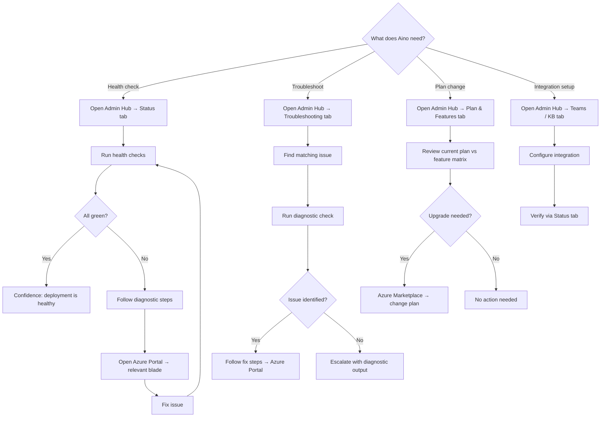
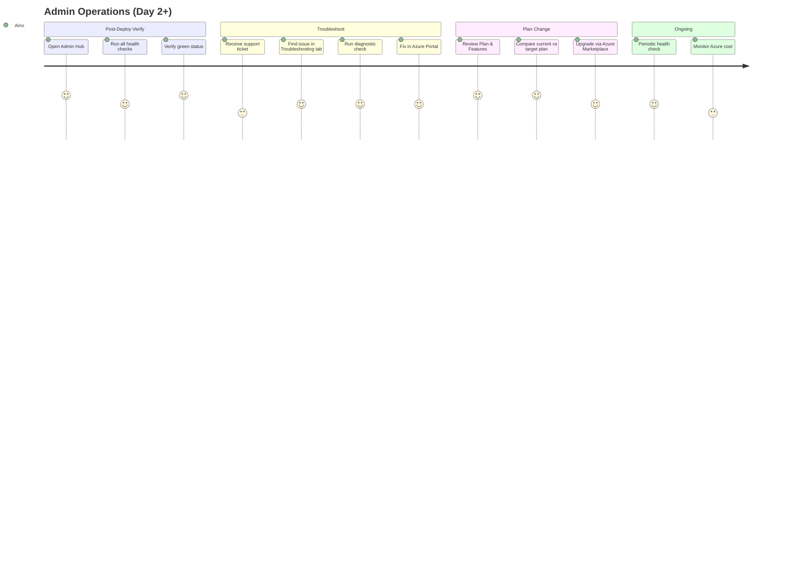

# Flow 10: Azure App — Admin Operations

> Admin Aino manages the VariScout deployment after initial setup — health monitoring, troubleshooting, and plan changes.
>
> **Priority:** Medium — operational hygiene (reduces support burden, improves admin confidence)
>
> See also: [Journeys Overview](../index.md) | [AI Setup](azure-ai-setup.md) | [Team Collaboration](azure-team-collaboration.md)

---

## Persona: Admin Aino

| Attribute         | Detail                                                            |
| ----------------- | ----------------------------------------------------------------- |
| **Role**          | IT Admin / Azure Platform Engineer                                |
| **Goal**          | Ensure VariScout is healthy, troubleshoot issues, manage upgrades |
| **Knowledge**     | Azure Portal, Entra ID, App Registrations, RBAC, Teams Admin      |
| **Pain points**   | No health visibility in-app, unclear app-vs-Azure responsibility  |
| **Entry point**   | In-app admin hub (shield icon) or Azure Portal                    |
| **Decision mode** | Diagnostic — needs evidence before taking action                  |

### What Aino is thinking:

- "Someone reported OneDrive sync is broken — where do I check?"
- "We want to upgrade to Team — what changes?"
- "Is the AI endpoint still working after the weekend?"
- "The new hire can't access the app — what's missing?"

---

## Journey Flow

### Mermaid Flowchart

### Admin Operations Journey

---

## Step-by-Step

### 1. Post-Deployment Verification

After the ARM template deploys and the app is live, Aino verifies that all integrations are working.

**In-app (Admin Hub → Status tab):**

| Check          | Method                    | What it proves                              |
| -------------- | ------------------------- | ------------------------------------------- |
| Authentication | `GET /.auth/me`           | EasyAuth configured, user has valid session |
| User Profile   | `GET /me`                 | User.Read permission granted                |
| Blob Storage   | `POST /api/storage-token` | SAS token generation working (Team plan)    |
| AI Endpoint    | `GET {endpoint}`          | AI Services reachable                       |

Each check shows: green (pass), red (fail with error message), or grey (not applicable for current plan).

**Per-user delegation caveat:** AI Search and Graph API checks use the current user's delegated token. A successful check proves _this admin's_ access — another user with different SharePoint permissions or Conditional Access policies may get different results.

**What cannot be checked from the browser:**

| Item                 | Why                                        | Where to check instead                                              |
| -------------------- | ------------------------------------------ | ------------------------------------------------------------------- |
| Client secret expiry | Server-side, no browser API                | Azure Portal → Entra ID → App Registration → Certificates & secrets |
| App Service health   | Circular — if app is down, check can't run | Azure Portal → App Service → Health check                           |
| Resource costs       | Requires Azure Management API              | Azure Portal → Cost Management                                      |
| Other users' access  | Delegated token = current user only        | Azure Portal → Entra ID → Enterprise Applications → Users           |

For these, the Status tab shows an **"Open in Azure Portal →"** deep link to the relevant blade.

### 2. Ongoing Health Monitoring

Aino periodically checks the Status tab to ensure integrations remain healthy. Common triggers:

- After Azure maintenance windows
- After App Registration changes (secret rotation, permission updates)
- After plan upgrades (new integrations become available)
- When users report issues

### 3. Troubleshooting Common Issues

The Troubleshooting tab provides a structured diagnostic flow for common support tickets:

| Issue                       | Diagnostic                                                                | Fix Location                                      |
| --------------------------- | ------------------------------------------------------------------------- | ------------------------------------------------- |
| "Users can't sign in"       | Check EasyAuth config — does `/.auth/me` return a token?                  | Azure Portal → App Service → Authentication       |
| "Team projects not syncing" | Test SAS token endpoint — does `/api/storage-token` return?               | Azure Portal → Storage Account → Access control   |
| "CoScout not responding"    | Test AI endpoint connectivity — is the endpoint reachable?                | Azure Portal → AI Services → Keys and Endpoint    |
| "New user can't access"     | User not assigned to Enterprise Application                               | Azure Portal → Entra ID → Enterprise Applications |
| "AI responses are slow"     | Check AI model deployment — throttling or cold start?                     | Azure Portal → AI Services → Model deployments    |
| "User can't save to team"   | Check Blob Storage RBAC — does user have `Storage Blob Data Contributor`? | Azure Portal → Storage Account → Access control   |

Each row provides:

1. Issue description (searchable)
2. **"Run Check"** button — executes the browser-based diagnostic
3. Result with pass/fail and error details
4. **"Fix in Azure Portal →"** deep link to the relevant blade

### 4. Plan Changes and Feature Activation

The Plan & Features tab shows the current plan and what each tier unlocks:

| Feature                        | Standard | Team |
| ------------------------------ | -------- | ---- |
| Analysis & charts              | ✓        | ✓    |
| Findings & investigation       | ✓        | ✓    |
| Local file storage (IndexedDB) | ✓        | ✓    |
| AI narration & insights        | ✓        | ✓    |
| CoScout assistant              | ✓        | ✓    |
| Shared Blob Storage            | —        | ✓    |
| Photo evidence                 | —        | ✓    |
| Team assignment                | —        | ✓    |
| Knowledge Catalyst             | —        | ✓    |

Current plan is highlighted. Upgrade links point to Azure Marketplace subscription management.

After a plan upgrade:

1. Update `VITE_VARISCOUT_PLAN` in App Service configuration
2. Redeploy ARM template if new resources are needed (e.g., AI Services)
3. Verify new features via Status tab health checks

### 5. Integration Lifecycle

**Blob Storage access (Team plan):**

- New team members need `Storage Blob Data Contributor` RBAC role on the Storage Account
- Assign via Azure Portal → Storage Account → Access control (IAM)
- Verify via Status tab health check

**Optional Teams static tab:**

- If customers want VariScout in the Teams app bar, provide the static tab manifest (see [ADR-059](../../07-decisions/adr-059-web-first-deployment-architecture.md))
- No permissions required — just a URL bookmark in Teams

---

## What Aino Does NOT Do In-App

VariScout has no backend. These responsibilities stay in Azure Portal:

| Responsibility          | Tool                                                 |
| ----------------------- | ---------------------------------------------------- |
| User provisioning       | Entra ID → Enterprise Applications                   |
| RBAC role assignment    | Azure Portal → IAM                                   |
| Cost management         | Azure Cost Management                                |
| Audit logging           | Azure App Service → Diagnostic logs                  |
| Scaling                 | Azure Portal → App Service → Scale up/out            |
| Availability monitoring | Azure Monitor → Availability tests                   |
| Secret rotation         | Entra ID → App Registration → Certificates & secrets |
| Billing                 | Azure Marketplace → Subscriptions                    |

The admin hub provides deep links to each of these blades so Aino doesn't have to navigate manually.

---

## Admin Role Gating

The Admin Hub uses **soft gating** via Entra ID App Roles:

| Scenario                                         | Behavior                                    |
| ------------------------------------------------ | ------------------------------------------- |
| No App Roles configured (default)                | All authenticated users see the Shield icon |
| App Roles configured, user has `VariScout.Admin` | Shield icon visible                         |
| App Roles configured, user lacks admin role      | Shield icon hidden                          |

This is backward compatible — existing deployments work without any changes. To restrict access:

1. Define a `VariScout.Admin` App Role in the App Registration
2. Assign admin users to the role in Entra ID → Enterprise Applications
3. The role appears as a `roles` claim in `/.auth/me`

The Status tab shows the current gating mode so Aino can see whether access is open or restricted.

See [Authentication — App Roles](../../08-products/azure/authentication.md#admin-role-gating-app-roles) for setup instructions.

---

## Success Metrics

| Metric                                         | Target |
| ---------------------------------------------- | ------ |
| Post-deploy verification completion rate       | > 90%  |
| Support tickets resolved via Troubleshooting   | Track  |
| Admin Hub visits per month                     | Track  |
| Health check failure → Azure Portal click rate | Track  |
| Time from issue report to diagnosis            | Track  |

---

## See Also

- [Admin Aino](../personas/admin-aino.md) — the IT Admin persona
- [Flow 8: Team Collaboration](azure-team-collaboration.md) — initial deployment and team setup
- [Flow 9: AI Setup](azure-ai-setup.md) — AI resource provisioning
- [ARM Template](../../08-products/azure/arm-template.md) — deployment resources
- [Authentication](../../08-products/azure/authentication.md) — EasyAuth configuration
- [Admin Experience Design](../../archive/specs/2026-03-19-admin-experience-design.md) — UI design spec
