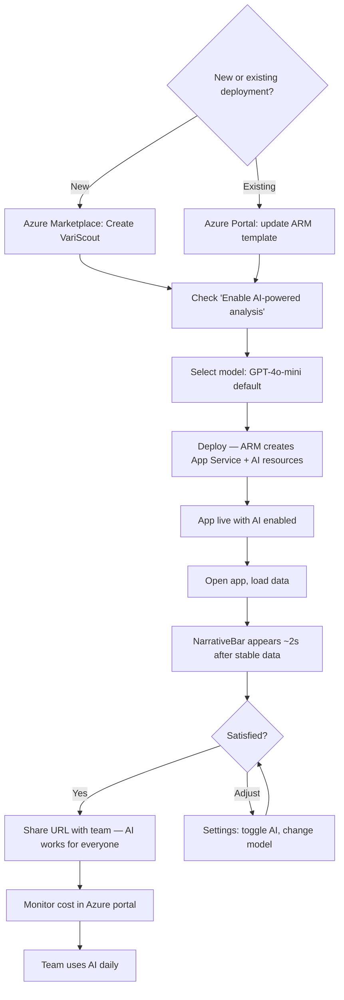
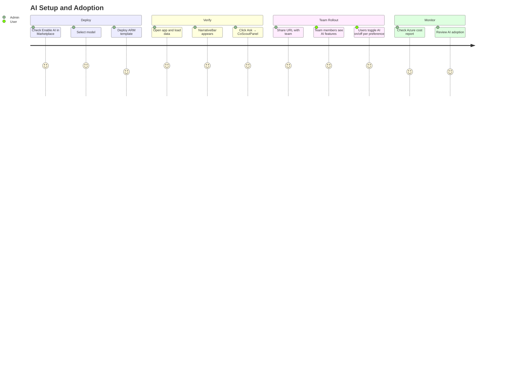

# Flow 9: Azure App — AI Setup

> OpEx Olivia enables AI-powered analysis for her team during deployment
>
> **Priority:** Medium - enhancement (adds value to existing Azure App deployment)
>
> See also: [Journeys Overview](../index.md) | [Team Collaboration](azure-team-collaboration.md) | [Daily Use](azure-daily-use.md)

---

## Persona: OpEx Olivia (Admin)

| Attribute         | Detail                                                        |
| ----------------- | ------------------------------------------------------------- |
| **Role**          | OpEx Manager, VariScout deployment owner                      |
| **Goal**          | Enable AI features so the team gets natural language guidance |
| **Knowledge**     | Comfortable with Azure portal, manages team deployment        |
| **Pain points**   | Cost uncertainty, IT approval for AI resources                |
| **Entry point**   | Azure Marketplace deployment (new) or Azure portal (existing) |
| **Decision mode** | Admin — configures once, team benefits daily                  |

### What Olivia is thinking:

- "Will this add real value, or is it just a chatbot gimmick?"
- "How much will AI cost per month?"
- "Can individual users turn it off if they prefer?"
- "Does this send our data outside our tenant?"

---

## Journey Flow

### Mermaid Flowchart

### AI Setup Journey

---

## Step-by-Step

### 1. Enable AI During Deployment

AI is an optional checkbox in the ARM template deployment wizard.

**New deployment (Azure Marketplace):**

1. Find VariScout on Azure Marketplace and click "Create"
2. Fill in the standard fields (app name, region, Client ID, Client Secret)
3. Check **"Enable AI-powered analysis"**
4. Select AI model from the dropdown:

| Model         | Tier      | Best for                         | Relative cost |
| ------------- | --------- | -------------------------------- | ------------- |
| GPT-4o-mini   | Fast      | Narration, chart chips (default) | Lowest        |
| GPT-4o        | Reasoning | CoScout conversations, reports   | Medium        |
| Claude Sonnet | Reasoning | CoScout conversations, reports   | Medium        |

5. Click Deploy — the ARM template creates:
   - App Service Plan + App Service + EasyAuth (standard resources)
   - Azure AI Foundry account (AI Services, S0 SKU)
   - Model deployment(s) — fast model for narration/chips, reasoning model for CoScout
   - EasyAuth updated with Cognitive Services scope

6. Deployment completes in ~2–3 minutes

**Existing deployment (add AI later):**

1. Open the resource group in Azure portal
2. Redeploy the ARM template with `enableAI: true`
3. The template conditionally creates AI resources alongside the existing App Service

**Bring-your-own endpoint:** Organizations with existing Azure AI Foundry deployments can point VariScout at their own endpoint by setting the `VITE_AI_ENDPOINT` app setting. No additional ARM resources needed.

### 2. Authentication and Permissions

AI authentication uses the same EasyAuth pattern as Graph API calls — no separate API keys in client code.

| Component       | How it works                                                     |
| --------------- | ---------------------------------------------------------------- |
| AI endpoint URL | Build-time setting (`VITE_AI_ENDPOINT`) — not a secret           |
| Authentication  | Azure AD (Entra ID) bearer token via EasyAuth session            |
| RBAC            | Users need "Cognitive Services User" role on the AI resource     |
| Cognitive scope | Added to EasyAuth `authsettingsV2` automatically by ARM template |

No API keys are stored in client-side JavaScript. The browser obtains tokens via the existing `getAccessToken()` helper in `easyAuth.ts`.

### 3. First Analysis with AI

After deployment, Olivia opens the app and loads a dataset to verify AI is working:

1. Open `https://<app-name>.azurewebsites.net`
2. Upload or paste data, complete column mapping
3. Dashboard loads — after ~2 seconds of stable data, the **NarrativeBar** appears at the bottom
4. NarrativeBar shows a one-line summary (e.g., "Process stable. Cpk 1.42, no Nelson Rule violations detected.")
5. Click **"Ask →"** in the NarrativeBar — the **CoScoutPanel** slides open from the right
6. Type a question (e.g., "What should I investigate first?") — AI responds with context-aware guidance
7. Drill into a factor — **ChartInsightChip** appears below the Boxplot (e.g., "Drill Machine A (47%)")
8. NarrativeBar updates with the new drill scope

If AI does not appear, see [Troubleshooting](#troubleshooting) below.

### 4. User-Level Settings

Each user controls their own AI experience via the Settings panel:

| Setting            | Default              | Effect                               |
| ------------------ | -------------------- | ------------------------------------ |
| Show AI assistance | ON (when configured) | Toggle hides all three AI components |

The toggle only appears when an AI endpoint is configured. When toggled OFF:

- NarrativeBar, ChartInsightChip, and CoScoutPanel are all hidden
- Dashboard layout is unchanged — no empty spaces or placeholders
- The app behaves identically to a non-AI deployment

The toggle persists per-user in localStorage. One team member can use AI while another works without it.

### 5. Cost Monitoring

AI costs are consumption-based (pay per token). VariScout minimizes costs through several mechanisms:

| Control              | How it works                                                      |
| -------------------- | ----------------------------------------------------------------- |
| Stats-only payloads  | AI receives computed stats (~500 tokens), never raw data          |
| Dual-model routing   | NarrativeBar/chips use cheap model; CoScoutPanel uses smart model |
| Response caching     | Identical analysis states reuse cached AI responses (24h TTL)     |
| Client-side throttle | Max 1 narration request per 5 seconds                             |
| Monthly budget       | Configurable via ARM template parameters (Azure spending limit)   |

**Typical cost profile:**

- NarrativeBar: ~500 tokens per request, fast model (very low cost)
- ChartInsightChip: ~200 tokens per chip, fast model
- CoScoutPanel: ~2K–8K tokens per conversation turn, reasoning model (higher cost per query, but used less frequently)

Monitor costs in Azure portal under the AI Services resource → Cost Analysis.

---

## Phased Rollout

AI features are delivered in three phases (see [ADR-019](../../07-decisions/adr-019-ai-integration.md)):

| Phase | Features                                                                                   | Deployment                          |
| ----- | ------------------------------------------------------------------------------------------ | ----------------------------------- |
| 1     | AI service layer, NarrativeBar, process description field, factor role inference, ARM      | Marketplace update                  |
| 2     | ChartInsightChip, AI-enhanced Nelson Rule explanations, drill suggestions                  | App update (no ARM changes)         |
| 3     | CoScoutPanel, Azure AI Search, Remote SharePoint knowledge, report generation + publishing | ARM update (adds Search + Function) |

Each phase is backward compatible. Existing deployments continue working when new features ship. Phase 3 requires a template redeployment to provision Azure AI Search and the OBO token exchange Function.

---

## Data Sovereignty

All AI resources run in the customer's Azure tenant:

- AI models are deployed via Azure AI Foundry in the customer's subscription
- Prompts and responses stay within the tenant boundary
- AI receives only computed statistics — never raw measurement data
- No telemetry or data is sent to VariScout (the publisher)
- Responses are cached locally in IndexedDB

This architecture satisfies GDPR requirements by design. The customer's IT team has full visibility and control over AI resource usage through the Azure portal.

---

## Troubleshooting

### NarrativeBar not appearing

| Symptom                    | Likely cause                                    | Fix                                                               |
| -------------------------- | ----------------------------------------------- | ----------------------------------------------------------------- |
| No AI UI at all            | `enableAI` not set during deployment            | Redeploy ARM template with "Enable AI" checked                    |
| No AI UI at all            | `VITE_AI_ENDPOINT` not configured               | Set the app setting in Azure portal → App Service → Configuration |
| Toggle missing in Settings | No AI endpoint detected                         | Verify `VITE_AI_ENDPOINT` is set and the AI resource exists       |
| Bar hidden after toggle    | User toggled "Show AI assistance" OFF           | Re-enable in Settings panel                                       |
| Bar never loads            | RBAC: user lacks "Cognitive Services User" role | Assign the role on the AI Services resource in Azure portal       |
| Bar shows "(cached)"       | Cached response from a previous analysis state  | Update data or drill to trigger a fresh AI request                |

### Latency issues

| Symptom                     | Likely cause                      | Fix                                                                  |
| --------------------------- | --------------------------------- | -------------------------------------------------------------------- |
| Slow NarrativeBar (>5s)     | Cold start on AI model deployment | First request after idle may be slow; subsequent requests are faster |
| CoScoutPanel timeout (>10s) | Reasoning model capacity          | Check Azure portal for throttling; consider scaling the deployment   |
| Responses feel stale        | Response caching (24h TTL)        | Data changes automatically invalidate the cache                      |

### Cost unexpectedly high

1. Check Azure portal → AI Services resource → Cost Analysis
2. Review CoScoutPanel usage — reasoning model is the largest cost driver
3. Consider switching reasoning model to GPT-4o-mini if deep CoScout conversations are rare
4. Set a monthly spending limit via Azure budget alerts

---

## Success Metrics

| Metric                                    | Target |
| ----------------------------------------- | ------ |
| AI enabled at deployment                  | Track  |
| Users with AI toggle ON                   | > 70%  |
| NarrativeBar impressions per session      | Track  |
| CoScoutPanel conversations per user/week  | Track  |
| AI cost per user per month                | < €5   |
| Time to first AI insight (from data load) | < 5s   |

---

## See Also

- [Team Collaboration](azure-team-collaboration.md) — admin deployment and team setup
- [Daily Use](azure-daily-use.md) — how AI fits into daily analysis workflows
- [Teams Mobile](azure-teams-mobile.md) — AI on phone
- [AI Components](../../06-design-system/components/ai-components.md) — NarrativeBar, ChartInsightChip, CoScoutPanel specs
- [AI Architecture](../../05-technical/architecture/ai-architecture.md) — technical implementation
- [ADR-019: AI Integration](../../07-decisions/adr-019-ai-integration.md) — architectural decision
- [ARM Template](../../08-products/azure/arm-template.md) — deployment resources
