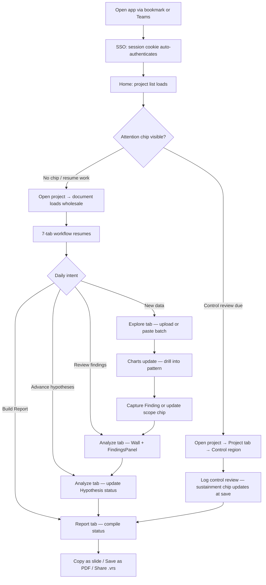

# Flow 7: Azure App — Daily Use

> Improvement-specialist daily workflow: re-ingest data, capture findings, advance hypotheses, review Control.
>
> **Priority:** High - retention (ongoing value delivery)
>
> See also: [Journeys Overview](../index.md) | [First Analysis](azure-first-analysis.md) | [Project Reopen](project-reopen.md)

---

## Persona: Improvement Specialist (Established User)

| Attribute         | Detail                                                                    |
| ----------------- | ------------------------------------------------------------------------- |
| **Roles**         | Lead, Member, or Sponsor (per-project, ADR-082)                           |
| **Goal**          | Re-ingest new data, advance the investigation, keep Control current       |
| **Knowledge**     | Knows the 7-tab workflow; comfortable with drill-down and the Wall        |
| **Pain points**   | Needs fast data turnaround; wants to know what's changed since last visit |
| **Entry point**   | Bookmark, Teams tab, or browser history                                   |
| **Decision mode** | Efficient — load data, run the Measure⇄Analyze loop, capture findings     |

### What the specialist is thinking:

- "New batch data came in — has the process drifted?"
- "Which factor is still driving the variation?"
- "I need to update the hypotheses before today's review meeting"
- "Is the Control review due?"

---

## Journey Flow

### Mermaid Flowchart

---

## Daily Workflows

### Quick Check (2–3 minutes)

Most common daily task: verify process stability with a fresh data batch.

1. Open the app — SSO authenticates automatically (EasyAuth session cookie)
2. Home shows the project list; scan cards for attention chips (control due, finding counts)
3. Select the project — document loads wholesale; stores hydrate in one pass
4. Switch to the **Explore tab** — upload or paste today's batch via the data-ingest overlay
5. Check the I-Chart: are points within control limits? Any Nelson rule violations?
6. Review the Stats panel: mean, sigma, Cp/Cpk
7. _(If AI enabled)_ Glance at the **NarrativeBar** at the bottom of the chart workspace — a single-line summary appears after stable data (e.g., "Process stable. Cpk 1.42, no violations.")
8. Done — close or continue to deep dive

### Deep Dive (5–15 minutes)

When the quick check surfaces an issue:

1. Add or change factors via the **"Factors" button** (reopens ColumnMapping; up to 6 factors)
2. Check ANOVA: is the factor significant? (p-value, eta-squared contribution)
3. _(If AI enabled)_ **ChartInsightChip** below the Boxplot card may suggest a drill direction (e.g., "Drill Machine A (η² = 47%)"). Chips are dismissable and never block the workflow.
4. Drill down: click Boxplot bars or Pareto categories to filter; a `ProblemStatementScope` chip records the scope, keyed to the active Improvement Project
5. Follow the breadcrumb trail — each chip shows sample count (n=X) for the filtered subset
6. _(If AI enabled)_ NarrativeBar updates with each drill step
7. _(If AI enabled)_ Click the **CoScout** panel for deeper questions (e.g., "Have we seen this pattern before?")
8. Capture meaningful observations as Findings (right-click a chart category → "Add observation")

### Capture, Status, Report Loop

The core daily cycle after data is in:

**1. Capture Findings (Explore or Analyze tab)**

Right-clicking a chart category or pinning from the Wall creates a `Finding` with source metadata. Status starts at `observed`; the specialist advances it as evidence accumulates:

| Status          | Meaning                                           |
| --------------- | ------------------------------------------------- |
| `observed`      | Pattern spotted, not yet investigated             |
| `investigating` | Actively drilling and testing mechanisms          |
| `analyzed`      | Suspected cause identified; ready to plan actions |
| `improving`     | Corrective actions in progress                    |
| `resolved`      | Actions complete, outcome verified                |

Findings persist in the `.vrs` document and round-trip through export / import.

**2. Advance Hypothesis Status (Analyze tab)**

Each Finding may carry one or more Hypotheses. The specialist sets Hypothesis status based on evidence judgment (the "tool assists, analyst decides" invariant):

| Status                   | Report treatment                   |
| ------------------------ | ---------------------------------- |
| `evidence-survived-test` | Narrative + cause rows in Report   |
| `refuted`                | Tested-and-excluded section        |
| `proposed`               | Open-questions block (collapsible) |
| `needs-disconfirmation`  | Open-questions block               |

The Report composes from this analyst-owned status — no separate membership list.

**3. Build the Report (Report tab)**

Switch to the Report tab; it compiles automatically from current Hypothesis status, Finding status, and Control data.

| Share option | How                                                         |
| ------------ | ----------------------------------------------------------- |
| Copy section | Each story step has a "Copy as slide" button (16:9 capture) |
| Save as PDF  | TOC footer → browser print → "Save as PDF"                  |
| Share `.vrs` | Export from the header; colleague imports into their app    |

---

## Control Review Workflow

When the Home card shows a control due-ness chip (from `metadata.sustainment.nextReviewDue`):

1. Select the project from Home
2. Navigate to the **Project tab** → the Control region is the third stage (Charter → Approach → **Control**)
3. The Control region surfaces active control records for the Improvement Project
4. Log the review: observations, evidence, next review date
5. Save — `metadata.sustainment` updates; the Home card chip refreshes on next visit

Leads and Members can write control reviews. Sponsors see the outcome in the Report.

---

## Performance Mode (Multi-Channel Analysis)

For processes with many measurement points (filling heads, cavities, test stations):

1. Upload data with multiple numeric columns
2. App detects wide format and suggests Performance Mode
3. **Performance I-Chart** — Cpk scatter by channel
4. **Performance Pareto** — channels ranked worst-first (up to 20)
5. **Performance Boxplot** — distribution comparison (top 5)
6. Click a channel to drill into its individual analysis

---

## AI-Assisted Analysis (Optional)

When AI is configured, three components enhance the workflow without changing it:

| Component            | Where                         | What it does                                                         |
| -------------------- | ----------------------------- | -------------------------------------------------------------------- |
| **NarrativeBar**     | Fixed at chart workspace base | One-line plain-language summary of current analysis state            |
| **ChartInsightChip** | Below chart cards             | Per-chart contextual suggestion (drill target, violation context)    |
| **CoScout**          | Slide-out panel               | Conversational AI for deeper questions, grounded in analysis context |

All AI features are optional and dismissable. The analysis works identically without AI.

AI never sends raw measurement data — only computed statistics. See [ADR-019](../../07-decisions/adr-019-ai-integration.md).

---

## Export and Sharing

| Action         | How                                     | Output                           |
| -------------- | --------------------------------------- | -------------------------------- |
| CSV export     | Editor header button                    | Filtered data as CSV             |
| Copy chart     | Chart card menu → "Copy to clipboard"   | PNG image on clipboard           |
| Download chart | Chart card menu → "Download"            | PNG file                         |
| Share project  | Export `.vrs` from header               | Colleague opens in their app     |
| Report View    | Report tab → scrollable compiled report | Copy sections as slides          |
| Save as PDF    | Report tab → "Save as PDF" button       | Professional PDF (browser print) |

---

## Platform Capabilities

| Capability          | Detail                                                                |
| ------------------- | --------------------------------------------------------------------- |
| Saved projects      | Listed on Home; synced via Blob Storage (Azure App)                   |
| Factor management   | Add/remove/change up to 6 factors during analysis                     |
| Row capacity        | 250,000 rows                                                          |
| Performance Mode    | Multi-channel Cpk analysis (hundreds of channels)                     |
| Offline work        | Full functionality; queues sync on reconnection                       |
| Finding persistence | Round-trips via `.vrs` document (PO-6); no data lost on export/import |
| Control reviews     | Project tab Control region; due-ness visible on Home card             |
| Roles               | Lead / Member / Sponsor per-project ACL (ADR-082)                     |

---

## See Also

- [Project Reopen Flow](project-reopen.md) — full project-open mechanics, store hydration, Home card chips
- [First Analysis](azure-first-analysis.md) — onboarding journey
- [IA Nav Model](../ia-nav-model.md) — 7-tab nav + Workspace context / Analysis Scope
- [ADR-082: Wedge Architecture](../../07-decisions/adr-082-wedge-architecture.md) — single-SKU + per-project ACLs
- [ADR-019: AI Integration](../../07-decisions/adr-019-ai-integration.md) — AI architectural decisions
- [Performance Mode](../../03-features/analysis/performance-mode.md) — multi-channel analysis
