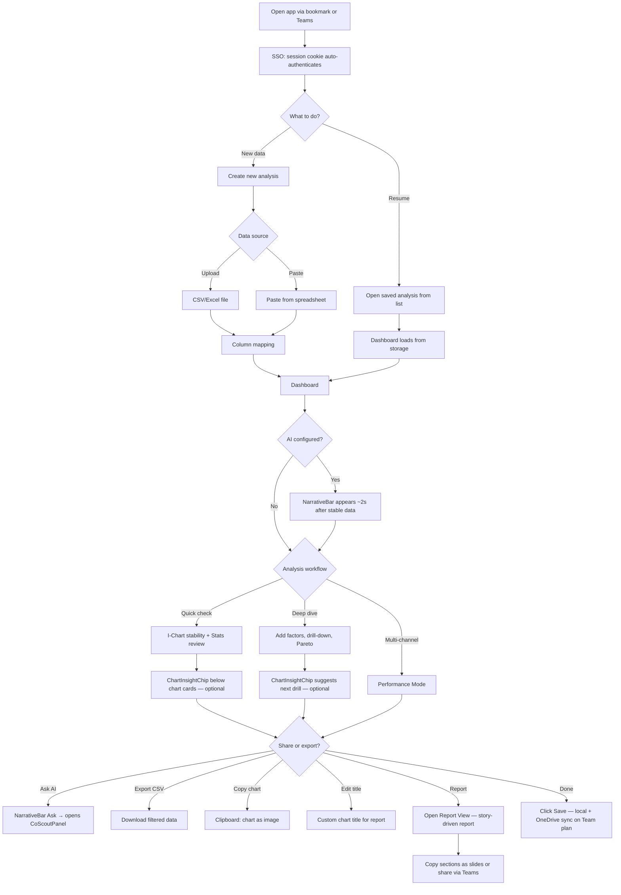
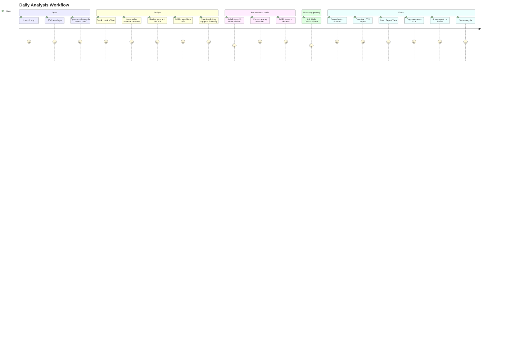

# Flow 7: Azure App — Daily Use

> Green Belt Gary's daily workflow: repeat analysis, Performance Mode, exports
>
> **Priority:** High - retention (ongoing value delivery)
>
> See also: [Journeys Overview](../index.md) | [First Analysis](azure-first-analysis.md) | [Team Collaboration](azure-team-collaboration.md)

---

## Persona: Green Belt Gary (Established User)

| Attribute         | Detail                                                       |
| ----------------- | ------------------------------------------------------------ |
| **Role**          | Quality Engineer, daily VariScout user                       |
| **Goal**          | Analyze new production batches, track trends, share findings |
| **Knowledge**     | Knows the app, comfortable with drill-down                   |
| **Pain points**   | Needs fast data turnaround, multiple measurement channels    |
| **Entry point**   | Bookmark, Teams tab, or browser history                      |
| **Decision mode** | Efficient — wants to load data and get answers quickly       |

### What Gary is thinking:

- "New batch data came in — let me check stability"
- "Which filling heads are drifting?"
- "I need to export this chart for the morning meeting"
- "Can I compare all channels at once?"

---

## Journey Flow

### Mermaid Flowchart

### Daily Use Journey

---

## Daily Workflows

### Quick Check (2–3 minutes)

The most common daily task: verify stability of a production process.

1. Open the app — SSO authenticates automatically (EasyAuth session cookie)
2. Open existing analysis from the saved list (loaded from IndexedDB; Team plan also syncs via OneDrive)
3. Upload or paste today's data batch
4. Check I-Chart: are points within control limits? Any Nelson rule violations?
5. Review Stats panel: mean, sigma, Cp/Cpk
6. _(If AI enabled)_ Glance at **NarrativeBar** at the bottom of the dashboard — a single-line summary appears ~2 seconds after stable data (e.g., "Process stable. Cpk 1.42, no violations detected.")
7. Done — close or continue to deep dive

### Deep Dive (5–15 minutes)

When the quick check reveals issues:

1. Add or change factors via the **"Factors" button** in the nav bar (reopens ColumnMapping, up to 6)
2. Check ANOVA: is the factor significant? (p-value, eta-squared)
3. _(If AI enabled)_ **ChartInsightChip** appears below the Boxplot card with a contextual suggestion (e.g., "Drill Machine A (47% contribution)"). Chips are dismissable and never block the workflow.
4. Drill down: click Boxplot bars or Pareto categories to filter
5. Follow the breadcrumb trail — each chip shows variation contribution (eta-squared %)
6. _(If AI enabled)_ NarrativeBar updates with each drill step, summarizing the new scope (e.g., "Machine A explains 47% of variation. Morning shift shows Nelson Rule 2 violation.")
7. _(If AI enabled)_ Click **"Ask →"** in the NarrativeBar to open the **CoScoutPanel** for deeper questions (e.g., "Have we seen this pattern before?" or "What should I investigate next?")
8. Identify the root cause factor/level combination

### Performance Mode (Multi-Channel Analysis)

For processes with many measurement points (filling heads, cavities, test stations):

1. Upload data with multiple numeric columns (channels)
2. App detects wide format and suggests Performance Mode
3. **Performance I-Chart** — Cpk scatter plot by channel
4. **Performance Pareto** — channels ranked worst-first (up to 20)
5. **Performance Boxplot** — distribution comparison (top 5)
6. Click a channel to drill into its individual analysis
7. **Performance Capability** — histogram for the selected channel

---

## Investigation Workflow

When a deep dive reveals a significant pattern, Gary captures it as a finding and works through a structured investigation. The workflow has four phases, progressing from discovery to verified resolution.

### Phase 1 — Discovery: Observations become Findings

1. During a deep dive, Gary spots a pattern — e.g., a Boxplot category with unusually wide spread
2. **Right-click the category → "Add observation"** — a Finding is created with source metadata (chart type, category, filter context)
3. The Finding appears in the **Findings panel** sidebar with status **Observed**
4. _(If AI enabled)_ **NarrativeBar** summarizes the current state; **ChartInsightChip** may suggest a next drill direction

Gary can pin multiple findings in one session. Each captures a distinct observation with its drill-down context preserved.

### Phase 2 — Investigation: Hypotheses and Validation

5. Open a Finding → change status to **Investigating** → click **"Add hypothesis"**
6. Type the suspected cause (e.g., "Operator B lacks training on Product Variant C")
7. The hypothesis **auto-validates via η²** — if the factor's contribution exceeds the threshold, it shows as "Supported"; otherwise "Not supported"
8. Create **sub-hypotheses** to explore branches: diverge (cast wide), validate each (data, gemba walk, or expert input), converge on the supported ones
9. _(If AI enabled)_ **CoScout** suggests validation approaches when asked; the **Investigation Sidebar** shows phase-aware questions (e.g., "Have you explored [uncovered category]?")

The investigation phase badge updates automatically: Initial → Diverging → Validating → Converging, based on hypothesis count and validation status.

### Phase 3 — Ideation: Improvement Ideas and Actions

10. For each supported hypothesis, add **improvement ideas** — describe potential fixes with optional What-If projections
11. **Compare ideas** using the What-If Simulator: adjust contribution percentages to see projected Cpk impact
12. Select the best idea → create **corrective actions** with description, assignee, and due date
13. Change Finding status to **Improving** — the action plan is now active
14. _(Team plan)_ Teams auto-posts the finding with its action plan to the configured channel

### Phase 4 — Verification: Proving the Improvement Worked

The goal is to demonstrate measurable improvement after corrective actions are complete.

**Recommended approach — Staged Analysis:**

The most reliable verification method is to combine before and after data in a single analysis using a **Stage column**:

1. Add a `Stage` column to the data (e.g., "Before", "After") identifying which period each row belongs to
2. Upload the combined dataset — VariScout calculates **independent control limits per stage**
3. Compare Cpk, mean shift, and variation reduction between stages in the same dashboard
4. All findings, hypotheses, and actions are preserved throughout — no data is lost

This approach provides clear visual and statistical before/after comparison in one view. See [Staged Analysis](../../03-features/analysis/staged-analysis.md) for details.

**Chart-by-chart verification (current state):**

| Step | Chart            | What Gary checks                                    | How (today)                                                                                        |
| ---- | ---------------- | --------------------------------------------------- | -------------------------------------------------------------------------------------------------- |
| 1    | **I-Chart**      | Are violations reduced? Are control limits tighter? | Visual comparison of per-stage limits ✓                                                            |
| 2    | **Stats Panel**  | How much did mean, σ, Cpk change?                   | **Overall stats only** — no per-stage breakdown. Gary must mentally compare with remembered values |
| 3    | **Boxplot**      | Did the specific factor (e.g., Station 2) improve?  | Manual: drill into Stage "After", note distribution, then swap to "Before" and compare             |
| 4    | **Capability**   | Is Cpk above target now?                            | Filter to "After" stage, check histogram and Cpk value                                             |
| 5    | **NarrativeBar** | Summary: did the improvement work?                  | Shows current state, but not stage-aware — doesn't compare before/after                            |

> **Future enhancement**: [ADR-023](../../07-decisions/adr-023-data-lifecycle.md) designs a **Staged Comparison Card** (per-stage metrics with deltas), **auto-filled outcomes** (cpkBefore/cpkAfter from staged data), **stage-aware NarrativeBar**, and a **verification checklist** in the InvestigationSidebar. This reduces the 7-step manual process to a guided 3-step flow.

**Alternative — Manual outcome recording:**

If the verification data lives in a separate file or system:

1. Run a new analysis with the post-improvement data — note the Cpk value
2. Return to the saved project containing the investigation
3. Open the Finding → **Outcome** section → enter the `cpkAfter` value and select effectiveness

> **Important:** Loading a new file as a new project clears findings from the current session. Always **save the investigation project first** before opening a separate analysis. The recommended Staged Analysis approach avoids this issue entirely.

**Recording the outcome:**

15. Set outcome: **Effective** / **Partial** / **Not Effective** — with Cpk before and after recorded
16. Change Finding status to **Resolved**
17. _(If AI enabled)_ NarrativeBar reflects the improvement in current stats when using Staged Analysis
18. _(Team plan)_ Teams auto-posts the outcome with Cpk before/after comparison
19. _(Team AI plan)_ The resolved finding is **indexed to the Knowledge Base** — future investigations can reference this resolution

### Tier Availability

| Phase            | PWA (Free)                 | Azure Standard                         | Azure Team                 |
| ---------------- | -------------------------- | -------------------------------------- | -------------------------- |
| 1. Discovery     | Observed status only       | Full                                   | Full                       |
| 2. Investigation | 3 statuses, no persistence | Full, IndexedDB persistence            | + Teams posting            |
| 3. Ideation      | Not available              | Full (actions, What-If)                | + Assignees, Teams posting |
| 4. Verification  | Not available              | Full (Staged Analysis, manual outcome) | + Knowledge Base indexing  |

---

## Export and Sharing

| Action           | How                                               | Output                          |
| ---------------- | ------------------------------------------------- | ------------------------------- |
| CSV export       | Editor header button                              | Filtered data as CSV            |
| Copy chart       | Chart card menu → "Copy to clipboard"             | PNG image on clipboard          |
| Edit chart title | Click chart title → type custom text              | Appears in copied image         |
| Download chart   | Chart card menu → "Download"                      | PNG file                        |
| Share analysis   | Share the `.vrs` file from OneDrive _(Team plan)_ | Colleague opens in their app    |
| Report View      | Toolbar button → scrollable story report          | Copy sections as slides         |
| Share report     | Report View → "Share Report" _(Team plan)_        | Teams Adaptive Card + deep link |

### Report View — Share the Full Story

Instead of downloading individual charts and assembling them in PowerPoint, Gary opens the **Report View** — a scrollable, story-driven document that composes the entire analysis into a shareable format. The report adapts to the analysis type:

| Analysis Type              | What Gary Did                       | Report Shows                                                                         |
| -------------------------- | ----------------------------------- | ------------------------------------------------------------------------------------ |
| **Quick Check**            | Checked stability, no issues        | 2 steps: Current Condition → Verdict (I-Chart + key stats)                           |
| **Deep Dive**              | Found patterns, created hypotheses  | 3 active steps + 2 future: Current → Drivers → Hypotheses → _(actions)_ → _(verify)_ |
| **Full Improvement Cycle** | Completed actions, verified outcome | 5 complete steps: Current → Drivers → Hypotheses → Actions → Verification            |

**Copy workflow (3 levels):**

1. **Copy element** — Hover over any chart or stats block → copy button → paste into PowerPoint as individual image
2. **Copy section as slide** — Each story step has a "Copy as slide" button → captures at 16:9 (1920×1080) → paste = one PowerPoint slide done
3. **Copy all charts** — TOC footer → bundles every chart as individual PNGs for custom layout

**Teams sharing (Team plan):**

- Click "Share Report" in the TOC footer
- Posts an Adaptive Card to the Teams channel with process name, key metric (Cpk), and status
- Deep link (`?project=X&mode=report`) opens the Report View directly for colleagues

**Time savings:** Weekly review drops from 5–10 minutes of manual assembly to 1–2 minutes of copy-paste. Improvement reports drop from 15–20 minutes to 3–5 minutes.

See [ADR-024: Scouting Report](../../07-decisions/adr-024-scouting-report.md) for the full design.

---

## AI-Assisted Analysis (Optional)

When AI is configured (see [AI Setup](azure-ai-setup.md)), three components enhance the daily workflow without changing it:

| Component            | Where                        | What it does                                                            |
| -------------------- | ---------------------------- | ----------------------------------------------------------------------- |
| **NarrativeBar**     | Fixed at dashboard bottom    | One-line plain-language summary of current analysis state               |
| **ChartInsightChip** | Below chart cards            | Per-chart contextual suggestion (e.g., drill target, violation context) |
| **CoScoutPanel**     | Slide-out panel (right edge) | Conversational AI for deeper questions, grounded in analysis context    |

All AI features are **optional and dismissable**. The dashboard works identically without AI — no empty spaces, no placeholders. Users control AI visibility via the "Show AI assistance" toggle in Settings.

AI never sends raw measurement data — only computed statistics (mean, Cpk, violations). See [ADR-019](../../07-decisions/adr-019-ai-integration.md) for the full design rationale.

---

## Settings

Accessible from the settings panel:

| Setting            | Options               | Effect                         |
| ------------------ | --------------------- | ------------------------------ |
| Theme              | Light / Dark / System | Switches all UI colors         |
| Company accent     | Color picker          | Brand color on headers         |
| Chart font scale   | Slider                | Adjusts chart text size        |
| Show AI assistance | Toggle (on/off)       | Show or hide all AI components |

The "Show AI assistance" toggle only appears when an AI endpoint is configured. Default: ON.

---

## Platform Capabilities (Established User)

| Capability          | Detail                                                                  |
| ------------------- | ----------------------------------------------------------------------- |
| Saved analyses      | Listed on open; synced via OneDrive on Team plan (Standard: local-only) |
| Factor management   | Add/remove/change up to 6 factors during analysis                       |
| Row capacity        | 100,000 rows                                                            |
| Performance Mode    | Multi-channel Cpk analysis (hundreds of channels)                       |
| Offline work        | Full functionality, queues sync for reconnection                        |
| Chart branding      | No VariScout branding (enterprise tier)                                 |
| Capability analysis | Histogram + probability plot with Cp/Cpk                                |

---

## Success Metrics

| Metric                              | Target |
| ----------------------------------- | ------ |
| Sessions per week (active user)     | > 3    |
| Time to first chart (returning)     | < 30s  |
| Drill-down depth (avg)              | > 2    |
| Performance Mode adoption           | > 20%  |
| Chart export per session            | Track  |
| Analyses saved (per user per month) | Track  |

---

## See Also

- [First Analysis](azure-first-analysis.md) — onboarding journey
- [Team Collaboration](azure-team-collaboration.md) — sharing and admin setup
- [AI Setup](azure-ai-setup.md) — admin flow for enabling AI features
- [Performance Mode](../../03-features/analysis/performance-mode.md) — multi-channel analysis
- [Drill-Down Workflow](../../03-features/workflows/drill-down-workflow.md) — investigation methodology
- [Four Lenses Workflow](../../03-features/workflows/four-lenses-workflow.md) — analysis framework
- [AI Components](../../06-design-system/components/ai-components.md) — NarrativeBar, ChartInsightChip, CoScoutPanel specs
- [ADR-019: AI Integration](../../07-decisions/adr-019-ai-integration.md) — architectural decision
- [ADR-024: Scouting Report](../../07-decisions/adr-024-scouting-report.md) — dynamic Report View
