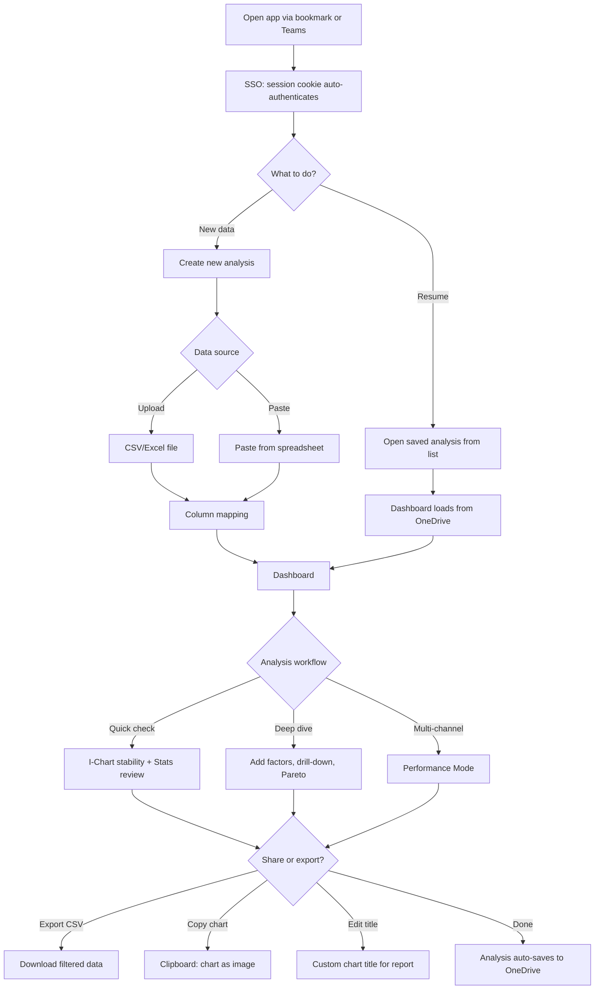
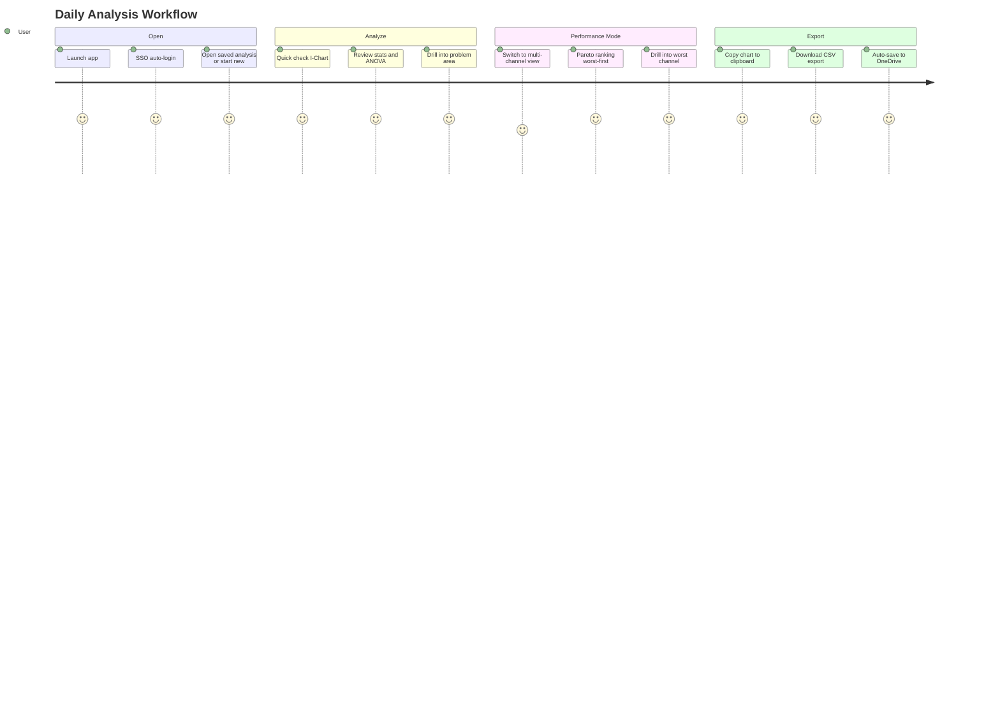

# Flow 7: Azure App — Daily Use

> Green Belt Gary's daily workflow: repeat analysis, Performance Mode, exports
>
> **Priority:** High - retention (ongoing value delivery)
>
> See also: [Journeys Overview](../index.md) | [First Analysis](azure-first-analysis.md) | [Team Collaboration](azure-team-collaboration.md)

---

## Persona: Green Belt Gary (Established User)

| Attribute         | Detail                                                       |
| ----------------- | ------------------------------------------------------------ |
| **Role**          | Quality Engineer, daily VariScout user                       |
| **Goal**          | Analyze new production batches, track trends, share findings |
| **Knowledge**     | Knows the app, comfortable with drill-down                   |
| **Pain points**   | Needs fast data turnaround, multiple measurement channels    |
| **Entry point**   | Bookmark, Teams tab, or browser history                      |
| **Decision mode** | Efficient — wants to load data and get answers quickly       |

### What Gary is thinking:

- "New batch data came in — let me check stability"
- "Which filling heads are drifting?"
- "I need to export this chart for the morning meeting"
- "Can I compare all channels at once?"

---

## Journey Flow

### Mermaid Flowchart

### Daily Use Journey

---

## Daily Workflows

### Quick Check (2–3 minutes)

The most common daily task: verify stability of a production process.

1. Open the app — SSO authenticates automatically (EasyAuth session cookie)
2. Open existing analysis from the saved list (loaded from OneDrive)
3. Upload or paste today's data batch
4. Check I-Chart: are points within control limits? Any Nelson rule violations?
5. Review Stats panel: mean, sigma, Cp/Cpk
6. Done — close or continue to deep dive

### Deep Dive (5–15 minutes)

When the quick check reveals issues:

1. Add factors via **FactorManagerPopover** (up to 6, can add/change during analysis)
2. Check ANOVA: is the factor significant? (p-value, eta-squared)
3. Drill down: click Boxplot bars or Pareto categories to filter
4. Follow the breadcrumb trail — each chip shows variation contribution (eta-squared %)
5. Use the **Investigation Mindmap** to visualize the drill-down tree
6. Identify the root cause factor/level combination

### Performance Mode (Multi-Channel Analysis)

For processes with many measurement points (filling heads, cavities, test stations):

1. Upload data with multiple numeric columns (channels)
2. App detects wide format and suggests Performance Mode
3. **Performance I-Chart** — Cpk scatter plot by channel
4. **Performance Pareto** — channels ranked worst-first (up to 20)
5. **Performance Boxplot** — distribution comparison (top 5)
6. Click a channel to drill into its individual analysis
7. **Performance Capability** — histogram for the selected channel

---

## Export and Sharing

| Action           | How                                   | Output                       |
| ---------------- | ------------------------------------- | ---------------------------- |
| CSV export       | Editor header button                  | Filtered data as CSV         |
| Copy chart       | Chart card menu → "Copy to clipboard" | PNG image on clipboard       |
| Edit chart title | Click chart title → type custom text  | Appears in copied image      |
| Download chart   | Chart card menu → "Download"          | PNG file                     |
| Share analysis   | Share the `.vrs` file from OneDrive   | Colleague opens in their app |

---

## Settings

Accessible from the settings panel:

| Setting          | Options               | Effect                  |
| ---------------- | --------------------- | ----------------------- |
| Theme            | Light / Dark / System | Switches all UI colors  |
| Company accent   | Color picker          | Brand color on headers  |
| Chart font scale | Slider                | Adjusts chart text size |

---

## Platform Capabilities (Established User)

| Capability            | Detail                                               |
| --------------------- | ---------------------------------------------------- |
| Saved analyses        | Listed on open, synced via OneDrive                  |
| Factor management     | Add/remove/change up to 6 factors during analysis    |
| Row capacity          | 100,000 rows                                         |
| Performance Mode      | Multi-channel Cpk analysis (hundreds of channels)    |
| Investigation Mindmap | Radial tree showing drill-down path with eta-squared |
| Offline work          | Full functionality, queues sync for reconnection     |
| Chart branding        | No VariScout branding (enterprise tier)              |
| Regression            | Simple + Advanced regression with What-If simulation |
| Capability analysis   | Histogram + probability plot with Cp/Cpk             |

---

## Success Metrics

| Metric                              | Target |
| ----------------------------------- | ------ |
| Sessions per week (active user)     | > 3    |
| Time to first chart (returning)     | < 30s  |
| Drill-down depth (avg)              | > 2    |
| Performance Mode adoption           | > 20%  |
| Chart export per session            | Track  |
| Analyses saved (per user per month) | Track  |

---

## See Also

- [First Analysis](azure-first-analysis.md) — onboarding journey
- [Team Collaboration](azure-team-collaboration.md) — sharing and admin setup
- [Performance Mode](../../03-features/analysis/performance-mode.md) — multi-channel analysis
- [Drill-Down Workflow](../../03-features/workflows/drill-down-workflow.md) — investigation methodology
- [Four Lenses Workflow](../../03-features/workflows/four-lenses-workflow.md) — analysis framework
