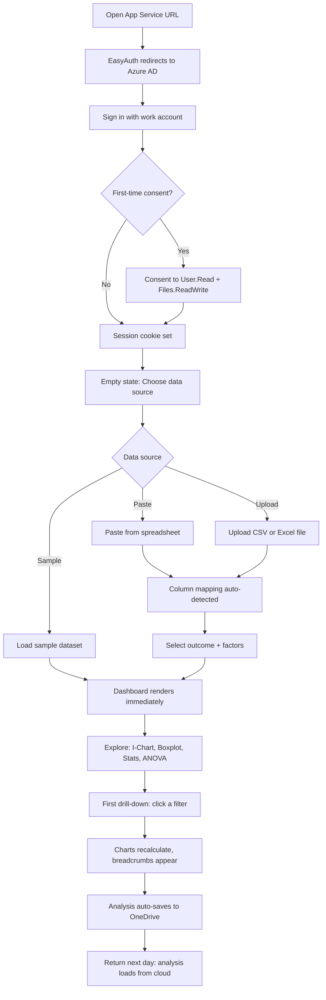
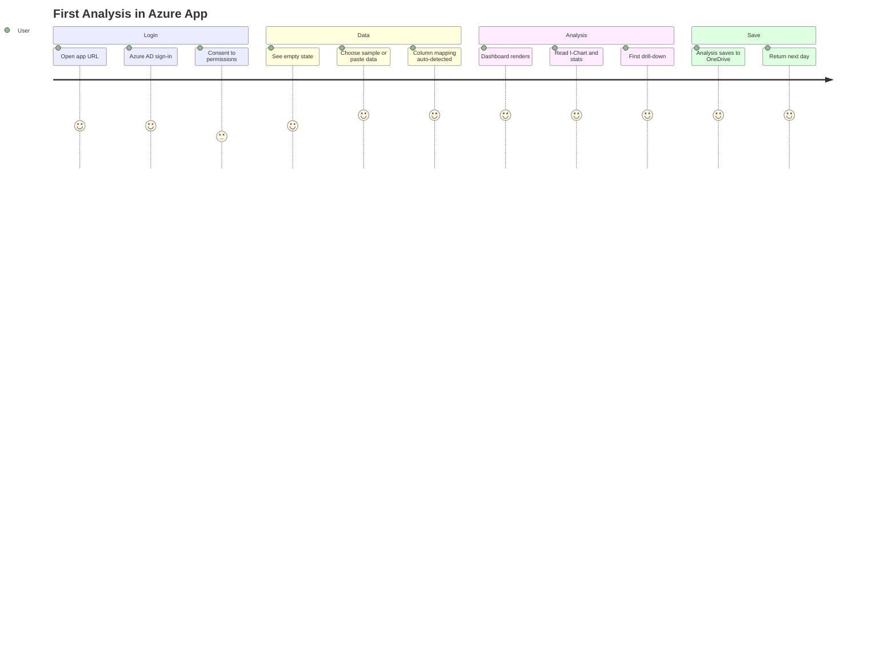

# Flow 6: Azure App — First Analysis

> Green Belt Gary runs his first analysis in the Azure App
>
> **Priority:** High - activation (first value moment)
>
> See also: [Journeys Overview](../index.md) | [Enterprise Evaluation](enterprise.md) | [How It Works](../../08-products/azure/how-it-works.md)

---

## Persona: Green Belt Gary

| Attribute         | Detail                                                     |
| ----------------- | ---------------------------------------------------------- |
| **Role**          | Quality Engineer, Green Belt certified                     |
| **Goal**          | Analyze production data without Excel friction             |
| **Knowledge**     | Knows SPC concepts, comfortable with data                  |
| **Pain points**   | Excel templates break, no drill-down, manual chart updates |
| **Entry point**   | Azure App URL (deployed by admin or self)                  |
| **Decision mode** | Hands-on — needs to see value in first 5 minutes           |

### What Gary is thinking:

- "IT deployed this — let me see if it actually works"
- "Can I just paste my data and get charts?"
- "Does it understand my column structure?"
- "Where does my analysis get saved?"

---

## Entry Points

| Source              | Arrives Via                          | Lands On         |
| ------------------- | ------------------------------------ | ---------------- |
| IT deployment email | App Service URL                      | EasyAuth sign-in |
| Colleague link      | Direct URL                           | EasyAuth sign-in |
| Teams tab           | Teams sideloaded app                 | App (SSO)        |
| Bookmark            | Browser bookmark after first session | App (SSO)        |

---

## Journey Flow

### Mermaid Flowchart

### First Analysis Journey

---

## Step-by-Step

### 1. First Login

The user opens the App Service URL (e.g., `https://variscout-contoso.azurewebsites.net`). EasyAuth intercepts the unauthenticated request and redirects to Azure AD sign-in.

- User signs in with their work Microsoft account
- First-time users consent to `User.Read` (display name) and `Files.ReadWrite` (OneDrive sync)
- A platform-managed session cookie is set — no MSAL library, no token in browser storage
- The app reads user info from `/.auth/me`

See [Authentication](../../08-products/azure/authentication.md) for technical details.

### 2. Empty State

After login, the app shows an empty editor with three options:

| Option         | Description                                         |
| -------------- | --------------------------------------------------- |
| Sample dataset | Pre-loaded data (coffee, bottleneck, sachets, etc.) |
| Paste data     | Paste tab- or comma-separated text from clipboard   |
| Upload file    | Upload CSV or Excel file (parsed in-browser)        |

For a first-time user, **sample datasets** are the fastest path to seeing value. Each sample includes pre-computed stats and meaningful variation patterns.

### 3. Column Mapping

If pasting or uploading, the app:

1. Parses the text/file with `parseText()` / `parseFile()` (in-browser, no server)
2. Auto-detects column types via `detectColumns()` — numeric, categorical, date
3. Presents the **ColumnMapping** screen: select one outcome (numeric) and up to 6 factors (categorical)
4. Click "Analyze" to proceed

### 4. Dashboard

The dashboard renders four views simultaneously:

- **I-Chart** — individual values over time with control limits
- **Boxplot** — distribution by factor levels (if factors selected)
- **Stats panel** — mean, sigma, Cp, Cpk, sample count
- **ANOVA** — F-statistic, p-value, eta-squared (if factors present)

All computation happens in-browser via `@variscout/core` stats engine.

### 5. First Drill-Down

Gary clicks a bar in the Boxplot (e.g., "Machine A"). The dashboard:

- Applies a filter (breadcrumb appears: `Machine A`)
- Recalculates all charts for the filtered subset
- Shows the variation contribution (eta-squared %) in the filter chip
- Enables deeper drilling into sub-factors

This is the "aha moment" — seeing how variation hides inside aggregated data.

### 6. Save and Return

The analysis auto-saves:

1. **IndexedDB** — immediate local save (offline-first)
2. **OneDrive** — syncs to `OneDrive/VariScout/Projects/` as a `.vrs` file (when online)

Next day, Gary opens the app and his analysis loads from OneDrive. No setup needed — EasyAuth session persists.

See [OneDrive Sync](../../08-products/azure/onedrive-sync.md) for sync details.

---

## Platform-Specific Notes

| Aspect           | Azure App behavior                                     |
| ---------------- | ------------------------------------------------------ |
| Authentication   | EasyAuth (platform-level, no library code)             |
| Data input       | Upload, paste, or manual entry — all parsed in-browser |
| Factor limit     | Up to 6 factors, can add/change during analysis        |
| Row limit        | 100,000 rows                                           |
| Persistence      | IndexedDB + OneDrive sync                              |
| Offline          | Full functionality, queues changes for sync            |
| Performance Mode | Available (multi-channel Cpk analysis)                 |
| Branding         | No VariScout branding on charts (enterprise tier)      |

---

## Success Metrics

| Metric                              | Target  |
| ----------------------------------- | ------- |
| Login → first chart rendered        | < 3 min |
| First drill-down in first session   | > 60%   |
| Return within 7 days                | > 50%   |
| Analysis saved to OneDrive          | > 80%   |
| Sample dataset chosen (first visit) | Track   |

---

## See Also

- [Azure App Overview](../../08-products/azure/index.md)
- [How It Works](../../08-products/azure/how-it-works.md) — end-to-end architecture
- [Authentication](../../08-products/azure/authentication.md) — EasyAuth details
- [OneDrive Sync](../../08-products/azure/onedrive-sync.md) — persistence flow
- [Enterprise Evaluation](enterprise.md) — how Olivia evaluated before Gary got access
- [Azure Daily Use](azure-daily-use.md) — Gary's workflow after first analysis
