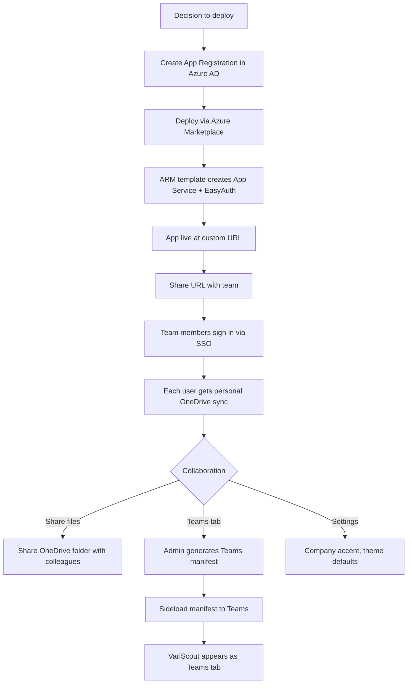
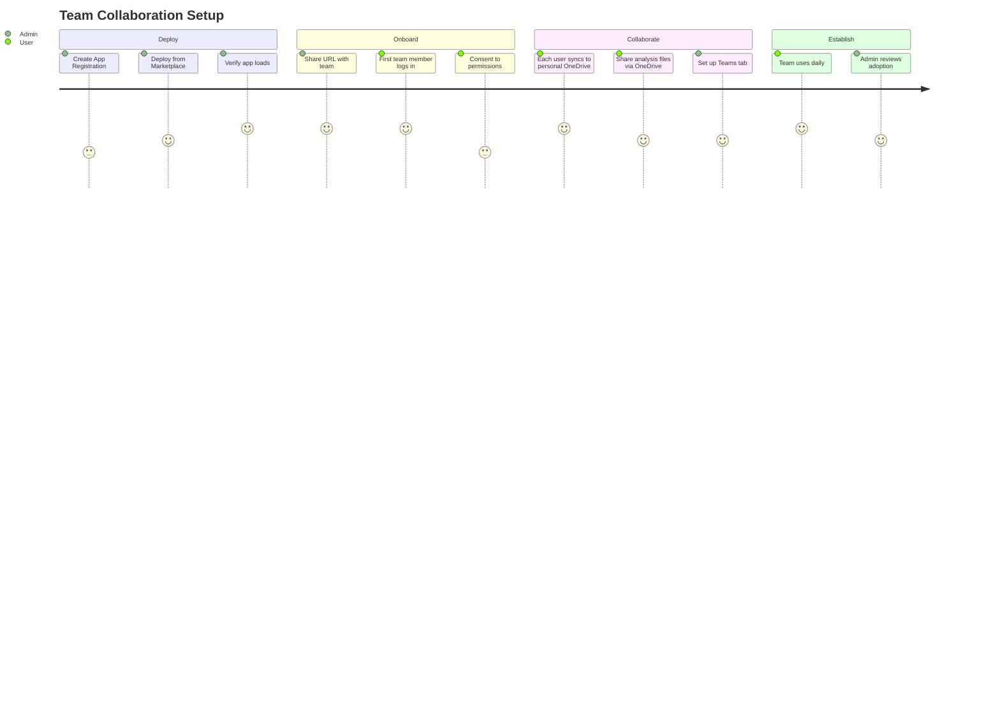

# Flow 8: Azure App — Team Collaboration

> OpEx Olivia deploys VariScout for her team and sets up sharing
>
> **Priority:** Medium - expansion (team adoption after initial deployment)
>
> See also: [Journeys Overview](../index.md) | [Enterprise Evaluation](enterprise.md) | [First Analysis](azure-first-analysis.md)

---

## Persona: OpEx Olivia (Admin)

| Attribute         | Detail                                                  |
| ----------------- | ------------------------------------------------------- |
| **Role**          | OpEx Manager, VariScout deployment owner                |
| **Goal**          | Get the team using VariScout, enable collaboration      |
| **Knowledge**     | Strategic, manages deployment and team access           |
| **Pain points**   | Onboarding friction, IT coordination, Teams integration |
| **Entry point**   | Azure Marketplace or ARM template deployment            |
| **Decision mode** | Admin — configures once, team uses daily                |

### What Olivia is thinking:

- "How do I get this deployed for my team?"
- "Can everyone use their existing Microsoft login?"
- "How do team members share analyses?"
- "Can we put this in Teams so people actually use it?"

---

## Journey Flow

### Mermaid Flowchart



### Team Adoption Journey



---

## Step-by-Step

### 1. Deployment (Admin — One-Time)

The admin (Olivia or IT) deploys VariScout to the organization's Azure tenant.

**Pre-requisite**: Create an App Registration in Azure AD:

| Step | Action                                           |
| ---- | ------------------------------------------------ |
| 1    | Go to Azure AD → App Registrations → New         |
| 2    | Name: "VariScout" (or any name)                  |
| 3    | Add redirect URI (configured during deployment)  |
| 4    | API permissions: `User.Read` + `Files.ReadWrite` |
| 5    | Create a client secret                           |
| 6    | Note the Client ID and Client Secret             |

**Deploy from Azure Marketplace:**

1. Find VariScout on Azure Marketplace
2. Click "Create"
3. Enter: app name, region, Client ID, Client Secret
4. Deploy — ARM template creates App Service Plan + App Service + EasyAuth config
5. App is live at `https://<app-name>.azurewebsites.net` (~2 minutes)

See [ARM Template](../../08-products/azure/arm-template.md) and [Marketplace Guide](../../08-products/azure/marketplace.md) for details.

### 2. Team Onboarding (Zero Friction)

There is no user provisioning. Anyone in the Azure AD tenant can access the app:

1. Admin shares the App Service URL (email, Teams message, intranet)
2. Team member opens the URL
3. EasyAuth redirects to Azure AD sign-in (existing work account)
4. First-time consent: `User.Read` + `Files.ReadWrite`
5. App loads — ready to use

**No separate accounts, no invitations, no license assignment.** The Managed Application covers unlimited users in the tenant.

### 3. Personal OneDrive Sync

Each user gets their own analysis storage:

```
User's OneDrive/
└── VariScout/
    └── Projects/
        ├── analysis-001.vrs
        ├── analysis-002.vrs
        └── ...
```

- Analyses save to the user's personal OneDrive (not a shared location)
- Sync happens via Graph API with `Files.ReadWrite` permission (personal only, no SharePoint)
- Offline-first: works without internet, syncs when reconnected

### 4. Sharing Analyses

Since each user's analyses live in their personal OneDrive:

| Sharing method        | How                                                        |
| --------------------- | ---------------------------------------------------------- |
| Share OneDrive file   | Right-click `.vrs` file in OneDrive → Share with colleague |
| Share OneDrive folder | Share the `VariScout/Projects/` folder for ongoing access  |
| Export and send       | CSV export → email/Teams attachment                        |
| Copy chart            | Copy chart as PNG → paste into email/presentation          |

**Note**: v1 uses personal OneDrive only. Shared team libraries (SharePoint) are not supported yet.

### 5. Teams Integration

The admin can add VariScout as a Teams tab:

1. Open the **Admin Settings** panel in the app
2. Click **Teams Setup** (AdminTeamsSetup component)
3. The app generates a Teams manifest (`manifest.json`) with the correct App Service URL
4. Download the `.zip` package (generated client-side with JSZip)
5. In Teams Admin Center: Upload → Sideload the `.zip`
6. VariScout appears as a Teams tab option

Team members can then add VariScout to any Teams channel as a tab — SSO flows through seamlessly.

### 6. Settings and Branding

Admin or any user can customize via the Settings panel:

| Setting          | Purpose                                   |
| ---------------- | ----------------------------------------- |
| Theme            | Light / Dark / System (per user)          |
| Company accent   | Brand color applied to headers (per user) |
| Chart font scale | Adjust chart text size (per user)         |

Settings are stored in browser `localStorage` (per device, not synced).

---

## Data Ownership

All data stays within the customer's Azure tenant:

```
CUSTOMER TENANT                        VARISCOUT (Publisher)
┌──────────────────────┐               ┌────────────────────┐
│                      │               │                    │
│  App Service         │               │  Marketplace       │
│  (hosts the app)     │  ── NO ────▶  │  listing only      │
│                      │  connection   │                    │
│  Azure AD            │               │  No access to:     │
│  (authenticates)     │               │  - Customer data   │
│                      │               │  - User identities │
│  OneDrive            │               │  - App resources   │
│  (stores analyses)   │               │  - Usage telemetry │
│                      │               │                    │
└──────────────────────┘               └────────────────────┘
```

- Publisher management is disabled — zero access to customer deployment
- No telemetry or outbound calls to publisher systems
- Data survives subscription cancellation (analyses remain in OneDrive)

---

## Permissions Summary

| Permission        | Type      | Who consents | Purpose                   |
| ----------------- | --------- | ------------ | ------------------------- |
| `User.Read`       | Delegated | Each user    | Display user name & email |
| `Files.ReadWrite` | Delegated | Each user    | OneDrive analysis sync    |

No admin consent required. No `Sites.ReadWrite.All`, no SharePoint access, no mail access.

---

## Success Metrics

| Metric                                | Target  |
| ------------------------------------- | ------- |
| Deployment → first team login         | < 1 day |
| Team members active (month 1)         | > 50%   |
| Analyses saved per user (month 1)     | > 3     |
| Teams tab adoption (if set up)        | Track   |
| OneDrive sharing between team members | Track   |
| Return rate (week 2)                  | > 60%   |

---

## See Also

- [Azure App Overview](../../08-products/azure/index.md) — product positioning and pricing
- [How It Works](../../08-products/azure/how-it-works.md) — end-to-end architecture
- [ARM Template](../../08-products/azure/arm-template.md) — deployment resources
- [Authentication](../../08-products/azure/authentication.md) — EasyAuth details
- [OneDrive Sync](../../08-products/azure/onedrive-sync.md) — sync and offline behavior
- [Enterprise Evaluation](enterprise.md) — how Olivia evaluated before deploying
- [First Analysis](azure-first-analysis.md) — what team members experience on day one
- [Daily Use](azure-daily-use.md) — ongoing workflow
