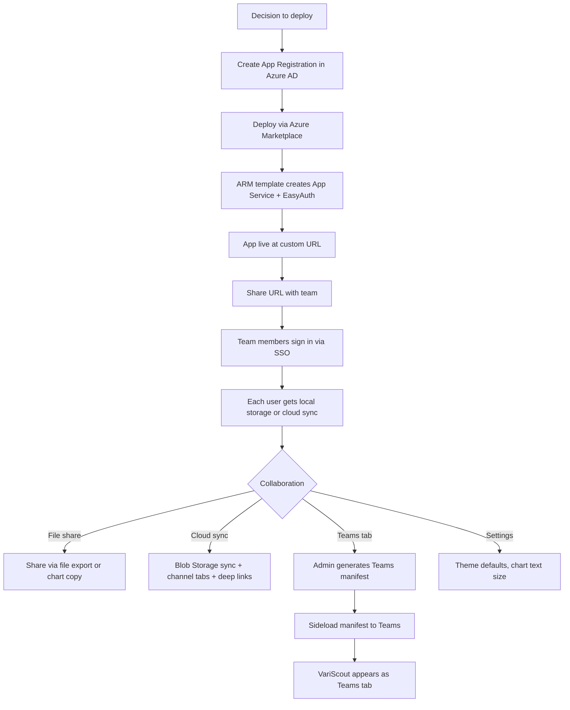
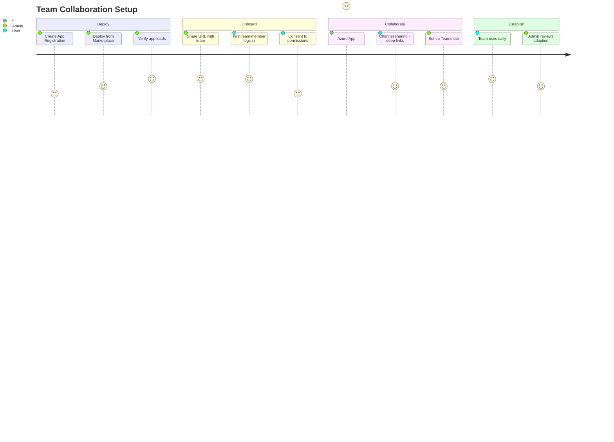

# Flow 8: Azure App — Team Collaboration

> OpEx Olivia deploys VariScout for her team and sets up sharing
>
> **Priority:** Medium - expansion (team adoption after initial deployment)
>
> See also: [Journeys Overview](../index.md) | [Enterprise Evaluation](enterprise.md) | [First Analysis](azure-first-analysis.md)

---

## Persona: OpEx Olivia (Admin)

| Attribute         | Detail                                                  |
| ----------------- | ------------------------------------------------------- |
| **Role**          | OpEx Manager, VariScout deployment owner                |
| **Goal**          | Get the team using VariScout, enable collaboration      |
| **Knowledge**     | Strategic, manages deployment and team access           |
| **Pain points**   | Onboarding friction, IT coordination, Teams integration |
| **Entry point**   | Azure Marketplace or ARM template deployment            |
| **Decision mode** | Admin — configures once, team uses daily                |

### What Olivia is thinking:

- "How do I get this deployed for my team?"
- "Can everyone use their existing Microsoft login?"
- "How do team members share analyses?"
- "Can we put this in Teams so people actually use it?"

---

## Journey Flow

### Mermaid Flowchart



### Team Adoption Journey



---

## Step-by-Step

### 1. Deployment (Admin — One-Time)

The admin (Olivia or IT) deploys VariScout to the organization's Azure tenant.

**Pre-requisite**: Create an App Registration in Azure AD:

| Step | Action                                                                                           |
| ---- | ------------------------------------------------------------------------------------------------ |
| 1    | Go to Azure AD → App Registrations → New                                                         |
| 2    | Name: "VariScout" (or any name)                                                                  |
| 3    | Add redirect URI (configured during deployment)                                                  |
| 4    | API permissions: `User.Read` + `People.Read` (both user-consent, zero admin consent per ADR-059) |
| 5    | Create a client secret                                                                           |
| 6    | Note the Client ID and Client Secret                                                             |

**Deploy from Azure Marketplace:**

1. Find VariScout on Azure Marketplace
2. Click "Create"
3. Enter: app name, region, Client ID, Client Secret
4. _(Optional)_ Check **"Enable AI-powered analysis"** — provisions Azure AI Foundry resources in the same tenant. Select model (GPT-4o-mini default). See [AI Setup](azure-ai-setup.md) for the full admin flow.
5. Deploy — ARM template creates App Service Plan + App Service + EasyAuth config (+ AI resources if enabled)
6. App is live at `https://<app-name>.azurewebsites.net` (~2 minutes)

See [ARM Template](../../08-products/azure/arm-template.md) and [Marketplace Guide](../../08-products/azure/marketplace.md) for details.

### 2. Team Onboarding (Zero Friction)

There is no user provisioning. Anyone in the Azure AD tenant can access the app:

1. Admin shares the App Service URL (email, Teams message, intranet)
2. Team member opens the URL
3. EasyAuth redirects to Azure AD sign-in (existing work account)
4. First-time consent: `User.Read` (user consent only — zero admin consent required per ADR-059)
5. App loads — ready to use

**No separate accounts, no invitations, no license assignment.** The Managed Application covers unlimited users in the tenant.

### 3. Data Storage

All Azure App users share the same storage architecture (single SKU, no plan split):

**Azure App** — local + Blob Storage:

- Projects saved to IndexedDB (browser) + synced to Azure Blob Storage in customer's resource group
- Blob Storage accessed via SAS tokens (`/api/storage-token`); zero admin-consent Graph API permissions
- Offline-first: works without internet, syncs when reconnected

```
Azure Blob Storage (customer's resource group)/
variscout-projects/
├── {projectId}/
│   ├── analysis.json
│   ├── metadata.json
│   └── photos/{findingId}/{photoId}.jpg
└── _index.json
```

See [ADR-059](../../07-decisions/adr-059-web-first-deployment-architecture.md) for the Blob Storage architecture.

### 4. Sharing Analyses

| Sharing method            | How                                                              |
| ------------------------- | ---------------------------------------------------------------- |
| Channel tab (shared .vrs) | Analyses stored in Blob Storage — team members see the same data |
| Teams deep links          | Share chart/finding URLs via Teams chat                          |
| Export and send           | CSV export → email/Teams attachment                              |
| Copy chart                | Copy chart as PNG → paste into email/presentation                |

**Azure App**: Channel tabs provide built-in team collaboration via Blob Storage — all project members access the same analysis. Deep links allow sharing specific charts or findings via Teams chat.

### 5. Teams Integration

The admin can add VariScout as a Teams tab:

1. Open the **Admin Settings** panel in the app
2. Click **Teams Setup** (AdminTeamsSetup component)
3. The app generates a Teams manifest (`manifest.json`) with the correct App Service URL
4. Download the `.zip` package (generated client-side with JSZip)
5. In Teams Admin Center: Upload → Sideload the `.zip`
6. VariScout appears as a Teams tab option

Team members can then add VariScout to any Teams channel as a tab — SSO flows through seamlessly.

### 6. AI-Powered Analysis (Optional)

If the admin enabled AI during deployment, all team members have access to AI-assisted analysis features:

| Feature                | Phase | Description                                                                                          |
| ---------------------- | ----- | ---------------------------------------------------------------------------------------------------- |
| **NarrativeBar**       | 1     | Plain-language summary at dashboard bottom, visible to all users                                     |
| **ChartInsightChip**   | 2     | Per-chart suggestions (e.g., "Drill Machine A (47%)")                                                |
| **CoScoutPanel**       | 3     | Conversational AI for deeper questions                                                               |
| **Knowledge Catalyst** | 2+    | Resolved findings accumulate as searchable organizational knowledge (Blob Storage + Azure AI Search) |
| **Document retrieval** | 3     | CoScoutPanel references team SOPs, fault trees, past investigations via Azure AI Search (Phase 2+)   |
| **Shared AI insights** | 1+    | NarrativeBar and ChartInsightChip visible to all project members viewing the same analysis           |

**Knowledge Catalyst (Phase 2+):** Published investigation reports — with findings, corrective actions, and measured outcomes — are indexed to Azure AI Search in the customer's tenant. CoScoutPanel can answer questions like "Have we seen this pattern before?" by retrieving past investigations on demand. See [ADR-060](../../07-decisions/adr-060-coscout-intelligence-architecture.md) for the architecture (supersedes the earlier SharePoint Knowledge Base approach; Foundry IQ deferred per ADR-059).

**Document retrieval (Phase 3):** CoScoutPanel references quality documents (SOPs, fault trees, control plans) stored in Azure AI Search. Users click "Search Knowledge Base?" in CoScout to trigger on-demand search with per-user Blob Storage permissions.

Each user controls their own AI visibility via the "Show AI assistance" toggle in Settings. AI features are always optional — the app works identically without them.

See [AI Setup](azure-ai-setup.md) for the admin deployment flow and [ADR-019](../../07-decisions/adr-019-ai-integration.md) for the phased rollout plan.

### 7. Settings and Branding

Admin or any user can customize via the Settings panel:

| Setting            | Purpose                                              |
| ------------------ | ---------------------------------------------------- |
| Theme              | Light / Dark / System (per user)                     |
| Chart font scale   | Adjust chart text size (per user)                    |
| Show AI assistance | Show or hide AI components (per user, if configured) |

Settings are stored in browser `localStorage` (per device, not synced).

---

## Data Ownership

All data stays within the customer's Azure tenant — including AI resources:

```
CUSTOMER TENANT                        VARISCOUT (Publisher)
┌──────────────────────┐               ┌────────────────────┐
│                      │               │                    │
│  App Service         │               │  Marketplace       │
│  (hosts the app)     │  ── NO ────▶  │  listing only      │
│                      │  connection   │                    │
│  Azure AD            │               │  No access to:     │
│  (authenticates)     │               │  - Customer data   │
│                      │               │  - User identities │
│  Blob Storage        │               │  - App resources   │
│  (stores analyses)   │               │  - AI prompts/data │
│                      │               │  - Usage telemetry │
│  Azure AI Foundry    │               │                    │
│  (optional, in-tenant) │             │                    │
│                      │               │                    │
└──────────────────────┘               └────────────────────┘
```

When AI is enabled, Azure AI Foundry resources are deployed in the customer's tenant. AI receives only computed statistics (mean, Cpk, violations) — never raw measurement data. GDPR by design.

- Publisher management is disabled — zero access to customer deployment
- No telemetry or outbound calls to publisher systems
- Data survives subscription cancellation (analyses remain on device or in Blob Storage)

---

## Permissions Summary

| Permission    | Type      | Who consents | Purpose                           |
| ------------- | --------- | ------------ | --------------------------------- |
| `User.Read`   | Delegated | Each user    | Display user name & email         |
| `People.Read` | Delegated | Each user    | People picker for team assignment |

**Azure App (single SKU)**: Zero admin-consent Graph API permissions required. `Files.ReadWrite.All` and `Channel.ReadBasic.All` are removed — Blob Storage in the customer's resource group replaces OneDrive/SharePoint sync. See [ADR-059](../../07-decisions/adr-059-web-first-deployment-architecture.md).

---

## Success Metrics

| Metric                            | Target  |
| --------------------------------- | ------- |
| Deployment → first team login     | < 1 day |
| Team members active (month 1)     | > 50%   |
| Analyses saved per user (month 1) | > 3     |
| Teams tab adoption (if set up)    | Track   |
| Blob Storage sync reliability     | Track   |
| Return rate (week 2)              | > 60%   |

---

## See Also

- [Azure App Overview](../../08-products/azure/index.md) — product positioning and pricing
- [How It Works](../../08-products/azure/how-it-works.md) — end-to-end architecture
- [ARM Template](../../08-products/azure/arm-template.md) — deployment resources
- [Authentication](../../08-products/azure/authentication.md) — EasyAuth details
- [Blob Storage Sync](../../08-products/azure/blob-storage-sync.md) — sync and offline behavior
- [AI Setup](azure-ai-setup.md) — admin flow for enabling AI features
- [Enterprise Evaluation](enterprise.md) — how Olivia evaluated before deploying
- [First Analysis](azure-first-analysis.md) — what team members experience on day one
- [Daily Use](azure-daily-use.md) — ongoing workflow
- [ADR-019: AI Integration](../../07-decisions/adr-019-ai-integration.md) — AI architectural decision
