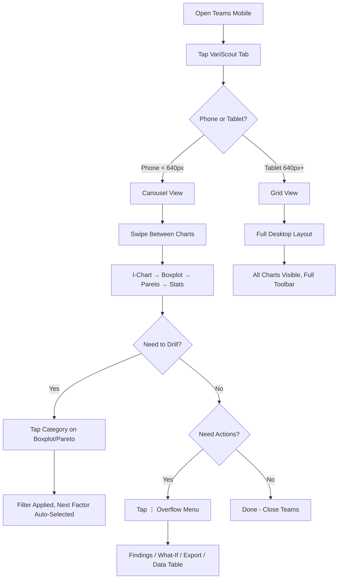

# Azure Teams Mobile Flow

How quality engineers use VariScout on their phones via the Teams mobile app.

---

## Persona

[Field Fiona](../personas/field-fiona.md) — Field Quality Engineer who reviews charts during morning meetings and on the shop floor.

---

## Flow Diagram



---

## Breakpoints

| Viewport            | Layout                            | Navigation                      | Toolbar             | FindingsPanel       |
| ------------------- | --------------------------------- | ------------------------------- | ------------------- | ------------------- |
| < 640px (phone)     | Carousel: 1 chart at a time       | Swipe + pill buttons + chevrons | Save + ⋮ overflow   | Full-screen overlay |
| 640–1024px (tablet) | Grid: charts stacked/side-by-side | Click                           | Full inline toolbar | Resizable sidebar   |
| > 1024px (desktop)  | Grid: optimal layout              | Click + keyboard                | Full inline toolbar | Resizable sidebar   |

---

## Phone Carousel UX

### Navigation

- **Swipe left/right**: Move between 4 views (I-Chart, Boxplot, Pareto, Stats)
- **Pill buttons**: Direct navigation with icons (labels hidden < 400px)
- **Chevron arrows**: Previous/next with 44px touch targets
- **Dot indicators**: Show current position

### What's Shown

- Current chart (full width, maximized)
- Factor selector (Boxplot/Pareto views only)
- Filter breadcrumbs (when filters active, horizontal scroll)
- ANOVA results (below Boxplot)

### What's Hidden on Phone

- Editable chart titles
- Chart export buttons (copy, download, SVG)
- Maximize button (carousel IS full-view)
- Draggable text annotations (replaced by bottom-sheet action menu for highlights + findings)
- FilterContextBar per-card
- Stage column selector
- Selection panel (brush selection is desktop-only)

---

## Toolbar Adaptation

### Phone Header

```
[←] [Project name (truncated)] [💾] [⋮]
```

The ⋮ overflow menu contains:

- Add Data
- Edit Data
- Export CSV
- What-If
- Presentation
- Findings (with count badge)
- Data Table

### Desktop Header

```
[← Back] [Project name] [Sync status] [+ Add Data ▾] [✏️] [⬇️] [🧪 What-If] [🖥️] [📋 Findings] [📊] [💾 Save]
```

---

## Findings on Phone

On phone, the FindingsPanel renders as a **fixed full-screen overlay** instead of a resizable sidebar:

- Triggered from overflow menu or pin button
- Close button (44px touch target) in header
- Same FindingsLog content as desktop
- Popout button hidden (no multi-window on mobile)

---

## Data Panel on Phone

The inline DataPanel is hidden on phone. Instead:

- "Data Table" in overflow menu opens DataTableModal (full-screen modal)
- Point-click → row-highlight sync is disabled (no room for side panel)

---

## Key Design Principles

1. **One thing at a time**: Phone shows a single chart, not a miniaturized dashboard
2. **Native feel**: Swipe gesture matches iOS/Android navigation patterns
3. **Desktop unchanged**: All responsive changes gated by `useIsMobile(640)`
4. **Touch targets**: All interactive elements ≥ 44px (Apple HIG / Material Design)
5. **Progressive disclosure**: Overflow menu keeps actions accessible without cluttering the header
