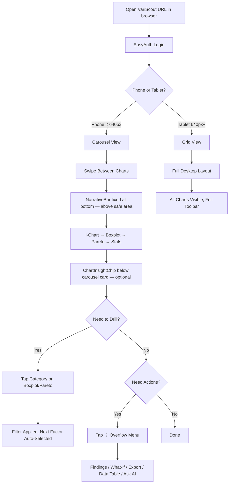

# Azure Mobile Flow

How quality engineers use VariScout on their phones via the mobile browser.

> **Updated (ADR-059):** VariScout is now a web-first application. Mobile access is via the browser (not Teams mobile app). All mobile features work identically in any mobile browser — Safari, Chrome, Edge.

---

## Persona

[Field Fiona](../personas/field-fiona.md) — Field Quality Engineer who reviews charts during morning meetings and on the shop floor.

---

## Flow Diagram



---

## Breakpoints

| Viewport            | Layout                            | Navigation                      | Toolbar             | FindingsPanel       | NarrativeBar (if AI)               |
| ------------------- | --------------------------------- | ------------------------------- | ------------------- | ------------------- | ---------------------------------- |
| < 640px (phone)     | Carousel: 1 chart at a time       | Swipe + pill buttons + chevrons | Save + ⋮ overflow   | Full-screen overlay | Fixed bottom bar (above safe area) |
| 640–1024px (tablet) | Grid: charts stacked/side-by-side | Click                           | Full inline toolbar | Resizable sidebar   | Fixed bottom bar                   |
| > 1024px (desktop)  | Grid: optimal layout              | Click + keyboard                | Full inline toolbar | Resizable sidebar   | Fixed bottom bar                   |

---

## Phone Carousel UX

### Navigation

- **Swipe left/right**: Move between 4 views (I-Chart, Boxplot, Pareto, Stats)
- **Pill buttons**: Direct navigation with icons (labels hidden < 400px)
- **Chevron arrows**: Previous/next with 44px touch targets
- **Dot indicators**: Show current position

### What's Shown

- Current chart (full width, maximized)
- ChartInsightChip below the current carousel card (if AI enabled, one chip per chart)
- Factor selector (Boxplot/Pareto views only)
- Filter breadcrumbs (when filters active, horizontal scroll)
- ANOVA results (below Boxplot)
- NarrativeBar fixed at bottom of screen, above safe area inset (if AI enabled)

### What's Hidden on Phone

- Editable chart titles
- Chart export buttons (copy, download, SVG)
- Maximize button (carousel IS full-view)
- Draggable text annotations (replaced by bottom-sheet action menu for highlights + findings)
- FilterContextBar per-card
- Stage column selector
- Selection panel (brush selection is desktop-only)

---

## Toolbar Adaptation

### Phone Header

```
[←] [Project name (truncated)] [💾] [⋮]
```

The ⋮ overflow menu contains:

- Add Data
- Edit Data
- Export CSV
- What-If
- Presentation
- Findings (with count badge)
- Data Table
- Ask AI (if AI enabled — opens CoScoutPanel)

### Desktop Header

```
[← Back] [Project name] [Sync status] [+ Add Data ▾] [✏️] [⬇️] [🧪 What-If] [🖥️] [📋 Findings] [📊] [💾 Save]
```

---

## Findings on Phone

On phone, the FindingsPanel renders as a **fixed full-screen overlay** instead of a resizable sidebar:

- Triggered from overflow menu or pin button
- Close button (44px touch target) in header
- Same FindingsLog content as desktop
- Popout button hidden (no multi-window on mobile)

---

## AI on Phone

When AI is configured and the user toggle is ON, three components adapt to the phone layout:

| Component            | Phone Layout                                                                                                                                                                               |
| -------------------- | ------------------------------------------------------------------------------------------------------------------------------------------------------------------------------------------ |
| **NarrativeBar**     | Fixed at bottom of screen, above safe area inset. 48px collapsed height (tap to expand up to 96px / 3 lines). Single line with text truncation. "Ask →" button at right edge.              |
| **ChartInsightChip** | Displayed below the current carousel card. One chip per chart view. Dismissable.                                                                                                           |
| **CoScoutPanel**     | Opens as **full-screen overlay** (same pattern as FindingsPanel on phone). Close button with 44px touch target. Triggered from NarrativeBar "Ask →" button or overflow menu "Ask AI" item. |

When AI is unavailable (no endpoint, toggle off, offline with no cache), all three components are hidden. The phone layout is identical to a non-AI deployment.

---

## Data Panel on Phone

The inline DataPanel is hidden on phone. Instead:

- "Data Table" in overflow menu opens DataTableModal (full-screen modal)
- Point-click → row-highlight sync is disabled (no room for side panel)

---

## Offline Sync Indicator on Phone

When offline or sync is in progress, show a status icon in the phone toolbar area alongside the overflow menu.

| State      | Icon            | Color            | Tooltip                      |
| ---------- | --------------- | ---------------- | ---------------------------- |
| Synced     | Cloud check     | `text-green-500` | "All changes saved"          |
| Syncing    | Cloud + spinner | `text-blue-400`  | "Syncing..."                 |
| Offline    | Cloud off       | `text-amber-500` | "Working offline"            |
| Sync error | Cloud alert     | `text-red-400`   | "Sync failed — tap to retry" |

**Phone header with sync indicator:**

```
[←] [Project name (truncated)] [☁️] [💾] [⋮]
```

The sync icon (☁️) is 20px, positioned between the project name and save button. Tap opens a brief toast with sync details. Only shown on Azure Team plan (`isTeamPlan()`).

---

## ColumnMapping Phone Optimization

On phone (<640px), the ColumnMapping dialog adapts for touch-first interaction.

| Element                 | Desktop                           | Phone                             |
| ----------------------- | --------------------------------- | --------------------------------- |
| Spec limits section     | Collapsible (expanded by default) | Accordion (collapsed by default)  |
| "Start Analysis" button | Bottom of dialog                  | Sticky at bottom of viewport      |
| Column cards            | Standard size                     | Larger tap targets (min-h-[56px]) |
| Preview table           | Collapsible                       | Hidden (saves vertical space)     |

The sticky "Start Analysis" button uses `position: sticky; bottom: env(safe-area-inset-bottom)` to remain accessible as the user scrolls through column cards.

---

## Report View on Phone

When the user opens the Scouting Report on a phone viewport:

- **Navigation**: The sidebar TOC is hidden (`hidden lg:flex`). A `<select>` dropdown appears in the header bar after the report type badge, listing all sections with status indicators (checkmark = done, dot = active, circle = future). Tapping a section scrolls to it.
- **Charts**: Report chart snapshots use responsive width (`Math.min(containerWidth - 48, 720)`) measured via `ResizeObserver`. Charts scale down to fit the viewport without horizontal scroll.
- **Layout**: Sections stack vertically in a single column. Each section is collapsible (`defaultOpen` for done/active, collapsed for future).
- **Copy/Share**: The sidebar copy/share buttons are hidden. Users can still copy individual sections via the section header button.

---

## Verification (Staged Comparison) on Phone

- **StagedComparisonCard**: The comparison table may overflow on narrow screens. The card container should use `overflow-x-auto` to allow horizontal scrolling for 3+ stages.
- **Verification charts**: Rendered at responsive width (same as report charts). Interactive elements are disabled (`pointerEvents: 'none'`) — these are read-only snapshots.
- **Chart toggles**: The verification evidence toggle chips wrap naturally via `flex-wrap`.

---

## Investigation Workflow on Phone

The full 5-status investigation workflow (observed → investigating → analyzed → improving → resolved) works on phone:

- **Status transitions**: FindingStatusBadge dropdown works via tap (no hover dependency).
- **Action buttons**: All hover-dependent buttons (edit, delete, ask CoScout, share, assign) are always visible on touch devices via the `touch-show` CSS class.
- **Hypothesis section**: Collapsible within FindingCard, works normally on touch.
- **Improvement ideas**: Idea action buttons (effort, project, remove) always visible on touch. Add-idea input works normally.
- **Action items**: Action buttons (ask CoScout, delete) always visible on touch. Checkbox completion works normally.
- **Outcome recording**: Three outcome buttons (Effective / Not Effective / Partially Effective) are full tap targets.
- **CoScout integration**: "Ask CoScout" buttons open CoScoutPanel as full-screen overlay (same pattern as FindingsPanel on phone).
- **Assigned to me**: Toggle button (person icon) in FindingsPanel header filters to only show findings and action items assigned to the current user. Badge count updates to reflect filtered results.

---

## Key Design Principles

1. **One thing at a time**: Phone shows a single chart, not a miniaturized dashboard
2. **Native feel**: Swipe gesture matches iOS/Android navigation patterns
3. **Desktop unchanged**: All responsive changes gated by `useIsMobile(640)`
4. **Touch targets**: All interactive elements ≥ 44px (Apple HIG / Material Design)
5. **Progressive disclosure**: Overflow menu keeps actions accessible without cluttering the header
