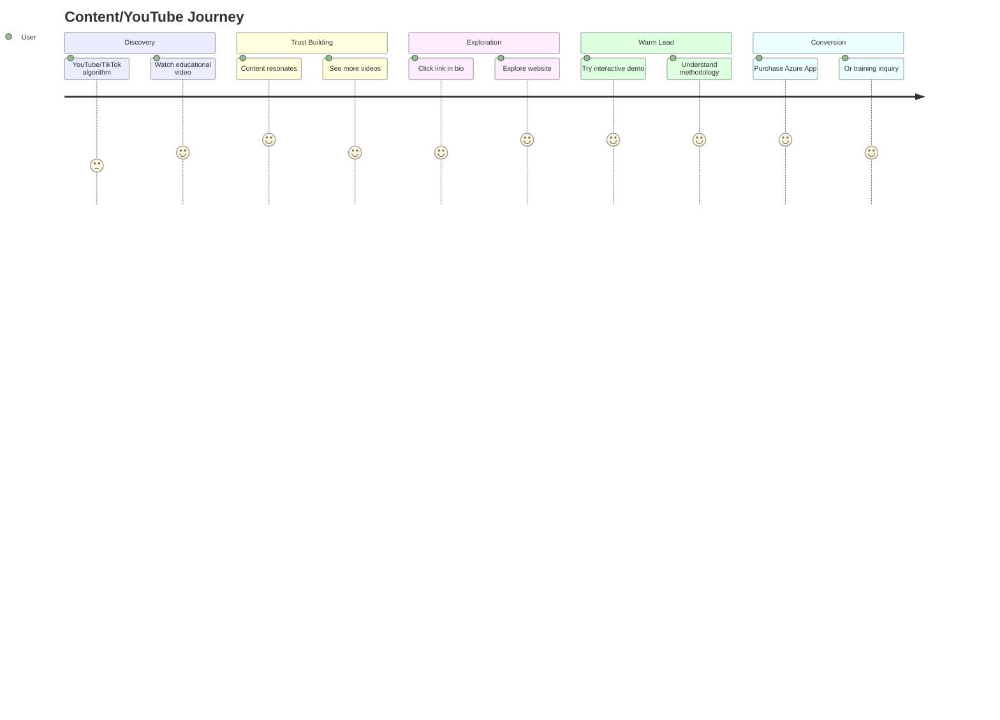
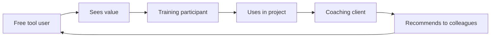

# Flow 3: YouTube/Content → Website → Product

> Curious Carlos discovers VaRiScout through content, builds trust, converts
>
> **Priority:** High - authority building + warm leads
>
> See also: [Journeys Overview](../index.md)

---

## Persona: Curious Carlos (Content Path)

| Attribute          | Detail                                            |
| ------------------ | ------------------------------------------------- |
| **Role**           | Operations Supervisor                             |
| **Goal**           | Understand variation better                       |
| **Knowledge**      | Interested but not formally trained               |
| **Content need**   | Visual explanations, real examples                |
| **Entry points**   | YouTube search, TikTok For You, Instagram Explore |
| **Trust building** | Needs multiple touchpoints before converting      |

### What Carlos is thinking:

- "This guy explains it in a way I can understand"
- "I've seen a few of his videos now"
- "Maybe I should try that tool he uses"

---

## The Content Engine

```
1 VIDEO (Jukkis talking, 5-10 min)
        │
        ├── YouTube (full video)
        ├── Blog post (transcript + expansion)
        ├── LinkedIn posts (2-3 per week)
        ├── TikTok clips (3-5 per video)
        └── Instagram reels + carousel
```

Every piece of content leads back to the website.

---

## Entry Points

| Platform          | Content Type            | Lands On            |
| ----------------- | ----------------------- | ------------------- |
| YouTube search    | "how to read I-chart"   | /tools/i-chart      |
| YouTube suggested | VaRiScout tutorial      | /blog/X or /        |
| TikTok clip       | "AI vs I-Chart" hook    | / or /tools/i-chart |
| Instagram reel    | Quick chart explanation | /tools/X            |
| LinkedIn post     | Thought leadership      | /blog/X or /cases/X |

---

## Journey Flow

### Mermaid Flowchart

```mermaid
flowchart TD
    A[YouTube Search OR<br/>TikTok/IG Algorithm] --> B[VaRiScout Content<br/>Educational video with demo]
    B --> C[Video CTA<br/>'Try VaRiScout']
    C --> D{Landing Page}
    D -->|Blog| E[/blog post]
    D -->|Tool| F[/tools/X]
    E --> G{Explore}
    F --> G
    G -->|Try demo| H[Interactive exploration]
    G -->|Read more| I[Deeper content]
    H --> J[/products]
    I --> J
    J --> K{Outcome}
    K --> L[CONVERSION]
    K --> M[TRAINING INQUIRY]
```

### User Satisfaction Journey



### The Content Flywheel



### ASCII Reference

```
┌─────────────────┐
│ YouTube Search  │
│ "how to read    │
│  control chart" │
│       OR        │
│ TikTok/IG clip  │
│ "AI vs I-Chart" │
└────────┬────────┘
         │
         ▼
┌─────────────────┐
│ VaRiScout       │
│ Content         │
│                 │
│ Educational     │
│ video/clip      │
│ with demo       │
└────────┬────────┘
         │
         ▼
┌─────────────────┐
│ Video CTA:      │
│ "Try VaRiScout" │
│ Link in bio/    │
│ description     │
└────────┬────────┘
         │
    ┌────┴────┐
    │         │
    ▼         ▼
┌────────┐ ┌────────────┐
│ /blog  │ │ /tools/X   │
│ (post) │ │            │
└────┬───┘ └─────┬──────┘
     │           │
     │    ┌──────┴──────┐
     │    │             │
     │    ▼             ▼
     │ ┌────────┐ ┌────────────┐
     │ │Try demo│ │ Deeper     │
     │ │        │ │ content    │
     │ └────┬───┘ └─────┬──────┘
     │      │           │
     └──────┼───────────┘
            │
            ▼
   ┌─────────────────┐
   │ /products       │
   │                 │
   │ Warm from video │
   │ Ready to try    │
   └────────┬────────┘
            │
            ▼
   ┌─────────────────┐
   │ CONVERSION      │
   │       OR        │
   │ TRAINING        │
   │ INQUIRY         │
   └─────────────────┘
```

---

## Weekly Content Cycle

| Day           | Content                                           |
| ------------- | ------------------------------------------------- |
| **Monday**    | YouTube video + Blog post + LinkedIn announcement |
| **Tuesday**   | LinkedIn post #1 + TikTok clip #1                 |
| **Wednesday** | Instagram carousel + TikTok clip #2               |
| **Thursday**  | LinkedIn post #2 + TikTok clip #3                 |
| **Friday**    | LinkedIn post #3 (engagement/discussion)          |

---

## The Flywheel

```
Free tool user
      ↓
Sees value, wants to learn more
      ↓
Training participant (GB course)
      ↓
Uses tool in real project (at gemba)
      ↓
Needs coaching support
      ↓
Coaching client (explore data together)
      ↓
Recommends to colleagues → New free tool users
```

Content → Tool → Training → Coaching → Referral → Content

---

## CTAs in Content

| Platform  | CTA                           | Destination           |
| --------- | ----------------------------- | --------------------- |
| YouTube   | "Try VaRiScout" (description) | variscout.com/app     |
| YouTube   | "Read more" (description)     | variscout.com/blog/X  |
| TikTok    | "Link in bio"                 | variscout.com         |
| Instagram | "Link in bio"                 | variscout.com         |
| LinkedIn  | Direct link in post           | variscout.com/cases/X |
| Blog post | "Try it yourself"             | /app                  |
| Blog post | "Get the full course"         | RDMAIC training link  |

---

## Content to Website Links

| Content Topic            | Website Page       | Reason                |
| ------------------------ | ------------------ | --------------------- |
| "How to read I-Chart"    | /tools/i-chart     | Deep dive + demo      |
| "Boxplot interpretation" | /tools/boxplot     | Interactive learning  |
| "The 46% story"          | /cases/bottleneck  | Full case study       |
| "Four Lenses method"     | /learn/four-lenses | Methodology deep dive |
| "AI vs EDA"              | /blog/ai-vs-eda    | Thought leadership    |
| General awareness        | /                  | Full journey          |

---

## Mobile Considerations

- Most TikTok/Instagram traffic is mobile
- Landing pages must load fast (<3s)
- Demo must work on phone
- Single prominent CTA
- No friction to /app

---

## Success Metrics

| Metric                             | Target |
| ---------------------------------- | ------ |
| YouTube → Website (UTM)            | >5%    |
| TikTok/IG → Website (UTM)          | >2%    |
| Content viewers → Product page     | >10%   |
| Content viewers → Training inquiry | Track  |
| Blog post → Email capture          | >3%    |

---

## UTM Tracking

Standard UTM structure:

```
?utm_source=youtube&utm_medium=video&utm_campaign=ichart-tutorial
?utm_source=tiktok&utm_medium=clip&utm_campaign=ai-vs-eda
?utm_source=linkedin&utm_medium=post&utm_campaign=weekly-content
```

Track:

- Source platform
- Content type
- Specific campaign/topic

---

## Related Documents

- [Social Discovery Flow](./social-discovery.md) - Social case discovery flow
