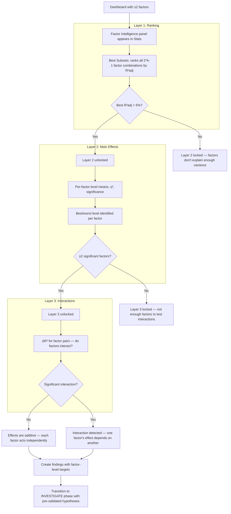
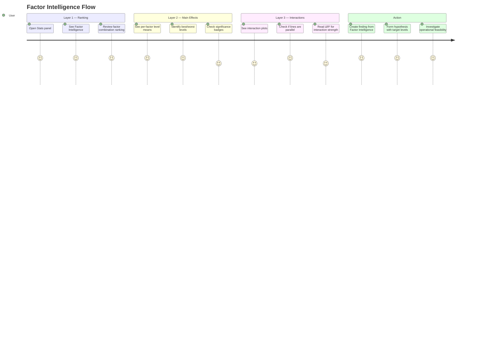

# Flow: Factor Intelligence

> **Supersession note (ER-2, 2026-06-11):** the η² ranking previously surfaced inside `FactorIntelligencePanel` (Stats sidebar) re-homes to the Explore factor strip, which ranks all candidate factors by ω²-adjusted η² on the default surface. `FactorIntelligencePanel` retires in ER-7. The multi-factor combination ranking (R²adj layers below) moves to the model drawer (ER-3).

> Green Belt Gary uses Factor Intelligence to systematically identify which factors matter, how they affect the outcome, and whether they interact — before forming hypotheses.
>
> **Priority:** High — accelerates the SCOUT-to-INVESTIGATE transition
>
> See also: [Analysis Journey Map](../../03-features/workflows/analysis-journey-map.md) | [ADR-052](../../07-decisions/adr-052-factor-intelligence.md)

---

## Persona: Green Belt Gary

| Attribute       | Detail                                                               |
| --------------- | -------------------------------------------------------------------- |
| **Role**        | Quality Engineer, Green Belt certified                               |
| **Goal**        | Identify the right factors to investigate — skip dead ends           |
| **Knowledge**   | Knows ANOVA basics, comfortable with η² and p-values                 |
| **Pain points** | Drill-down loop is slow, misses factor combinations, no interactions |
| **Entry point** | Dashboard with ≥2 factors mapped and data loaded                     |

### What Gary is thinking:

- "I've got 5 factors — which combination explains the most variation?"
- "Is Supplier really the biggest driver, or is it Machine?"
- "Does Supplier's effect change depending on which Machine is used?"
- "What factor levels should I target for improvement?"

---

## Prerequisites

Factor Intelligence activates automatically when:

- ≥ 2 categorical factors are mapped
- 1 numeric outcome is selected
- Data has been loaded (≥ 5 observations)

No user action needed to enable it — it appears in the **Stats panel** (sidebar or mobile stats view).

---

## Journey Flow

### Mermaid Flowchart

### User Journey Diagram

---

## Step-by-Step

### 1. Review Factor Ranking (Layer 1)

Gary opens the Stats panel and sees the **Factor Intelligence** header with layer progress dots (🔵⚫⚫). Layer 1 shows all factor combinations ranked by R²adj:

| Rank | Factors                    | R²adj |
| ---- | -------------------------- | ----- |
| 1    | Supplier + Machine         | 78.3% |
| 2    | Supplier + Machine + Shift | 77.1% |
| 3    | Supplier                   | 62.5% |
| 4    | Machine                    | 15.8% |

**Insight:** Supplier + Machine together explain 78% — Shift adds almost nothing. This immediately narrows the investigation scope from 3 factors to 2.

### 2. Understand Main Effects (Layer 2)

If R²adj > 5%, Layer 2 unlocks (🔵🟢⚫). Gary sees per-factor panels with:

- Connected dots showing level means (steeper slope = bigger effect)
- Green dot for best level, red for worst
- η² and p-value badges
- Range indicator (max − min)

**Insight:** Supplier A gives mean=95, Supplier C gives mean=54 (range=41). Machine M2 outperforms M1 by 8 units. Effect range immediately suggests which factor to prioritize.

### 3. Check Interactions (Layer 3)

If ≥2 significant main effects exist, Layer 3 unlocks (🔵🟢🟡). Gary sees interaction plots:

- Multi-line chart (Factor A on x-axis, Factor B as line series)
- Parallel lines = no interaction (additive effects)
- Crossing or diverging lines = interaction

**Insight:** If Supplier A is equally better on both machines, the effects are additive — improve either one independently. If A is only better on M2, that's an interaction — the improvement target becomes _both_ Supplier A _and_ Machine M2.

### 4. Transition to Investigation

From Factor Intelligence, Gary has evidence-based answers to three questions:

1. **Which** factors matter? → Best subsets ranking
2. **How** does each affect outcome? → Main effects with target levels
3. **Do they interact?** → Interaction analysis

He creates a finding (e.g., _"Supplier C on Machine M1 produces lowest yield"_) and transitions to INVESTIGATE with:

- Pre-validated hypothesis (statistically confirmed)
- Specific factor levels to change (Supplier C→A, Machine M1→M2)
- Focus on _operational feasibility_ rather than _is this real?_

---

## UI Components

| Component                 | Location      | Purpose                        |
| ------------------------- | ------------- | ------------------------------ |
| `FactorIntelligencePanel` | Stats sidebar | Container with evidence gating |
| `BestSubsetsCard`         | Layer 1       | Factor combination ranking     |
| `MainEffectsPlot`         | Layer 2       | Per-factor level means chart   |
| `InteractionPlot`         | Layer 3       | Multi-line interaction chart   |

All render in the Stats sidebar, mobile Stats view, and presentation mode.

---

## Evidence Gating Rules

| Gate          | Condition              | If Not Met                             |
| ------------- | ---------------------- | -------------------------------------- |
| Layer 2 opens | R²adj > 5%             | Message: "unlocks when R²adj > 5%"     |
| Layer 3 opens | ≥2 significant factors | Message: "unlocks when ≥2 significant" |

These gates prevent premature conclusions — analysts must pass through the teaching progression.

---

## Success Metrics

| Metric                                       | Target |
| -------------------------------------------- | ------ |
| Layer 2 unlocked in sessions with ≥2 factors | > 70%  |
| Time from data load to first factor insight  | < 30s  |
| Findings created from Factor Intelligence    | Track  |
| Hypotheses with specific target levels       | Track  |

---

## See Also

- [Analysis Journey Map](../../03-features/workflows/analysis-journey-map.md) — the 4-phase journey context
- [ADR-052: Factor Intelligence](../../07-decisions/adr-052-factor-intelligence.md) — design decision
- [Factor Intelligence Design Doc](../../archive/discussions/2026-03-29-factor-intelligence-design.md) — full 5-layer vision
- [Azure Daily Use](azure-daily-use.md) — how Factor Intelligence fits into daily analysis
- [Azure First Analysis](azure-first-analysis.md) — first-time user experience
