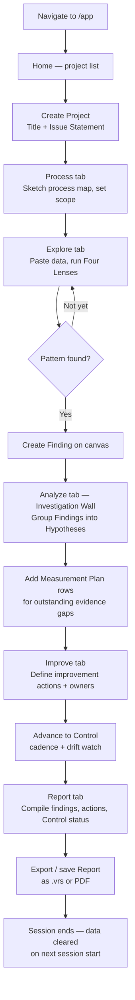

# PWA Solo Investigation (Mode-1)

> **Mode-1** — single-user solo investigation in the free PWA. No invite, no collaborators, no sign-off. Collaboration affordances and sign-off are Azure-only features gated by the `collaboratedAt` invite marker; they are hidden when the Project has never had a second member.

See also: [User Flows index](index.md), [PWA Education Flow](pwa-education.md), [First-Time Explorer Flow](first-time.md).

---

## Persona

| Attribute       | Detail                                                                        |
| --------------- | ----------------------------------------------------------------------------- |
| **Role**        | Improvement specialist — solo analyst (GB / BB / CI engineer)                 |
| **Goal**        | Run a structured investigation on their own data; produce a shareable Report  |
| **Knowledge**   | Familiar with variation analysis; may be new to VariScout                     |
| **Entry point** | Direct to the PWA at `/app`; no sign-in required                              |
| **Constraints** | Session-only storage (no cloud persist); no team collaboration; no CoScout AI |

### What they are thinking

- "I have a dataset and a problem — I need to figure out what's driving variation."
- "I don't need a team right now. I just need to work through this systematically."
- "Can I export this so I can share it later?"

---

## Journey Flow



### Sequence across the 7-tab nav

```mermaid
sequenceDiagram
    actor Solo as Solo Analyst
    participant Home
    participant Project
    participant Process
    participant Explore
    participant Analyze
    participant Improve
    participant Report

    Solo->>Home: Open PWA (no sign-in)
    Solo->>Project: Create Project — title + issue statement
    Note over Project: No Charter ceremony.<br/>Project = single-user collaboration<br/>via invite when ready (Azure only).
    Solo->>Process: Sketch process map, set scope dimensions
    Solo->>Explore: Paste data; run Four Lenses
    Note over Explore: Linked filtering active.<br/>Solo finds patterns, creates Findings.
    Solo->>Analyze: Group Findings into Hypotheses on the Wall
    Note over Analyze: Measurement Plans capture<br/>outstanding evidence gaps.
    Solo->>Improve: Define improvement actions, owners, dates
    Note over Improve: Active-IP cascade scopes<br/>upstream tabs to this Project.
    Solo->>Improve: Advance to Control (cadence + drift watch)
    Solo->>Report: Compile findings, actions, Control status
    Solo->>Report: Export Report (.vrs / PDF)
    Note over Report: Sign-off section hidden<br/>(no collaboratedAt marker — solo mode).
```

---

## What is hidden in Mode-1 (solo)

The following surfaces are collaboration affordances that only appear once the Project has a second member (i.e., after an invite has been accepted on the Azure tier, which sets the `collaboratedAt` marker):

| Surface                  | Solo PWA behavior                    | Azure collaborative behavior                          |
| ------------------------ | ------------------------------------ | ----------------------------------------------------- |
| Sign-off section         | Hidden (no `collaboratedAt` marker)  | Visible; optional, non-blocking; acting user approves |
| Member roster invite CTA | Not present (PWA has no invite flow) | Present; invite adds member immediately               |
| Sponsor role             | Not applicable                       | Identity + notification label; not an ACL gate        |
| CoScout AI panel         | Not available (PWA free tier)        | Available on Azure tenant SKU                         |
| Cloud sync               | Not available (session-only storage) | Blob Storage sync per ADR-059                         |

> **Design rationale:** sign-off is an Azure collaboration affordance. Making it visible when the analyst is working alone would add irrelevant UI with no actionable path. The `collaboratedAt` field (set once on the first invite, never cleared) is the predicate that gates the section. See [ADR-082](../../07-decisions/adr-082-wedge-architecture.md) and the [IM-7 decision-log entry](../../decision-log.md).

---

## Data persistence (PWA)

The PWA does **not** persist data between sessions. Closing the browser tab loses all work. This is by design — the PWA is a free learning and solo-investigation tool, not a production environment.

| What is available    | Where             | Retention                           |
| -------------------- | ----------------- | ----------------------------------- |
| Current analysis     | In-memory (React) | Current session only                |
| Active Project state | IndexedDB (local) | Until browser storage is cleared    |
| Theme preference     | localStorage      | Persists across sessions            |
| Service Worker cache | Cache API         | App loads offline after first visit |

Analysts who need durable storage, team collaboration, or CoScout AI should use the [Azure App](azure-team-collaboration.md).

---

## Upgrade path to Azure

A solo analyst hits the natural ceiling of Mode-1 when they need to:

- **Save and share work** beyond a single session
- **Invite a team member** (Member / Sponsor) for review
- **Use CoScout AI** for hypothesis context and auto-fire signals
- **Get out-of-band sign-off** tracked and recorded in the Report

| Trigger            | What the analyst sees                                        |
| ------------------ | ------------------------------------------------------------ |
| Hits session limit | Upgrade context: "Save and sync with Azure App"              |
| Needs team review  | Upgrade context: "Invite your team with Azure App"           |
| Wants CoScout AI   | Upgrade context: "CoScout available on the Azure tenant SKU" |

The upgrade path is helpful, not blocking. The PWA solo flow is pedagogically complete — the analyst can produce a full Report. Collaboration is the ceiling, not the entry requirement.

---

## Success signals

A solo investigation has succeeded when:

- **Problem is framed.** Process map sketched; scope dimensions set; issue statement written.
- **Variation located.** At least one Finding created from canvas exploration.
- **Hypotheses structured.** Findings grouped into Hypotheses on the Investigation Wall; evidence gaps logged as Measurement Plan rows.
- **Actions committed.** Each action has an owner, target date, and acceptance signal on the Improve tab.
- **Report exportable.** Findings, actions, and Control status compile into a shareable Report.

---

## Related flows

- [First-Time Explorer Flow](first-time.md) — onboarding moment for brand-new users
- [PWA Education Flow](pwa-education.md) — training-room use with sample datasets
- [Azure — First Analysis](azure-first-analysis.md) — same investigation with durable storage + CoScout
- [Azure — Team Collaboration](azure-team-collaboration.md) — Mode-2 collaborative flow (invite, sign-off, Sponsor review)
