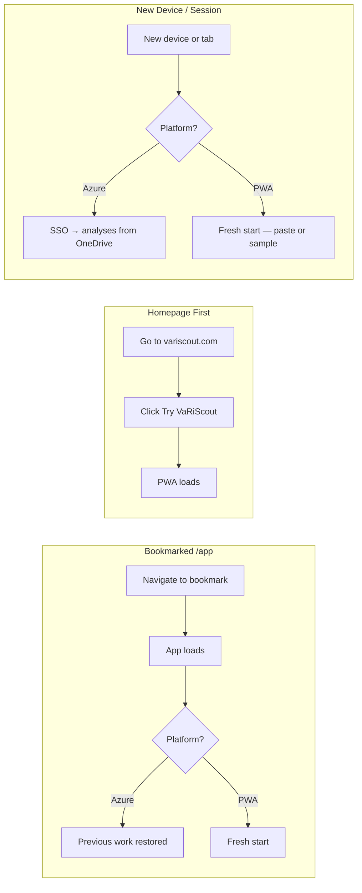
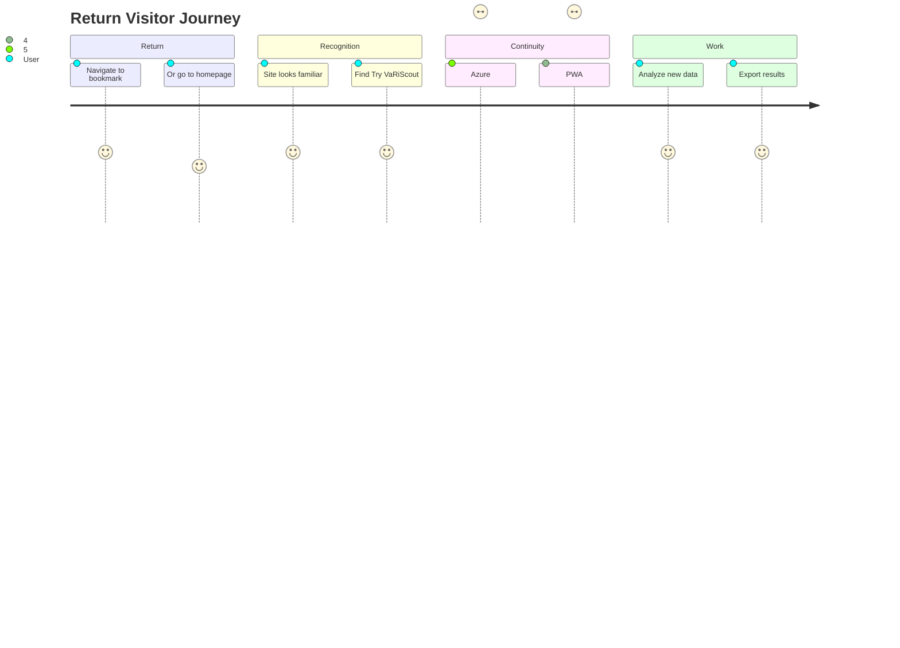

# Flow 5: Return Visitor → App

> Existing user returns to use VaRiScout
>
> **Priority:** Medium - retention/activation
>
> See also: [Journeys Overview](../index.md) for site architecture

---

## Persona: Return Visitor

| Attribute       | Detail                            |
| --------------- | --------------------------------- |
| **Role**        | Any previous user                 |
| **Goal**        | Use VaRiScout with their data     |
| **Knowledge**   | Already knows what VaRiScout is   |
| **Entry point** | Bookmark, direct URL, or homepage |
| **Need**        | Quick access, no friction         |

### What they're thinking:

- "I need to analyze this data"
- "Where's the app again?"
- "Did my previous work save?"

---

## Entry Points

| Source              | URL       | Intent          |
| ------------------- | --------- | --------------- |
| Bookmark (ideal)    | /app      | Direct to PWA   |
| Bookmark (homepage) | /         | Navigate to app |
| Browser history     | / or /app | Return to work  |

---

## Journey Flow

### Mermaid Flowchart

```mermaid
flowchart TD
    A[Direct URL or Bookmark] --> B{Entry Point}
    B -->|Direct| C[/app - PWA loads]
    B -->|Homepage| D[/ Homepage]
    D --> E[Clicks Try VaRiScout]
    E --> C
    C --> F{Platform?}
    F -->|Azure App| G[Previous analyses restored]
    F -->|PWA| H[Fresh start — paste or sample]
    G --> I[Continue working]
    H --> I
```

### Return Visitor Scenarios



### User Satisfaction Journey



### ASCII Reference

```
┌─────────────────┐
│ Direct URL or   │
│ Bookmark        │
└────────┬────────┘
         │
    ┌────┴────┐
    │         │
    ▼         ▼
┌────────┐ ┌─────────────────┐
│ /app   │ │ / (Homepage)    │
│        │ │                 │
│ Direct │ │ "I know what    │
│ to PWA │ │ this is"        │
└────────┘ └────────┬────────┘
                    │
                    ▼
           ┌─────────────────┐
           │ Clicks:         │
           │                 │
           │ [Try VaRiScout] │
           └────────┬────────┘
                    │
                    ▼
           ┌─────────────────┐
           │ /app loads      │
           │                 │
           │ Azure: previous │
           │ work restored   │
           │ PWA: fresh start│
           └─────────────────┘
```

---

## Key Design Principles

### 1. No Login Required

VaRiScout is 100% client-side:

- Auth state stored locally (EasyAuth for Azure App)
- Data stored in IndexedDB
- No server-side accounts
- "We don't have your data" (GDPR simple)

### 2. Fast Access from Homepage

Header CTA always visible:

```
[Logo: VaRiScout]  Journey  Cases  Tools ▼  Learn ▼  Pricing  [Try VaRiScout]
```

Return visitors click [Try VaRiScout] → straight to /app

---

## Data Persistence

### PWA (Session-Only)

The PWA does **not** persist data between sessions. Closing the browser tab loses all work. This is by design — the PWA is a free training tool, not a production environment.

| What's Available     | Where             | Retention                           |
| -------------------- | ----------------- | ----------------------------------- |
| Current analysis     | In-memory (React) | Current session only                |
| Theme preference     | localStorage      | Persists across sessions            |
| Service Worker cache | Cache API         | App loads offline after first visit |

Users who need persistence should use the [Azure App](azure-daily-use.md).

### Azure App

| What's Saved      | Where           | Retention     |
| ----------------- | --------------- | ------------- |
| Auth session      | EasyAuth/cookie | Until cleared |
| Saved analyses    | IndexedDB       | Until deleted |
| Analysis settings | IndexedDB       | Per dataset   |
| Cloud backup      | OneDrive        | User-managed  |

See [Azure Daily Use](azure-daily-use.md) for the Azure return experience.

---

## Return User Scenarios

### Scenario A: Bookmarked /app

1. User navigates to bookmark
2. App loads immediately
3. **Azure App:** Previous analyses restored from IndexedDB
4. **PWA:** Fresh start — paste data or load a sample
5. Continue working

### Scenario B: Homepage First

1. User goes to variscout.com
2. Sees familiar homepage
3. Clicks [Try VaRiScout]
4. **Azure App:** Previous work restored. **PWA:** Fresh start.

### Scenario C: New Device / New Session

1. User goes to variscout.com on new device (or returns after closing the tab)
2. **Azure App:** Signs in via SSO — saved analyses load from OneDrive
3. **PWA:** Fresh start — no previous data (session-only, no persistence)
4. PWA users paste data or load a sample to begin again

---

## Navigation for Return Visitors

The header is the same for everyone:

```
[Logo]  Journey  Cases  Tools ▼  Learn ▼  Pricing  [Try VaRiScout]
```

But return visitors:

- Ignore most navigation
- Go straight to [Try VaRiScout]
- May check /cases for new content
- May check /pricing for upgrade

---

## Upgrade Path

For free tier users returning:

| Trigger              | Prompt                                         |
| -------------------- | ---------------------------------------------- |
| File upload attempt  | "Upload files with Azure App — from €79/month" |
| Save/project attempt | "Save projects with Azure App"                 |
| Performance Mode     | "Performance Mode available in Azure App"      |

Upgrade prompts should be helpful, not blocking.

---

## CTAs for Return Visitors

| Location           | CTA               | Purpose       |
| ------------------ | ----------------- | ------------- |
| Header (all pages) | [Try VaRiScout]   | Direct to app |
| PWA (free)         | [Try Azure App]   | Conversion    |
| Cases (new)        | "New case study!" | Re-engagement |
| Blog (new)         | "New content"     | Re-engagement |

---

## Mobile Considerations

- Mobile bookmark works same as desktop
- Data syncs locally only (no cloud)
- Touch-optimized app experience

---

## Success Metrics

| Metric                        | Target |
| ----------------------------- | ------ |
| Return visitor → /app         | >80%   |
| Session frequency (returners) | Track  |
| Free → Paid conversion        | >5%    |
| Data retention (IndexedDB)    | Verify |

---

## Azure App Return Experience

Azure App return visitors have a fundamentally different experience from PWA users — SSO, saved analyses, and OneDrive sync.

For the full Azure return workflow, see [Azure Daily Use](azure-daily-use.md). Key differences:

| Aspect          | PWA Return                   | Azure App Return                         |
| --------------- | ---------------------------- | ---------------------------------------- |
| Authentication  | None                         | SSO auto-login (EasyAuth session cookie) |
| Previous work   | Lost (session-only)          | Loads from IndexedDB / OneDrive          |
| Data input      | Paste, manual entry, samples | Upload, paste, manual entry, samples     |
| Upgrade prompts | Yes (at capability limits)   | N/A (full features)                      |

---

## Free-to-Paid Upgrade Journey

PWA users hit natural capability limits that signal readiness for the Azure App. The upgrade path should feel helpful, not blocking.

### Upgrade Triggers

| Trigger                   | What happens                         | Upgrade message                              |
| ------------------------- | ------------------------------------ | -------------------------------------------- |
| Performance Mode detected | Modal appears, dismisses immediately | "Performance Mode is available in Azure App" |
| Factor limit (3) reached  | ColumnMapping caps at 3 factors      | "Analyze up to 6 factors with Azure App"     |
| File upload attempted     | Not available in PWA                 | "Upload files with Azure App"                |
| Session data loss         | User returns, data is gone           | "Save and sync with Azure App"               |

### Conversion Path

```
PWA user hits limit → sees upgrade context → visits website /pricing → Azure Marketplace → deploys
```

The `HomeScreen` (`apps/pwa/src/components/HomeScreen.tsx`) includes a subtle "Need team features?" link to the website, reinforcing that the Azure App exists without interrupting the free training experience.

---

## Technical Notes

### Storage by Platform

**PWA:** Session-only — all analysis data lives in React state. Closing the tab loses everything. Theme preference persists via localStorage.

**Azure App:** IndexedDB for local persistence, OneDrive for cloud sync. Auth tokens managed by EasyAuth (platform-level). Clear browser data = lose local cache, but OneDrive backup remains.

### No Account Migration Needed

Since there are no accounts:

- New device = fresh start (Azure App: sign in via SSO; PWA: paste data fresh)
- No "forgot password" flow
- No email verification
- Privacy-friendly design
