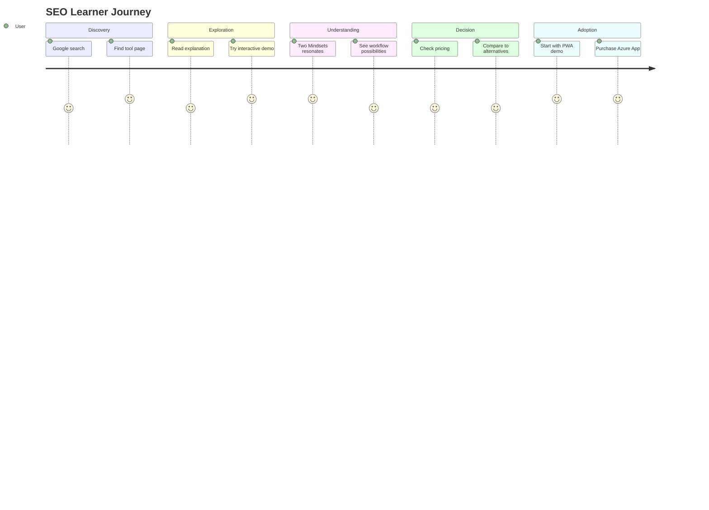

# Flow 1: SEO Learner → Product

> Green Belt Gary searches Google, finds a tool page, discovers VaRiScout
>
> **Priority:** Highest - largest volume potential
>
> See also: [Journeys Overview](../index.md) for site architecture

---

## Persona: Green Belt Gary

| Attribute         | Detail                                        |
| ----------------- | --------------------------------------------- |
| **Role**          | Quality Engineer, Green Belt certified        |
| **Goal**          | Find better tools than Excel                  |
| **Knowledge**     | Knows basics, wants efficiency                |
| **Pain points**   | Excel is tedious, Minitab is expensive        |
| **Entry points**  | Google search, LinkedIn, YouTube              |
| **Decision mode** | Evaluates tool capability, ease of use, price |

### What Gary is thinking:

- "I need to create a control chart but Excel is painful"
- "Minitab costs too much for what I need"
- "I just want something that works for basic SPC"

---

## Entry Points

| Search Query                   | Lands On          | Intent                    |
| ------------------------------ | ----------------- | ------------------------- |
| "how to read control chart"    | /tools/i-chart    | Learning + tool discovery |
| "boxplot interpretation"       | /tools/boxplot    | Specific tool help        |
| "capability analysis tutorial" | /tools/capability | Learning Cp/Cpk           |
| "free control chart software"  | /tools/i-chart    | Tool shopping             |
| "Minitab alternative"          | / or /pricing     | Direct comparison         |

---

## Journey Flow

### Mermaid Flowchart

```mermaid
flowchart TD
    A[Google Search<br/>'how to read control chart'] --> B[/tools/i-chart]
    B --> C{User Action}
    C -->|Scrolls| D[Sees patterns section]
    C -->|Clicks demo| E[Try It Demo]
    D --> F[Two Mindsets<br/>Resonates with EDA]
    E --> G[I like this!<br/>Clicks CTA]
    F --> H[/pricing]
    G --> H
    H --> I[Evaluates options]
    I --> J[CONVERSION<br/>PWA or Azure App]
```

### User Satisfaction Journey



### ASCII Reference

```
┌─────────────────┐
│ Google Search   │
│ "how to read    │
│  control chart" │
└────────┬────────┘
         │
         ▼
┌─────────────────┐
│ /tools/i-chart  │
│                 │
│ ✓ Answers query │
│ ✓ Visual first  │
│ ✓ Data needed   │
└────────┬────────┘
         │
         ▼
┌─────────────────┐     ┌─────────────────┐
│ Scrolls down    │────▶│ "Try It" Demo   │
│                 │     │                 │
│ Sees patterns   │     │ Interactive     │
│ section         │     │ exploration     │
└────────┬────────┘     └────────┬────────┘
         │                       │
         ▼                       ▼
┌─────────────────┐     ┌─────────────────┐
│ "Two Mindsets"  │     │ "I like this!"  │
│                 │     │                 │
│ Resonates with  │     │ Clicks CTA      │
│ EDA approach    │     │                 │
└────────┬────────┘     └────────┬────────┘
         │                       │
         └───────────┬───────────┘
                     │
                     ▼
         ┌─────────────────┐
         │ /pricing        │
         │                 │
         │ Evaluates       │
         │ options         │
         └────────┬────────┘
                  │
                  ▼
         ┌─────────────────┐
         │ CONVERSION      │
         │                 │
         │ Tries PWA (free)│
         │ or Azure App    │
         └─────────────────┘
```

---

## Page Sequence

### 1. Tool Page (/tools/i-chart)

**Must answer in 5 seconds:** "Does this answer my question?"

Page structure:

1. **Hero:** Interactive I-Chart with sample data
2. **What it shows:** Clear explanation of control limits, patterns
3. **Try it section:** Demo with pre-loaded data
4. **Two Mindsets:** EDA vs traditional approach (resonance point)
5. **Next steps:** Links to related tools

**Key content:**

- Visual explanation first, math second
- Pattern recognition guide
- "Why VaRiScout is different" section

### 2. Demo Interaction

Gary clicks around, explores the demo:

- Sees linked filtering in action
- Notices ease of use vs Excel
- Gets curious about other features

### 3. Product/Pricing Page

Gary evaluates:

- PWA (free) vs Azure App (from €79/month)
- Comparison to Minitab

---

## CTAs on This Journey

| Location       | CTA Text                   | Destination        | Note               |
| -------------- | -------------------------- | ------------------ | ------------------ |
| Tool page hero | "Try Demo"                 | /app               | Opens browser demo |
| After demo     | "Paste Your Data"          | /app               | Try with own data  |
| Two Mindsets   | "See the full methodology" | /learn or /journey |                    |
| End of page    | "Try Demo - No Signup"     | /app               | Opens browser demo |
| Related tools  | "Next: Boxplot"            | /tools/boxplot     |                    |

**Updated Journey:**

1. Tool page → "Try Demo" → Explore with samples
2. Like it? → "Paste Your Data" → Try with own data (free)
3. Need team features? → Azure App (from €79/month)

---

## Cross-Links from Tool Pages

| From           | Links To          | Reason                       |
| -------------- | ----------------- | ---------------------------- |
| /tools/i-chart | /tools/boxplot    | "Next: find which factor"    |
| /tools/i-chart | /tools/capability | "Check: does it meet specs?" |
| /tools/i-chart | /learn/two-voices | "Deep dive: Two Voices"      |
| /tools/i-chart | /cases/bottleneck | "See it in action"           |

---

## Mobile Considerations

- Tool demo must work on mobile (touch-optimized)
- Sticky "Try VaRiScout" button at bottom
- Simplified chart interactions
- Key content visible without scrolling

---

## Success Metrics

| Metric                       | Target |
| ---------------------------- | ------ |
| Tool page → Demo interaction | >50%   |
| Demo → Product page          | >15%   |
| Product page → Conversion    | >10%   |
| Tool page bounce rate        | <60%   |
| Time on tool page            | >90s   |

---

## SEO Notes

Target keywords per tool page:

- /tools/i-chart: "control chart", "I-MR chart", "how to read control chart"
- /tools/boxplot: "boxplot", "box and whisker", "boxplot interpretation"
- /tools/pareto: "pareto chart", "80/20 analysis", "pareto diagram"
- /tools/capability: "Cp Cpk", "capability analysis", "process capability"

Content structure for SEO:

- H1 matches primary keyword
- Clear answer in first paragraph
- Visual content (charts) with alt text
- Internal links to related content
