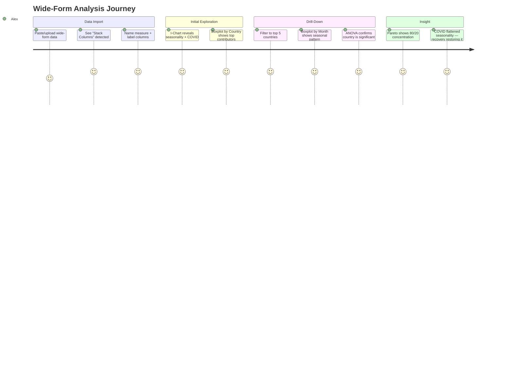

# Flow: Wide-Form Data Analysis

**Persona:** Analyst Alex
**Feature:** Stack Columns (ADR-050)
**Example dataset:** Finland Tourism Arrivals (15 countries × 30 years × 12 months)

---

## Journey Overview

---

## Step-by-Step Analysis

### 1. Import & Stack

Alex pastes or uploads a dataset with 17 columns: Year, Month, Total, and 15 country columns (or 85 columns with the full dataset).

**What VariScout detects:**

- 16 numeric columns (Year + Total + 14 countries)
- 1 text column (Month)
- Stack suggestion: 14 country columns (Year and Total excluded by heuristic)

**Alex's action:** Toggle stack on, name measure "Arrivals" and label "Country". Preview shows 360 rows × 15 countries = 5,400 rows × 4 columns (Year, Month, Country, Arrivals).

**Outcome:** Select Arrivals as outcome, Country + Month as factors. Start analysis.

### 2. I-Chart — Trend Discovery

The I-Chart shows all 5,400 data points sequentially.

**What Alex sees:**

- Strong seasonal oscillation (Jul peaks, Jan troughs) repeating every year
- A dramatic crash in early 2020 (COVID)
- Gradual recovery through 2021–2023
- 2024 approaching pre-COVID levels

**Insight:** "The data has a clear seasonal structure, not random variation."

### 3. Boxplot by Country — Who Matters?

Boxplot with Country as factor shows 15 boxes side by side.

**What Alex sees:**

- Germany and Sweden have the highest median arrivals and widest spread
- Estonia is surprisingly high (geographic proximity)
- Russian Federation has enormous IQR (high before 2022, near-zero after)
- Japan and China have tighter distributions but notable outliers

**Insight:** "Five countries drive most of the volume. Russia's box is bimodal — something changed."

### 4. Drill-Down — Filter to Top 5

Alex drills into the top 5 countries (Germany, Sweden, Estonia, Russia, UK) using filter chips.

**With Month as the remaining factor:**

- July and August dominate for Germany and Sweden (summer tourism)
- Estonia is more evenly distributed (border proximity, not seasonal tourism)
- Russia shows a flat pattern post-2022

**ANOVA result:** Country is highly significant (p < 0.001), eta² > 0.40.

### 5. Pareto — Concentration

Pareto chart ranked by arrival count. With 15 countries, all bars are visible with rotated labels. With the full 82-country dataset, VariScout shows the top 20 countries + "Others" aggregated bar (ADR-051).

- Germany + Sweden + Estonia = ~60% of arrivals from these 15 countries
- Top 5 countries = ~80%
- Bottom 5 = ~5%

**Insight:** "Tourism strategy should focus on 3–5 source markets, not all 15."

### 6. Temporal Deep Dive (Optional)

Switch factor to Year, keep Country filter on Germany:

- I-Chart shows German arrivals growing steadily until 2019
- 2020 crash, 2021–2023 recovery
- 2024 back to pre-COVID trend

**Insight:** "German tourism has fully recovered. The seasonal pattern is back."

---

## VariScout Features Demonstrated

| Feature                         | How it's used                                                   |
| ------------------------------- | --------------------------------------------------------------- |
| **Stack Columns** (ADR-050)     | Transform 15 country columns into Country + Arrivals            |
| **I-Chart + factor tooltips**   | Reveal seasonality; hover shows Month + Year context per point  |
| **Boxplot + rotated labels**    | Compare distributions across countries; labels readable at 15+  |
| **ANOVA**                       | Quantify which factor explains the most variation               |
| **Pareto Top N** (ADR-051)      | Top 20 countries + "Others"; readable even with 80+ categories  |
| **Create Factor + auto-switch** | Select summer peaks → create "summer" factor → boxplot switches |
| **Filter drill-down**           | Isolate top countries, then compare within them                 |
| **Factor switching**            | Toggle between Country and Month as primary factor              |

---

## Why This Matters Beyond Tourism

The same pattern applies to any wide-form dataset:

| Domain        | Columns     | Stack into             | Analysis question                       |
| ------------- | ----------- | ---------------------- | --------------------------------------- |
| Tourism       | Countries   | Country + Arrivals     | Which countries drive variation?        |
| HR Survey     | Questions   | Question + Score       | Which questions have most disagreement? |
| Sales         | Products    | Product + Revenue      | Which products are most volatile?       |
| Manufacturing | Sensors     | Sensor + Reading       | Which sensor drifts most?               |
| Healthcare    | Departments | Department + Wait Time | Where are the bottlenecks?              |

The methodology is universal: **stack → compare → drill → prioritize**.
