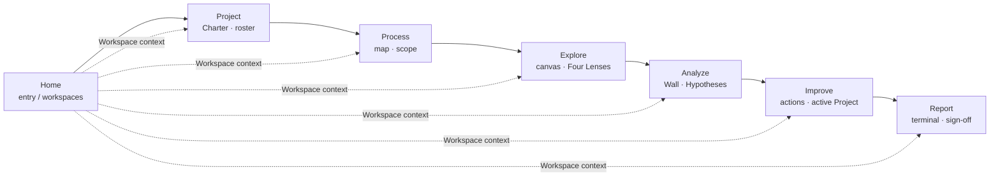

# V1 Information Architecture — Nav Model

V1 ships a flat 7-tab top-level navigation (per [V1 architecture spec](../superpowers/specs/2026-05-16-wedge-architecture-design.md) + [ADR-082](../07-decisions/adr-082-wedge-architecture.md), amended 2026-05-16 to restore Improve as a top-level verb tab; vocabulary refresh 2026-05-27 renamed the EDA tab `Analyze → Explore` and the hypothesis tab `Investigation → Analyze`; Workspace model locked 2026-06-09). Tabs sit in workflow order from entry (Home) to terminal (Report). The product object is the **Workspace**; every Workspace is backed by one active Project record, which stays informal until deliberately formalized.

## Nav graph

The solid arrows are the workflow walk (left-to-right). The dotted arrows are the Workspace context: the same Workspace's attached Project, data, process map, Wall, actions, and report context flow across the tabs. Code may still use legacy `IP` names internally where renaming would be too large, but the product model exposed to users is Workspace + Project + Analysis Scope.

## Tabs

### Home

**Purpose**: entry surface for Workspaces. In PWA this is sample/paste/import; in Azure this is the durable Workspace/document list filtered by role membership once formalized.
**Primary action**: open or create a Workspace.

### Project

**Purpose**: formalization layer for the Workspace: Charter, member roster, lifecycle stage view (Charter → Approach → Control), and Project-level metadata. Opening/filling this surface is a deliberate formalization act. Optional, non-blocking sign-off (Azure collaboration affordance; hidden solo) lives here.
**Primary action**: name/formalize the Workspace, read the Charter, advance stage (Lead-only), approve when collaboration requires it.

### Process

**Purpose**: process map + scope definition. The Process tab anchors the work to a specific value stream, station, or step; it defines what's in-scope before exploration runs.
**Primary action**: sketch / read the process map, set primary scope dimensions.

### Explore

**Purpose**: canvas-based exploratory data analysis. The Four Lenses (central tendency, spread, pattern, distribution) emerge here. Findings created on the canvas link forward to Hypotheses on the Wall.
**Primary action**: paste / connect data, explore on canvas, create Findings.

### Analyze

**Purpose**: Analyze Wall — Hypotheses, evidence, Measurement Plans. The accumulation surface where Findings cluster into Hypotheses, evidence is triangulated, and Measurement Plans capture outstanding evidence gaps.
**Primary action**: create / update Hypotheses; attach evidence; log Measurement Plan rows.

### Improve

**Purpose**: improvement action tracker scoped to the Workspace's Project. Improve is the working surface for action items, owners, and target dates. Control lives at the end of the Project lifecycle.
**Primary action**: create / track improvement actions; advance to Control; close out the Project.

### Report

**Purpose**: terminal compilation surface. Findings, Hypotheses, Actions, and Control status compile into a Report the Sponsor reviews (sign-off optional/out-of-band) and the team can share. Read-mostly for everyone except the Lead during compilation.
**Primary action**: review interim status during Control; sign off final Report (Sponsor).

## Workspace Context Rules

The **Workspace** is the user's current analysis container. It is always backed by one active Project record; that Project may be informal (quick analysis) or formalized (Charter/member/action/report prominence). There is no project selector, exit mode, or free-roaming mode inside a Workspace. Analytical narrowing is handled by **Analysis Scope**.

- **Project tab** shows the Project dossier: Charter, Approach, Control, roster, linked signals, and next formal decisions.
- **Process tab** shows the Workspace process map and current Analysis Scope.
- **Explore tab** scopes charts through Analysis Scope: outcome, factor, step, and categorical filters.
- **Analyze tab** shows the Workspace Wall and current scope; it does not switch project lenses.
- **Improve tab** shows the Project's action tracker.
- **Report tab** compiles Project evidence, actions, and Control status into the Sponsor-facing narrative.
- **Home** opens or creates Workspaces.

The Lead can formalize and advance Projects. Members and Sponsors can open formalized Projects they belong to, but role gating limits what they can edit. Informal quick-analysis Workspaces remain private to the creator.

The code still uses `useActiveIPContext(sessionHub)` and `<NoActiveProjectGuidance>` names in places. Treat those as internal compatibility names until a broader rename is worth the churn; user-facing copy should say Workspace, Project, and Analysis Scope.

## Role × tab matrix

Lead / Member / Sponsor are **per-project membership roles** — the V1 persona model collapsed to one Specialist who takes a role per Project (wedge §3.5). Access is membership-scoped (ACL), not persona-routed.

| Tab     | Lead           | Member        | Sponsor         |
| ------- | -------------- | ------------- | --------------- |
| Home    | Open/create    | Open          | Open            |
| Project | Edit + advance | Read          | Read + approve  |
| Process | Edit           | Read          | Read            |
| Explore | Edit           | Read + Find   | Read            |
| Analyze | Edit + close   | Edit evidence | Read            |
| Improve | Edit + IP      | Edit assigned | Read + sanction |
| Report  | Compile        | Read          | Sign off        |

See [`personas/lead.md`](personas/lead.md), [`personas/member.md`](personas/member.md), [`personas/sponsor.md`](personas/sponsor.md) for end-to-end per-persona sequences.

## Vocabulary: 5-verb activity frame

Wedge V1 organizes user activities under five verbs:

> **Frame → Explore → Analyze → Improve → Control**

Mapping to the 7-tab nav:

- **Frame** — Process tab (canvas configuration; structure + outcomes + factors)
- **Explore** — Explore tab (EDA / 4-chart dashboard)
- **Analyze** — Analyze tab (Wall / hypotheses)
- **Improve** — Improve tab (top-level verb tab, active Project context)
- **Control** — Control stage (verify + handoff closure)

Authoritative definition: [State/Edit mode + IP-scoped presentation spec §3 D6](../superpowers/specs/2026-05-28-state-edit-mode-and-ip-scoped-presentation-design.md). Architecture rationale: [ADR-082 Wedge architecture](../07-decisions/adr-082-wedge-architecture.md).

This activity frame supersedes the earlier 4-verb pre-wedge proposal (`Frame → Scout → Investigate → Improve`).
