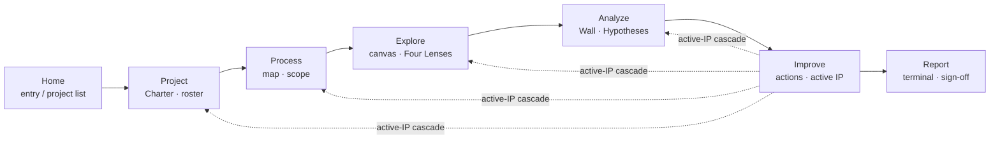

# V1 Information Architecture — Nav Model

V1 ships a flat 7-tab top-level navigation (per [V1 architecture spec](../superpowers/specs/2026-05-16-wedge-architecture-design.md) + [ADR-082](../07-decisions/adr-082-wedge-architecture.md), amended 2026-05-16 to restore Improve as a top-level verb tab; vocabulary refresh 2026-05-27 renamed the EDA tab `Analyze → Explore` and the hypothesis tab `Investigation → Analyze`). Tabs sit in workflow order from entry (Home) to terminal (Report); the **active-IP cascade** scopes downstream tabs when an Improvement Project is active.

## Nav graph

The solid arrows are the workflow walk (left-to-right). The dotted arrows are the **active-IP cascade**: when the Lead selects an Improvement Project as their active working focus on the Improve tab, the four upstream-of-Improve tabs scope their content to that IP until the Lead changes it.

## Tabs

### Home

**Purpose**: entry surface + project selector. Shows the user's accessible Projects (filtered by role membership). Sponsors see only sponsored Projects; Members see only invited Projects; Leads see Projects they lead.
**Primary action**: open a Project (or create one, if Lead).

### Project

**Purpose**: project-scoped Charter, member roster, lifecycle stage view (Charter → Approach → Control), and Project-level metadata. Sign-off gates (Charter approval, Control cadence) live here.
**Primary action**: read the Charter; advance stage (Lead-only); approve (Sponsor for Charter; Lead for hypothesis closure).

### Process

**Purpose**: process map + scope definition. The Process tab anchors the work to a specific value stream, station, or step; it defines what's in-scope before exploration runs.
**Primary action**: sketch / read the process map, set primary scope dimensions.

### Explore

**Purpose**: canvas-based exploratory data analysis. The Four Lenses (central tendency, spread, pattern, distribution) emerge here. Findings created on the canvas link forward to Hypotheses on the Wall.
**Primary action**: paste / connect data, explore on canvas, create Findings.

### Analyze

**Purpose**: Investigation Wall — Hypotheses, evidence, Measurement Plans. The accumulation surface where Findings cluster into Hypotheses, evidence is triangulated, and Measurement Plans capture outstanding evidence gaps.
**Primary action**: create / update Hypotheses; attach evidence; log Measurement Plan rows.

### Improve

**Purpose**: improvement action tracker scoped to the active Improvement Project (IP). When an Improvement Project is active, Improve becomes the working surface for action items, owners, and target dates. Control lives at the end of Improve's lifecycle.
**Primary action**: create / track improvement actions; advance to Control; close out the IP.

### Report

**Purpose**: terminal compilation surface. Findings, Hypotheses, Actions, and Control status compile into a Report the Sponsor signs off and the team can share. Read-mostly for everyone except the Lead during compilation.
**Primary action**: review interim status during Control; sign off final Report (Sponsor).

## Active-IP cascade rules

An **active IP** is the Improvement Project the Lead has selected as their current working focus. IPs are created via Charter ceremony (see Project tab); the active IP is then selected from the Lead's portfolio. At most one IP is active at a time per persona session. When an IP is active:

- **Project tab** filters its Charter / roster view to the IP's scope. The Project-level Charter remains accessible; the IP's working Charter sits underneath.
- **Process tab** highlights the process steps the IP touches; non-IP scope dims.
- **Explore tab** scopes the canvas to the dataset(s) attached to the IP's source hypothesis.
- **Analyze tab** filters the Wall to the IP's source hypothesis and its evidence cluster.
- **Improve tab** is the IP itself — owns active-IP selection.
- **Home / Report** are not scoped by the cascade (Home is project-level; Report aggregates).

The Lead owns the active-IP selection. Members and Sponsors see the cascade (their downstream tabs reflect it) but cannot change which IP is active. Clearing the active IP reverts downstream tabs to full-Project scope.

The cascade is the V1 verb-tab pattern — every verb tab follows the same `useActiveIPContext(sessionHub)` + `<NoActiveProjectGuidance>`-style empty state pattern when no IP is active (durable memory entry: `feedback_active_ip_cascade_pattern`).

## Persona × tab matrix

| Tab     | Lead           | Member        | Sponsor         |
| ------- | -------------- | ------------- | --------------- |
| Home    | Edit           | Read          | Read            |
| Project | Edit + advance | Read          | Approve         |
| Process | Edit           | Read          | Read            |
| Explore | Edit           | Read + Find   | Read            |
| Analyze | Edit + close   | Edit evidence | Read            |
| Improve | Edit + IP      | Edit assigned | Read + sanction |
| Report  | Compile        | Read          | Sign off        |

See [`personas/lead.md`](personas/lead.md), [`personas/member.md`](personas/member.md), [`personas/sponsor.md`](personas/sponsor.md) for end-to-end per-persona sequences.
