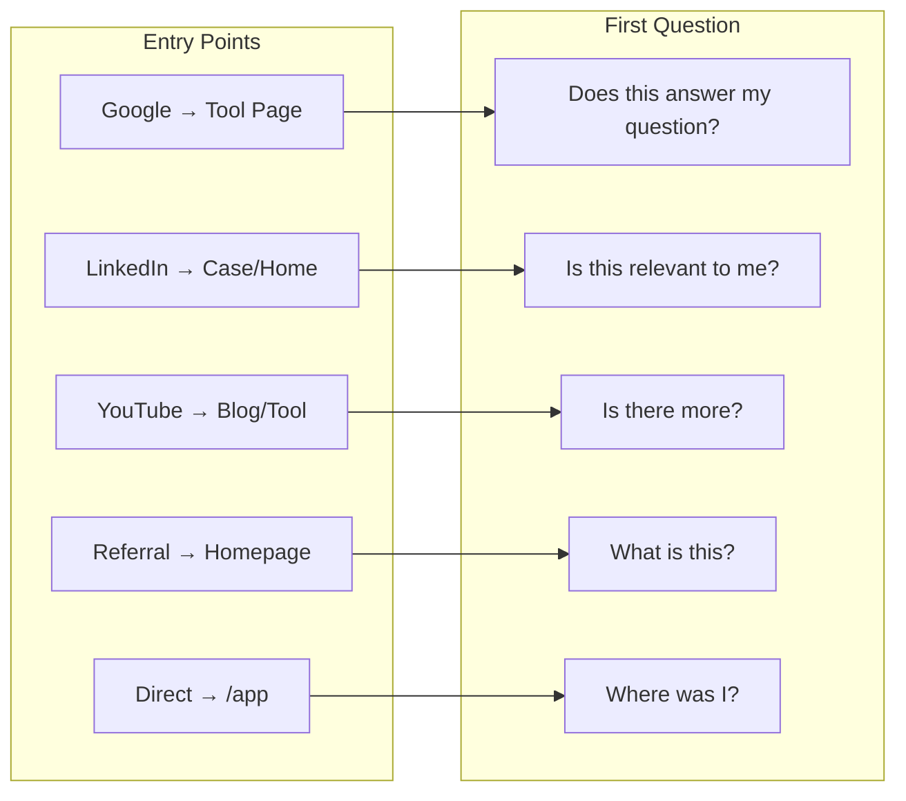
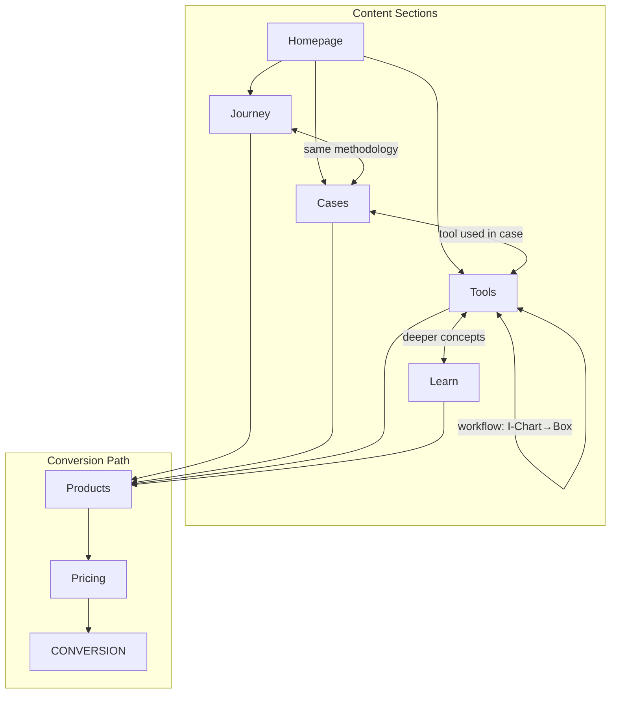

# User Journeys

How different users find, navigate, and convert on VariScout.

---

## Personas

| Persona                                            | Role                           | Goal                         | Entry Point                |
| -------------------------------------------------- | ------------------------------ | ---------------------------- | -------------------------- |
| [**Green Belt Gary**](personas/green-belt-gary.md) | Quality Engineer, GB certified | Find better tools than Excel | Google, LinkedIn, YouTube  |
| [**Curious Carlos**](personas/curious-carlos.md)   | Operations Supervisor          | Understand variation better  | YouTube, TikTok, Instagram |
| [**OpEx Olivia**](personas/opex-olivia.md)         | OpEx Manager                   | Find tools for team          | Referral, LinkedIn         |
| [**Student Sara**](personas/student-sara.md)       | LSS student / trainee          | Learn methodology            | Course link, Google        |
| [**Evaluator Erik**](personas/evaluator-erik.md)   | IT/Procurement                 | Assess for organization      | Direct link from colleague |
| [**Trainer Tina**](personas/trainer-tina.md)       | LSS Trainer / Consultant       | Tools for courses & clients  | LinkedIn, YouTube          |

**Secondary personas:** Consultant Chris, Academic Anna, Coffee Coop Carmen

---

## Use Cases

Strategic use cases grounded in VariScout's capabilities — the specific problems that bring searchers in.

| #   | Use Case                                                        | SEO Score | Industry              | Theme               |
| --- | --------------------------------------------------------------- | --------- | --------------------- | ------------------- |
| 1   | [Supplier Performance](use-cases/supplier-performance.md)       | 24        | Supply Chain          | Drill-down          |
| 2   | [University SPC](use-cases/university-spc.md)                   | 24        | Education             | Education           |
| 3   | [Assembly Bottleneck](use-cases/bottleneck-analysis.md)         | 22        | Manufacturing         | Aggregation trap    |
| 4   | [Supplier PPAP](use-cases/supplier-ppap.md)                     | 22        | Automotive            | Multi-channel       |
| 5   | [COPQ Drill-Down](use-cases/copq-drilldown.md)                  | 21        | Cross-industry        | Drill-down          |
| 6   | [Customer Complaint](use-cases/complaint-investigation.md)      | 21        | Cross-industry        | Investigation       |
| 7   | [Patient Wait Time](use-cases/patient-wait-time.md)             | 18        | Healthcare            | Aggregation trap    |
| 8   | [Call Center Performance](use-cases/call-center-performance.md) | 18        | Service Ops           | Drill-down          |
| 9   | [On-Time Delivery](use-cases/on-time-delivery.md)               | 15        | Logistics             | Capability vs SLA   |
| 10  | [Pharma OOS](use-cases/pharma-oos.md)                           | 19        | Pharma                | MSA + Investigation |
| 11  | [Consultant Delivery](use-cases/consultant-delivery.md)         | 17        | Professional Services | Education           |
| 12  | [Batch Consistency](use-cases/batch-consistency.md)             | 18        | Food / Chemical       | Drill-down          |
| 13  | [Lead Time Variation](use-cases/lead-time-variation.md)         | 19        | Supply Chain          | Aggregation trap    |

See [use-cases/index.md](use-cases/index.md) for full SEO scoring, theme groupings, and content phasing.

---

## Entry Points

### Flow Interconnection Diagram

```mermaid
flowchart TB
    subgraph Sources["Traffic Sources"]
        G[Google Search]
        L[LinkedIn]
        Y[YouTube / Social]
        R[Referral]
        D[Direct URL]
    end

    subgraph Landing["Landing Pages"]
        T[/tools/X]
        H[/ Homepage]
        C[/cases/X]
        B[/blog/X]
        A[/app]
    end

    subgraph Flows["User Flows"]
        F1[SEO Learner]
        F2[Social Discovery]
        F3[Content/YouTube]
        F4[Enterprise]
        F5[Return Visitor]
    end

    subgraph Conversion["Conversion"]
        P[/products]
        PR[/pricing]
        AZ[Azure Marketplace]
    end

    G --> T
    G --> H
    L --> H
    L --> C
    Y --> B
    Y --> T
    R --> H
    D --> H
    D --> A

    T --> F1
    C --> F2
    B --> F3
    H --> F4
    A --> F5

    F1 --> P
    F2 --> P
    F3 --> P
    F4 --> P
    F5 --> A

    P --> PR
    PR --> AZ
```

### Entry Point Matrix



### ASCII Reference

```
                                ┌─────────────────┐
                                │   variscout.com │
                                └────────┬────────┘
                                         │
    ┌────────────────┬───────────────────┼───────────────────┬────────────────┐
    │                │                   │                   │                │
    ▼                ▼                   ▼                   ▼                ▼
┌───────────┐ ┌───────────┐ ┌───────────────┐ ┌───────────┐ ┌───────────┐
│  Google   │ │ LinkedIn  │ │   YouTube /   │ │  Referral │ │  Direct   │
│  Search   │ │           │ │   Social      │ │           │ │   URL     │
└─────┬─────┘ └─────┬─────┘ └───────┬───────┘ └─────┬─────┘ └─────┬─────┘
      │             │               │               │             │
      ▼             ▼               ▼               ▼             ▼
┌───────────┐ ┌───────────┐ ┌───────────────┐ ┌───────────┐ ┌───────────┐
│ Tool Page │ │ Homepage  │ │ Blog / Tool   │ │ Homepage  │ │ Homepage  │
│ /tools/X  │ │     /     │ │    Page       │ │     /     │ │  or /app  │
└───────────┘ └───────────┘ └───────────────┘ └───────────┘ └───────────┘
```

### First Impression by Entry

| Entry Point                  | Lands On            | First Question                  | Must Answer in 5 Seconds        |
| ---------------------------- | ------------------- | ------------------------------- | ------------------------------- |
| Google "how to read boxplot" | /tools/boxplot      | "Does this answer my question?" | Yes - with visual + explanation |
| LinkedIn post about case     | /cases/bottleneck   | "Is this relevant to me?"       | Yes - industry recognition      |
| YouTube video link           | /blog/X or /tools/X | "Is there more?"                | Yes - deeper content + CTA      |
| TikTok/Instagram clip        | /tools/X or /       | "What is this tool?"            | Clear value prop + demo         |
| Colleague referral           | / (homepage)        | "What is this?"                 | Clear value prop + demo         |
| Return visit                 | / or /app           | "Where was I?"                  | Easy navigation to app/cases    |

---

## User Flows

<div class="grid cards" markdown>

- :material-magnify:{ .lg .middle } **SEO Learner**

  ***

  Google search → Tool page → Product

  [:octicons-arrow-right-24: Flow details](flows/seo-learner.md)

- :material-share-variant:{ .lg .middle } **Social Discovery**

  ***

  LinkedIn → Case → Product

  [:octicons-arrow-right-24: Flow details](flows/social-discovery.md)

- :material-youtube:{ .lg .middle } **Content & YouTube**

  ***

  YouTube/Content → Website → Product

  [:octicons-arrow-right-24: Flow details](flows/content-youtube.md)

- :material-domain:{ .lg .middle } **Enterprise**

  ***

  Referral → Enterprise evaluation

  [:octicons-arrow-right-24: Flow details](flows/enterprise.md)

- :material-redo:{ .lg .middle } **Return Visitor**

  ***

  Existing user → App

  [:octicons-arrow-right-24: Flow details](flows/return-visitor.md)

</div>

---

## Flow Priorities

| Priority | Flow                      | Why                             |
| -------- | ------------------------- | ------------------------------- |
| 1        | SEO → Tool Page → Product | Highest volume potential        |
| 2        | Social → Case → Product   | Best conversion story           |
| 3        | YouTube/Content → Website | Authority + warm leads          |
| 4        | Enterprise evaluation     | Self-serve, documentation-first |
| 5        | Return user → App         | Retention/activation            |

---

## Cross-Linking Strategy

### Content Interconnections



### Cross-Link Rules

| From         | Links To | Connection Type            |
| ------------ | -------- | -------------------------- |
| Journey      | Cases    | Same methodology in action |
| Cases        | Tools    | Tool used in the case      |
| Tools        | Learn    | Deeper concept explanation |
| Tools        | Tools    | Workflow progression       |
| All sections | Products | CTA on every page          |

### ASCII Reference

```
                ┌─────────────┐
                │  Homepage   │
                └──────┬──────┘
                       │
      ┌────────────────┼────────────────┐
      │                │                │
      ▼                ▼                ▼
┌───────────┐    ┌───────────┐    ┌───────────┐
│  Journey  │    │   Cases   │    │   Tools   │
└─────┬─────┘    └─────┬─────┘    └─────┬─────┘
      │                │                │
      └────────────────┼────────────────┘
                       │
            CROSS-LINKS:
            Journey ←→ Cases (same methodology)
            Cases ←→ Tools (tool used in case)
            Tools ←→ Learn (deeper concepts)
            Tools ←→ Tools (workflow: I-Chart→Box)
            All ──→ Products (CTA)
                       │
                       ▼
                ┌─────────────┐
                │  Products   │ → Pricing → CONVERSION
                └─────────────┘
```

---

## Architecture Principles

1. **Multiple entry points** — Every page can be a landing page
2. **Clear paths to conversion** — CTA on every page
3. **Cross-linking** — No dead ends, always "what's next"
4. **Progressive depth** — Surface → Middle → Deep layers
5. **Mobile-first** — Sticky CTAs, simplified navigation
6. **No login needed** — PWA and Excel work without accounts, data stays in your browser

> **The website is a collection of interconnected experiences, not a linear funnel.**
>
> Users can enter anywhere, explore in any order, and convert when ready.
> Every page must stand alone AND connect to the whole.
