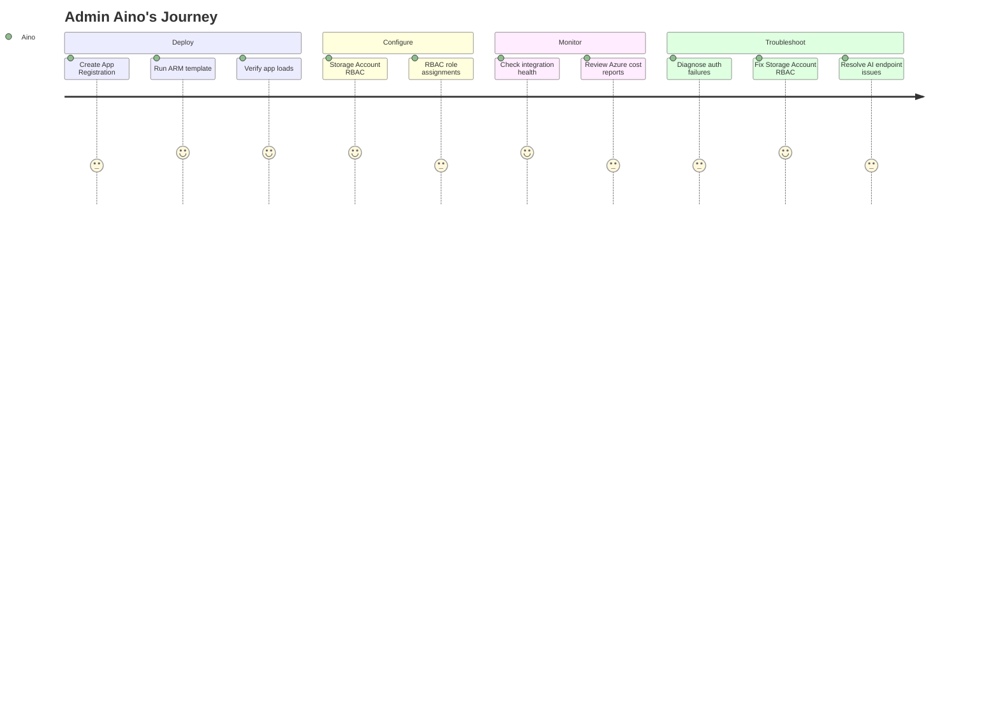

# Admin Aino

| Attribute         | Detail                                                                                                            |
| ----------------- | ----------------------------------------------------------------------------------------------------------------- |
| **Role**          | IT Admin / Azure Platform Engineer                                                                                |
| **Goal**          | Deploy, maintain, and troubleshoot VariScout for the organization                                                 |
| **Knowledge**     | Azure Portal, Entra ID, App Registrations, RBAC, Storage Accounts                                                 |
| **Pain points**   | Unclear what's app-side vs Azure-side, no health visibility, support tickets from users she can't diagnose in-app |
| **Decision mode** | Needs diagnostics, clear error messages, Azure Portal deep links                                                  |

---

## What Aino is thinking

- "Is the deployment healthy? Are all integrations working?"
- "Someone says CoScout isn't responding — how do I check?"
- "What plan are we on and what does upgrading unlock?"
- "The client secret expires in 30 days — does the app warn me?"
- "A new team member can't access the app — is it RBAC or EasyAuth?"

---

## 4-Phase Journey



---

## Entry Points

| Source             | Context                                 | Lands On                   |
| ------------------ | --------------------------------------- | -------------------------- |
| Deployment ticket  | "Deploy VariScout for the quality team" | Azure Marketplace          |
| Support ticket     | "Team storage not syncing"              | In-app admin → Status tab  |
| Olivia's request   | "Can we upgrade to Team?"               | In-app admin → Plan tab    |
| Azure Portal alert | "App Service health degraded"           | Azure Portal → App Service |

---

## Key Difference from Other Personas

| Persona    | Relationship to Aino                                                                                                          |
| ---------- | ----------------------------------------------------------------------------------------------------------------------------- |
| **Erik**   | Evaluates security pre-purchase, then walks away. Aino takes over post-deployment.                                            |
| **Olivia** | Initiated the purchase and owns the business case. Aino makes it work technically. In small orgs they may be the same person. |
| **Gary**   | End user. Raises support tickets that Aino triages.                                                                           |

---

## Aino's Diagnostic Checklist

| Question                        | How to check                                   | Where                                       |
| ------------------------------- | ---------------------------------------------- | ------------------------------------------- |
| Is EasyAuth configured?         | `GET /.auth/me` returns user claims            | In-app admin → Status                       |
| Is Blob Storage working?        | Test SAS token generation                      | In-app admin → Status                       |
| Is AI endpoint reachable?       | Test connectivity to AI Services               | In-app admin → Status                       |
| What plan are we on?            | Check `VITE_VARISCOUT_PLAN` and feature matrix | In-app admin → Plan & Features              |
| Is client secret expiring?      | Check Entra ID → Certificates & secrets        | Azure Portal (not checkable from browser)   |
| Why can't a user sign in?       | Check EasyAuth config + user assignment        | Azure Portal → App Service → Authentication |
| Is the App Service healthy?     | Check App Service health + metrics             | Azure Portal → App Service → Health check   |
| Can a user access team storage? | Check Storage Account RBAC role assignments    | Azure Portal → Storage Account → IAM        |

---

## Information Architecture for Aino

### Must Find Quickly

1. **Integration health status** — Are all connected services working?
2. **Current plan and features** — What's enabled, what requires upgrade?
3. **Troubleshooting guides** — Common issues with diagnostic steps
4. **Azure Portal deep links** — Jump to the right blade for fixes
5. **Storage Account access** — Manage RBAC roles for team Blob Storage

### In-App Admin Structure

```
Admin Hub (shield icon)
├── Status (health checks)
│   ├── Authentication
│   ├── Blob Storage (Team plan)
│   └── AI endpoint
├── Plan & Features (feature matrix)
└── Troubleshooting (diagnostics + Portal links)
```

---

## Journey Flow

```
┌─────────────────┐
│ Deployment       │
│ ticket from      │
│ Olivia / IT Ops  │
└────────┬────────┘
         │
         ▼
┌─────────────────┐
│ Azure Marketplace│
│                  │
│ ARM template     │
│ deployment       │
└────────┬────────┘
         │
         ▼
┌─────────────────┐
│ Post-deploy      │
│ verification     │
│                  │
│ - App loads?     │
│ - EasyAuth?      │
│ - Graph API?     │
│ - AI endpoint?   │
└────────┬────────┘
         │
    ┌────┴────────────┐
    │                 │
    ▼                 ▼
┌────────────┐  ┌────────────┐
│ ALL GREEN  │  │ ISSUES     │
│            │  │            │
│ Configure  │  │ Troubleshoot│
│ Teams, KB, │  │ using admin │
│ RBAC       │  │ diagnostics │
└────────────┘  └────────────┘
         │
         ▼
┌─────────────────┐
│ Ongoing          │
│                  │
│ Monitor health   │
│ Handle tickets   │
│ Plan upgrades    │
└─────────────────┘
```

---

## Success Metrics

| Metric                                     | Target |
| ------------------------------------------ | ------ |
| Time from deployment to first health check | < 5min |
| Support tickets resolved via in-app diag.  | Track  |
| Admin page visits per month                | Track  |
| Upgrade path clicks (Plan & Features tab)  | Track  |

---

## Related Flows

- [Flow 4: Enterprise Evaluator](../flows/enterprise.md) — Erik evaluates, Aino deploys
- [Flow 8: Team Collaboration](../flows/azure-team-collaboration.md) — Olivia initiates, Aino configures
- [Flow 9: AI Setup](../flows/azure-ai-setup.md) — Aino provisions AI resources
- [Flow 10: Admin Operations](../flows/azure-admin-operations.md) — Aino's day-2+ operations
