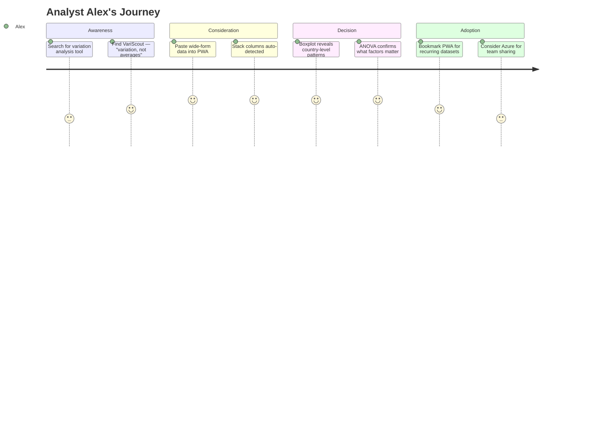

# Analyst Alex

| Attribute         | Detail                                                                         |
| ----------------- | ------------------------------------------------------------------------------ |
| **Role**          | Data Analyst / Business Analyst / Economist                                    |
| **Goal**          | Find variation patterns in multi-dimensional data                              |
| **Knowledge**     | Strong with data, less familiar with SPC terminology                           |
| **Pain points**   | Tools are either too simple (Excel charts) or too complex (R/Python scripting) |
| **Decision mode** | Evaluates speed to insight, visual clarity, interactivity                      |

---

## What Alex is thinking

- "I have this dataset with 80+ columns — where do I even start?"
- "I know there's a pattern in here, but pivot tables aren't showing it"
- "I don't need a full statistical package, just something that finds variation fast"
- "Every tool assumes I already know which column to analyze"

---

## 4-Phase Journey

---

## How Alex differs from Gary

| Dimension         | Green Belt Gary            | Analyst Alex                          |
| ----------------- | -------------------------- | ------------------------------------- |
| **Domain**        | Manufacturing / Quality    | Any domain with numeric data          |
| **Data shape**    | Long-form (rows = parts)   | Often wide-form (columns = entities)  |
| **Goal**          | Process control (Cpk, SPC) | Pattern discovery (variation, trends) |
| **Spec limits**   | Always has them            | Rarely has them                       |
| **Terminology**   | SPC, Cpk, control limits   | Variation, distribution, outliers     |
| **Entry feature** | I-Chart + spec limits      | Stack columns + Boxplot comparison    |

---

## Entry Points

| Search Query                          | Lands On       | Intent               |
| ------------------------------------- | -------------- | -------------------- |
| "compare variation across categories" | /tools/boxplot | Pattern discovery    |
| "analyze wide data without coding"    | /tools/stack   | Data reshaping       |
| "which factor drives the most change" | /tools/anova   | Significance testing |
| "free data variation tool"            | /              | Tool discovery       |

---

## Typical Datasets

- Tourism arrivals by country (80+ columns × 30 years)
- Employee survey scores by question (25+ questions × departments)
- Regional sales by product line (50+ products × quarters)
- Sensor readings across stations (12+ sensors × batches)
- Hospital wait times by department (10+ departments × shifts)

---

## What VariScout gives Alex

1. **No-code data reshaping** — Stack 80 columns into 2 with a toggle
2. **Instant visual comparison** — Boxplot shows variation across all categories at once
3. **Statistical backing** — ANOVA confirms whether differences are real, not noise
4. **Drill-down navigation** — Filter to subsets without re-uploading
5. **Pareto prioritization** — "Which 20% of categories drive 80% of variation?"
