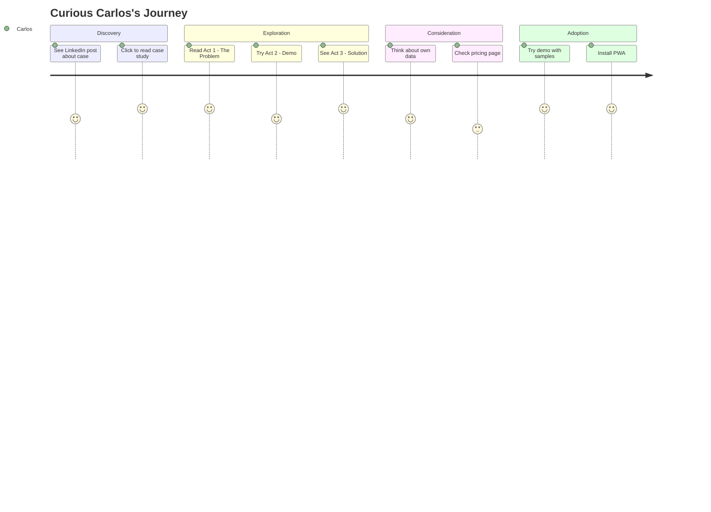

# Curious Carlos

| Attribute         | Detail                                        |
| ----------------- | --------------------------------------------- |
| **Role**          | Operations Supervisor                         |
| **Goal**          | Understand variation better                   |
| **Knowledge**     | Interested but not formally trained           |
| **Pain points**   | Sees problems but lacks tools to analyze them |
| **Decision mode** | Needs to "see it work" before committing      |

---

## What Carlos is thinking

- "That post about finding 46% of problems in one place is interesting"
- "I wonder if I could do something like this at my plant"
- "This seems easier than the stats stuff I've seen before"

---

## 4-Phase Journey



---

## Entry Points

| Social Source      | Content Type         | Lands On            |
| ------------------ | -------------------- | ------------------- |
| LinkedIn post      | Case study teaser    | /cases/bottleneck   |
| LinkedIn article   | "How we found 46%"   | /cases/X            |
| Instagram carousel | Before/after visuals | /cases/X or /       |
| TikTok clip        | "Watch me find it"   | / or /tools/X       |
| YouTube video      | Tutorial content     | /tools/X or /blog/X |

---

## Journey Flow

```
┌─────────────────┐
│ LinkedIn        │
│                 │
│ "This bakery    │
│ found 46% of    │
│ their problem   │
│ in ONE place"   │
└────────┬────────┘
         │
         ▼
┌─────────────────┐
│/cases/bottleneck│
│                 │
│ ACT 1: THE CASE │
│ Sees averages   │
│ "Line B is      │
│ under target"   │
└────────┬────────┘
         │
         ▼
┌─────────────────┐
│ ACT 2: YOUR TURN│
│                 │
│ Explores demo   │
│ Clicks around   │
│ Maybe finds it  │
└────────┬────────┘
         │
         ▼
┌─────────────────┐
│ ACT 3: SOLUTION │
│                 │
│ Scroll journey  │
│ "Aha! That's    │
│ how you think   │
│ about it!"      │
└────────┬────────┘
         │
    ┌────┴────┐
    │         │
    ▼         ▼
┌────────┐ ┌────────────┐
│ Another│ │ CTA:       │
│ case   │ │ "What's    │
│        │ │ YOUR 46%?" │
└────────┘ └─────┬──────┘
                 │
                 ▼
        ┌─────────────────┐
        │ Opens PWA to    │
        │ try own data    │
        └─────────────────┘
```

---

## The 3-Act Case Experience

Every case page follows this narrative arc:

### Act 1: The Setup

- Present the problem as management sees it
- Show the averages, the dashboard view
- "Line B is 3% under target"
- Create cognitive dissonance: "But wait..."

### Act 2: Your Turn

- Interactive demo with the case data
- User explores freely
- Some hints available if stuck
- "Can you find where the 46% is hiding?"

### Act 3: The Solution

- Scroll-based reveal of the analysis journey
- Step by step: I-Chart → Boxplot → Pareto → Drill-down
- The "aha moment": "46% was in Machine C, Shift 2, Operator X"
- Methodology connection: This is the Four Lenses in action

---

## Success Metrics

| Metric                    | Target |
| ------------------------- | ------ |
| Case Act 1 → Act 2 (demo) | >60%   |
| Case Act 2 → Act 3        | >70%   |
| Case → Product page       | >20%   |
| Case → Another case       | >30%   |
| Case → PWA conversion     | >5%    |

---

## Related Flows

- [Social Discovery Flow](../flows/social-discovery.md) — Carlos's primary flow
- [Content & YouTube Flow](../flows/content-youtube.md) — Alternative entry
