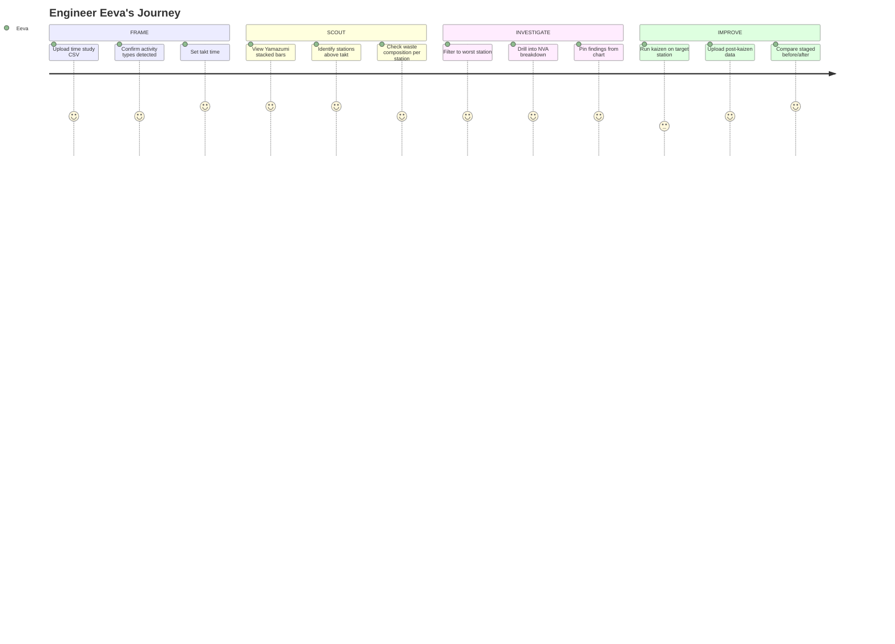

# Engineer Eeva

| Attribute         | Detail                                                                                                                          |
| ----------------- | ------------------------------------------------------------------------------------------------------------------------------- |
| **Role**          | Industrial Engineer at a packaging equipment manufacturer                                                                       |
| **Goal**          | Reduce cycle time waste across assembly stations using time study data                                                          |
| **Knowledge**     | Lean tools (Yamazumi, VSM, PDCA, 5S), time study methodology, takt time calculation, basic SPC                                  |
| **Pain points**   | Manual Yamazumi charts in Excel, no linked filtering, findings lost in email threads, kaizen results not tracked systematically |
| **Decision mode** | Needs visual composition breakdown, waste quantification, before/after comparison                                               |

---

## What Eeva is thinking

- "Which station is the bottleneck, and is it because of waste or actual value-add work?"
- "If I remove the NVA time from Station 5, does it drop below takt?"
- "How do I show management that Station 3 has the most waste, not the most work?"
- "We did a kaizen last month — can I prove the improvement with data?"
- "I need a Yamazumi chart for the standup in 10 minutes, not 2 hours in Excel."

---

## 4-Phase Journey



---

## Entry Points

| Source             | Context                                 | Lands On                        |
| ------------------ | --------------------------------------- | ------------------------------- |
| Time study export  | "I just finished timing 8 stations"     | Paste screen → Yamazumi mode    |
| Kaizen follow-up   | "Did last week's improvement hold?"     | Open saved project → staged     |
| Management request | "Show me where the waste is on Line 2"  | Yamazumi chart → export/present |
| Training session   | "Let's learn Yamazumi with sample data" | PWA → assembly-line sample      |

---

## Key Difference from Other Personas

| Persona    | Relationship to Eeva                                                                                                   |
| ---------- | ---------------------------------------------------------------------------------------------------------------------- |
| **Gary**   | Gary analyzes fill weight variation (SPC). Eeva analyzes cycle time composition (lean). Different data, same tool.     |
| **Olivia** | Olivia initiated the VariScout purchase for quality. Eeva expands usage to industrial engineering.                     |
| **Sam**    | Sam is learning SPC fundamentals. Eeva uses VariScout's PWA to teach lean concepts with the assembly-line sample data. |

---

## Eeva's Analysis Checklist

| Question                                      | How to check                              | Where                    |
| --------------------------------------------- | ----------------------------------------- | ------------------------ |
| Which stations exceed takt?                   | Yamazumi bars above takt line             | Yamazumi chart           |
| Where is waste concentrated?                  | NVA + Wait segment size by station        | Yamazumi chart → Pareto  |
| Is the bottleneck waste or value-add?         | VA vs NVA ratio for bottleneck station    | Filter → Summary panel   |
| Did the kaizen work?                          | Staged comparison: before vs after        | Staged I-Chart + Summary |
| What's the line's overall process efficiency? | Total VA / Total time across all stations | Summary panel            |

---

## Information Architecture for Eeva

### Must Find Quickly

1. **Yamazumi chart** — Stacked composition view with takt line
2. **Waste breakdown** — NVA + Wait as percentage and absolute time
3. **Station drill-down** — Click station to see activity detail
4. **Before/after** — Staged comparison for kaizen verification
5. **Export** — Chart image for standup presentation

### Workflow Pattern

```
┌─────────────────┐
│ Time study data  │
│ (CSV from        │
│  stopwatch app)  │
└────────┬────────┘
         │
         ▼
┌─────────────────┐
│ Yamazumi auto-   │
│ detected         │
│                  │
│ Set takt time    │
│ Confirm types    │
└────────┬────────┘
         │
         ▼
┌─────────────────┐
│ Visual analysis  │
│                  │
│ - Which > takt?  │
│ - Where is NVA?  │
│ - Drill down     │
└────────┬────────┘
         │
    ┌────┴────────────┐
    │                 │
    ▼                 ▼
┌────────────┐  ┌────────────┐
│ FIRST PASS │  │ KAIZEN     │
│            │  │ FOLLOW-UP  │
│ Pin        │  │            │
│ findings,  │  │ Staged     │
│ share      │  │ before/    │
│ Yamazumi   │  │ after      │
└────────────┘  └────────────┘
```

---

## Success Metrics

| Metric                                       | Target   |
| -------------------------------------------- | -------- |
| Time from data upload to Yamazumi chart      | < 30 sec |
| Kaizen projects tracked with staged analysis | Track    |
| Yamazumi charts exported per week            | Track    |
| Process efficiency improvement after kaizen  | Track    |

---

## Related Flows

- [Flow 1: First-Time Explorer](../flows/first-time.md) — How Eeva discovers Yamazumi mode
- [Flow 5: PWA Education](../flows/pwa-education.md) — Eeva uses PWA to teach lean concepts
- [Yamazumi Feature Doc](../../03-features/analysis/yamazumi.md) — Feature specification
- [Assembly Line Case Study](../../04-cases/assembly-line/index.md) — Teaching case for Yamazumi
