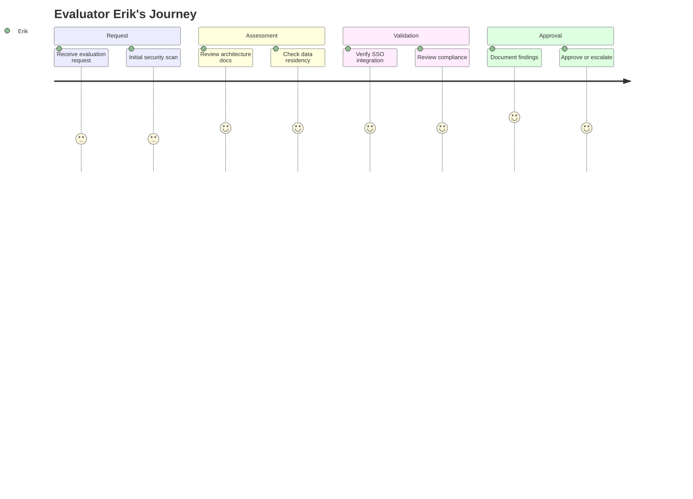

# Evaluator Erik

| Attribute         | Detail                                                        |
| ----------------- | ------------------------------------------------------------- |
| **Role**          | IT/Procurement                                                |
| **Goal**          | Assess for organization                                       |
| **Knowledge**     | Technical, security-focused                                   |
| **Pain points**   | Too many tools to evaluate, security concerns, vendor lock-in |
| **Decision mode** | Checklist-driven, needs documentation                         |

---

## What Erik is thinking

- "OpEx wants this tool - what's the security story?"
- "Where does the data go?"
- "Can we deploy this ourselves?"
- "What's our exit strategy if we need to switch?"

---

## 4-Phase Journey



---

## Entry Points

| Source          | Context                      | Lands On             |
| --------------- | ---------------------------- | -------------------- |
| OpEx request    | "Evaluate this for the team" | / or /products       |
| Direct link     | From colleague               | /products/enterprise |
| Security review | Due diligence                | /products/enterprise |

---

## Erik's Evaluation Checklist

| Question                   | Answer                            |
| -------------------------- | --------------------------------- |
| Security architecture?     | Azure-native, your tenant         |
| Data residency?            | Your choice of Azure region       |
| Authentication?            | Azure AD SSO                      |
| Compliance certifications? | Azure compliance + our docs       |
| SLA?                       | Azure SLA + our support tiers     |
| Exit strategy?             | Export all data, standard formats |
| Audit logging?             | Azure native logging              |
| Encryption?                | At rest and in transit            |
| GDPR compliance?           | Yes - data stays in your tenant   |

---

## Information Architecture for Erik

### Must Find Quickly

1. **Security documentation** - Not marketing, real technical specs
2. **Architecture diagram** - Where data flows
3. **Deployment guide** - How to install
4. **Integration requirements** - What it needs
5. **Exit/migration path** - How to leave

### Page Structure Needs

```
/products/enterprise
├── Overview (skim)
├── Security & Compliance (FOCUS)
│   ├── Data residency
│   ├── Authentication
│   ├── Encryption
│   └── Audit logging
├── Deployment
│   ├── Prerequisites
│   ├── Azure Marketplace
│   └── Configuration
├── Integration
│   ├── Azure AD
│   └── Power BI (if applicable)
└── Data portability
    ├── Export formats
    └── Migration guide
```

---

## Journey Flow

```
┌─────────────────┐
│ OpEx sends      │
│ evaluation      │
│ request         │
└────────┬────────┘
         │
         ▼
┌─────────────────┐
│ /products/      │
│ enterprise      │
│                 │
│ Quick scan:     │
│ "Is this legit?"│
└────────┬────────┘
         │
         ▼
┌─────────────────┐
│ Security docs   │
│                 │
│ - Architecture  │
│ - Data flow     │
│ - Encryption    │
│ - Compliance    │
└────────┬────────┘
         │
    ┌────┴────────────┐
    │                 │
    ▼                 ▼
┌────────────┐  ┌────────────┐
│ APPROVED   │  │ QUESTIONS  │
│            │  │            │
│ Proceed to │  │ Contact    │
│ deployment │  │ for more   │
│            │  │ info       │
└────────────┘  └────────────┘
```

---

## Documentation Requirements

Erik needs:

1. **PDF downloadable** - For internal distribution
2. **No marketing fluff** - Technical facts only
3. **Architecture diagrams** - Visual understanding
4. **Compliance matrix** - Checkbox-friendly
5. **Version history** - When docs were updated

---

## Success Metrics

| Metric                              | Target |
| ----------------------------------- | ------ |
| Enterprise page → Security docs     | >80%   |
| Docs download rate                  | Track  |
| Time to approval (from first visit) | Track  |
| Questions via contact form          | Track  |

---

## Related Flows

- [Enterprise Flow](../flows/enterprise.md) — Olivia initiates, Erik evaluates
