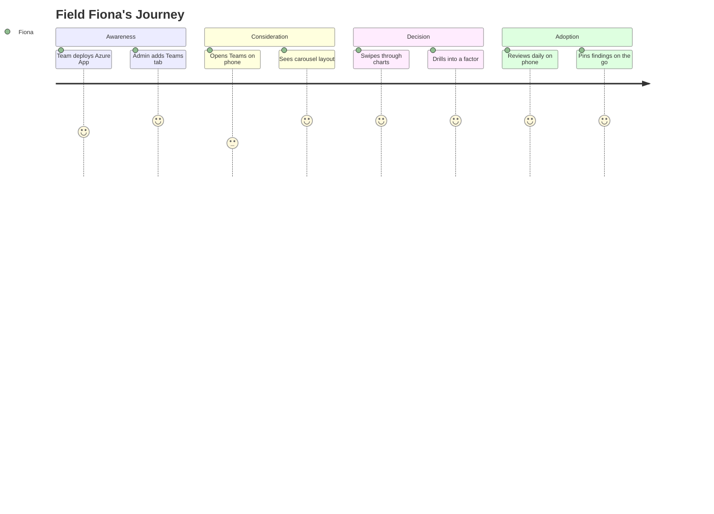

# Field Fiona

| Attribute         | Detail                                             |
| ----------------- | -------------------------------------------------- |
| **Role**          | Field Quality Engineer, manufacturing floor        |
| **Goal**          | Review charts during morning meetings, on the move |
| **Knowledge**     | SPC basics, uses Teams daily, rarely at a desktop  |
| **Pain points**   | Desktop tools unusable on phone, can't show charts |
| **Decision mode** | Needs instant access, touch-friendly, readable     |

---

## What Fiona is thinking

- "I need to check the overnight data before the standup"
- "Can I pull up the Pareto on my phone in the Teams meeting?"
- "The desktop layout is tiny and impossible to tap on my phone"
- "I just want to see one chart at a time, nice and big"

---

## 4-Phase Journey

---

## Key Scenarios

### Morning Standup (Gemba Walk)

1. Open Teams app on phone
2. Tap VariScout channel tab
3. Swipe to I-Chart — check overnight process stability
4. Swipe to Boxplot — compare shift performance
5. Tap a category to drill down
6. Pin finding for follow-up

### Production Floor Check

1. Walk to a machine showing issues
2. Pull up VariScout on phone via Teams
3. Swipe to Pareto — see top contributors
4. Open Findings from overflow menu
5. Add a note about observed conditions

---

## Device Context

| Context         | Device           | Viewport        | Interaction   |
| --------------- | ---------------- | --------------- | ------------- |
| Morning standup | iPhone / Android | 375×667–414×896 | Touch, swipe  |
| Floor check     | iPhone / Android | 375×667–414×896 | Touch, swipe  |
| Desk review     | Laptop / iPad    | 768×1024+       | Mouse + touch |

---

## Design Requirements

- **One chart at a time** on phone (carousel, not stacked grid)
- **44px minimum touch targets** on all navigation buttons
- **Swipe navigation** between charts (native feel)
- **Overflow menu** for toolbar actions (too many for phone header)
- **Full-screen Findings** overlay (sidebar doesn't fit on phone)
- **Bottom-sheet action menu** for category highlights and findings on phone
