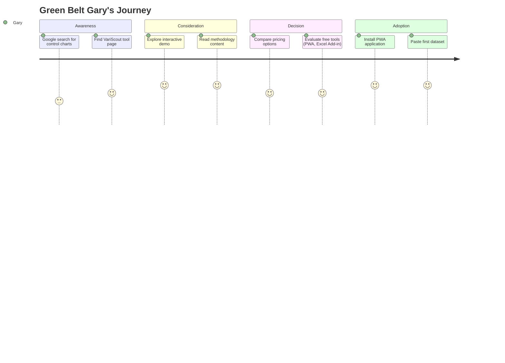

# Green Belt Gary

| Attribute         | Detail                                        |
| ----------------- | --------------------------------------------- |
| **Role**          | Quality Engineer, Green Belt certified        |
| **Goal**          | Find better tools than Excel                  |
| **Knowledge**     | Knows basics, wants efficiency                |
| **Pain points**   | Excel is tedious, Minitab is expensive        |
| **Decision mode** | Evaluates tool capability, ease of use, price |

---

## What Gary is thinking

- "I need to create a control chart but Excel is painful"
- "Minitab costs too much for what I need"
- "I just want something that works for basic SPC"

---

## 4-Phase Journey



---

## Entry Points

| Search Query                   | Lands On          | Intent                    |
| ------------------------------ | ----------------- | ------------------------- |
| "how to read control chart"    | /tools/i-chart    | Learning + tool discovery |
| "boxplot interpretation"       | /tools/boxplot    | Specific tool help        |
| "capability analysis tutorial" | /tools/capability | Learning Cp/Cpk           |
| "free control chart software"  | /tools/i-chart    | Tool shopping             |
| "Minitab alternative"          | / or /products    | Direct comparison         |

---

## Journey Flow

```
┌─────────────────┐
│ Google Search   │
│ "how to read    │
│  control chart" │
└────────┬────────┘
         │
         ▼
┌─────────────────┐
│ /tools/i-chart  │
│                 │
│ ✓ Answers query │
│ ✓ Visual first  │
│ ✓ Demo link     │
└────────┬────────┘
         │
         ▼
┌─────────────────┐
│ Scrolls down    │────▶ "Try It" Demo
│                 │
│ Sees patterns   │      Interactive
│ section         │      exploration
└────────┬────────┘
         │
         ▼
┌─────────────────┐
│ "Two Voices"    │
│                 │
│ Resonates with  │
│ EDA approach    │
└────────┬────────┘
         │
         ▼
┌─────────────────┐
│ /products or    │
│ /pricing        │
│                 │
│ Evaluates       │
│ options         │
└────────┬────────┘
         │
         ▼
┌─────────────────┐
│ CONVERSION      │
│                 │
│ Opens PWA or    │
│ installs Excel  │
│ add-in          │
└─────────────────┘
```

---

## Key Touchpoints

### Tool Page (/tools/i-chart)

**Must answer in 5 seconds:** "Does this answer my question?"

Page structure:

1. **Hero:** Interactive I-Chart with sample data
2. **What it shows:** Clear explanation of control limits, patterns
3. **Try it section:** Demo with pre-loaded data
4. **Two Voices:** EDA vs traditional approach (resonance point)
5. **Next steps:** Links to related tools

### Demo Interaction

Gary clicks around, explores the demo:

- Sees linked filtering in action
- Notices ease of use vs Excel
- Gets curious about other features

### Product/Pricing Page

Gary evaluates:

- Free tools (PWA, Excel Add-in) vs Azure App (€150/month)
- PWA (web, paste data) vs Excel Add-in (native)
- Comparison to Minitab

---

## Success Metrics

| Metric                       | Target |
| ---------------------------- | ------ |
| Tool page → Demo interaction | >50%   |
| Demo → Product page          | >15%   |
| Product page → Conversion    | >10%   |
| Tool page bounce rate        | <60%   |
| Time on tool page            | >90s   |

---

## Related Flows

- [SEO Learner Flow](../flows/seo-learner.md) — Gary's primary flow
