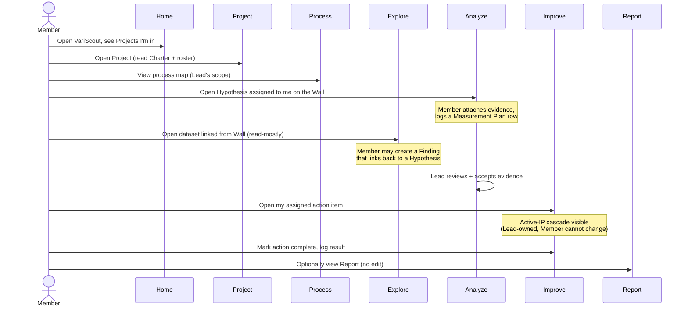

# Member Persona Journey

> **V1 in-project persona** — one of three persona roles a teammate plays inside a single Project (Lead / Member / Sponsor). A Member contributes content within a Project the Lead drives. The market-facing buyer persona (Improvement Specialist) lives in L1 ([`docs/01-vision/product-overview.md`](../../01-vision/product-overview.md)).

> **App scope** — Lead/Member/Sponsor role gating applies to the **Azure tenant SKU**. The **PWA** (free tier) is single-user open-access by design and does not enforce roles. See [`../../08-products/feature-parity.md`](../../08-products/feature-parity.md).

## Persona statement

The **Member** is invited into a Project to add domain knowledge, gemba observation, or analytical work. They edit hypothesis evidence, contribute measurement plan rows, and own assigned action items — but they do not drive the Project. They cannot sign off the Charter, approve hypothesis closure, or finalize the Report.

Real-world counterparts: SME, frontline operator, line manager, second analyst, recipe owner, lab technician — anyone with knowledge the Lead needs to triangulate hypotheses.

A Member is scoped to the projects they are invited into. They see only those Projects on Home; they do not see the Lead's wider portfolio.

## JTBD

> **When I** join a Project as Member, **I want to** contribute hypothesis evidence, measurement plan rows, or action items, **so I can** add my domain knowledge to the team's investigation.

Supporting jobs:

- When the Lead asks me to validate a hypothesis, I want to attach the data I have access to so the team has the evidence in one place.
- When a measurement plan needs a recurring reading, I want to log it where the Lead and Sponsor can see it without me chasing email.
- When I'm assigned an action item, I want a clean view of just my work so I don't have to navigate the full Project.

## Sequence across the 7-tab nav

Member's scope is narrower than Lead's: they touch **Analyze** (hypothesis evidence on the Wall), **Improve** (assigned actions), and **Process** (measurement plan rows). Home / Project / Explore / Report are mostly read for orientation.

## Feature touch-points

- [Investigation Wall](../../03-features/workflows/analyze-wall.md) — Add evidence to assigned Hypotheses; log Measurement Plan rows
- [Improvement Workspace](../../03-features/workflows/improvement-workspace.md) — Complete assigned action items under the active IP
- [Analysis Flow](../../03-features/workflows/analysis-flow.md) — Open datasets linked from the Wall; create Findings tied to a Hypothesis
- [Project Dashboard](../../03-features/workflows/project-dashboard.md) — Read Charter, see roster, view stage (no edit)

Supporting reference: [`flows/azure-team-collaboration.md`](../flows/azure-team-collaboration.md), [`flows/azure-teams-mobile.md`](../flows/azure-teams-mobile.md) (Members often work mobile on the floor).

## Outcomes / success signals

A Member has succeeded when:

- **Hypothesis evidence is attached.** Each assigned hypothesis has the Member's contributing data, gemba note, or SME judgment recorded.
- **Measurement Plan rows are logged.** Recurring readings appear in the Wall without Lead chasing.
- **Assigned actions are closed.** Each action item assigned to the Member is marked complete with a result note.
- **Lead does not have to chase.** The Member's contributions show up in the right surface at the right time; the Lead's review queue stays current.

Failure modes the journey is designed to prevent:

- Members editing surfaces they shouldn't (ACL is per-project + per-role; Members cannot advance stage or close hypotheses)
- Cross-tenant invites (V1 deliberately restricts membership to the same Azure AD tenant)
- Members losing scope to Projects they aren't in (Home filters to invited Projects only)
