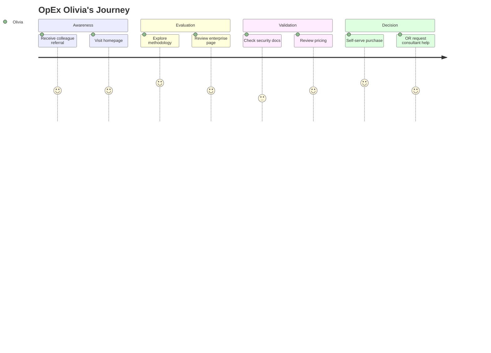

# OpEx Olivia

| Attribute         | Detail                                             |
| ----------------- | -------------------------------------------------- |
| **Role**          | OpEx Manager                                       |
| **Goal**          | Find tools for team                                |
| **Knowledge**     | Strategic, evaluates ROI                           |
| **Pain points**   | Budget constraints, IT approval, change management |
| **Decision mode** | Needs security docs, deployment guide, pricing     |

---

## What Olivia is thinking

- "My team needs better analysis tools"
- "Can I justify the cost vs Minitab?"
- "What's the IT/security story?"
- "How hard is deployment?"

---

## 4-Phase Journey



---

## Entry Points

| Source              | Arrives Via         | Lands On       |
| ------------------- | ------------------- | -------------- |
| Colleague referral  | Direct link         | / or /products |
| Conference          | QR code / card      | /              |
| LinkedIn            | Company page / post | / or /products |
| Team member request | "Check this out"    | /products      |

---

## Journey Flow

```
┌─────────────────┐
│ Referral from   │
│ colleague or    │
│ conference      │
└────────┬────────┘
         │
         ▼
┌─────────────────┐
│ / (Homepage)    │
│                 │
│ Quick scan:     │
│ "What is this?" │
│ "Who is it for?"│
└────────┬────────┘
         │
    ┌────┴────────────┐
    │                 │
    ▼                 ▼
┌────────────┐  ┌────────────┐
│ /journey   │  │ /products  │
│            │  │            │
│ See the    │  │ Jump to    │
│ methodology│  │ enterprise │
└─────┬──────┘  └─────┬──────┘
      │               │
      ▼               │
┌────────────┐        │
│ "I get it" │        │
│ Now eval   │────────┘
│ for team   │
└─────┬──────┘
      │
      ▼
┌─────────────────┐
│ /products/      │
│ enterprise      │
│                 │
│ Features        │
│ Security docs   │
│ Deployment guide│
│ Pricing         │
└────────┬────────┘
      │
 ┌────┴────────────────┐
 │                     │
 ▼                     ▼
┌────────────────┐  ┌─────────────────┐
│ SUBSCRIBE      │  │ NEED HELP?      │
│                │  │                 │
│ Azure          │  │ Your existing   │
│ Marketplace    │  │ consultants     │
│ Managed App    │  │ can assist      │
│ deploys auto   │  │                 │
└────────────────┘  └─────────────────┘
```

---

## Information Olivia Needs

| Question                    | Answer Location          |
| --------------------------- | ------------------------ |
| What does it do?            | /journey, /tools         |
| Is it secure?               | /products/enterprise     |
| Where's my data?            | /products/enterprise     |
| How much does it cost?      | /pricing                 |
| How do I deploy?            | /products/enterprise     |
| Who supports it?            | /support                 |
| Can I try it first?         | /app (free, permanently) |
| What training is available? | Training links           |

---

## Enterprise Page Requirements

The /products/enterprise page must answer:

### 1. Security & Compliance

- Where is data stored? → "Your Azure tenant, your data"
- SSO support? → Azure AD / Microsoft Entra ID
- Compliance? → SOC 2 considerations, GDPR
- Audit logs? → Azure native logging

### 2. Deployment

- How to deploy? → Azure Marketplace Managed Application
- Time to deploy? → Minutes (Managed Application)
- Who deploys? → Azure Marketplace handles it
- Updates? → Automatic via Azure

### 3. Pricing

- €150/month flat — all features, unlimited users in your tenant
- No per-user fees, no hidden costs
- Single plan, transparent pricing

### 4. Support

- Documentation-first
- Community support (free tier)
- Email support (paid tier)
- "Your existing LSS/IT consultants can assist"

---

## Success Metrics

| Metric                       | Target |
| ---------------------------- | ------ |
| Homepage → Enterprise page   | Track  |
| Enterprise page → Deployment | >5%    |
| Enterprise page → Contact    | >2%    |
| Marketplace subscriptions    | Track  |

---

## Related Flows

- [Enterprise Flow](../flows/enterprise.md) — Olivia's primary flow
