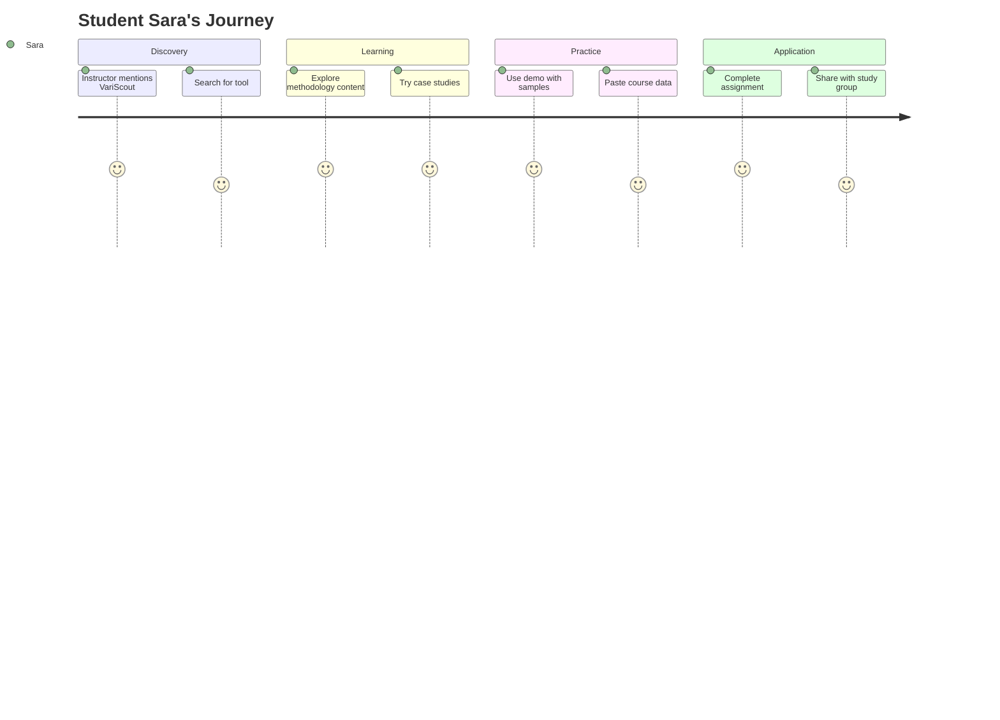

# Student Sara

| Attribute         | Detail                                                        |
| ----------------- | ------------------------------------------------------------- |
| **Role**          | LSS student / trainee                                         |
| **Goal**          | Learn methodology                                             |
| **Knowledge**     | Learning, needs guidance                                      |
| **Pain points**   | Theory feels abstract, tools seem complex                     |
| **Decision mode** | Follows instructor recommendations, looks for free/affordable |

---

## What Sara is thinking

- "I need to practice what I learned in class"
- "The instructor mentioned this tool"
- "I want to understand the concepts, not just click buttons"
- "Is there a free version I can use?"

---

## 4-Phase Journey



---

## Entry Points

| Source                          | Intent                 | Lands On         |
| ------------------------------- | ---------------------- | ---------------- |
| Course link                     | Instructor recommended | /app or /        |
| Google "control chart tutorial" | Self-learning          | /tools/i-chart   |
| YouTube search                  | Visual learning        | Video → /tools/X |
| Study group share               | Peer recommendation    | / or /app        |

---

## Journey Flow

```
┌─────────────────┐
│ Course / Class  │
│                 │
│ Instructor:     │
│ "Try VaRiScout" │
└────────┬────────┘
         │
         ▼
┌─────────────────┐
│ / (Homepage)    │
│                 │
│ Looks for:      │
│ - Free version  │
│ - Tutorials     │
│ - Documentation │
└────────┬────────┘
         │
    ┌────┴────────────┐
    │                 │
    ▼                 ▼
┌────────────┐  ┌────────────┐
│ /learn     │  │ /cases     │
│            │  │            │
│ Four       │  │ Practice   │
│ Lenses     │  │ examples   │
│ Two Voices │  │            │
└─────┬──────┘  └─────┬──────┘
      │               │
      └───────┬───────┘
              │
              ▼
     ┌─────────────────┐
     │ /app (Demo)     │
     │                 │
     │ Try with        │
     │ sample data     │
     └────────┬────────┘
              │
              ▼
     ┌─────────────────┐
     │ Paste own       │
     │ course data     │
     │                 │
     │ Complete        │
     │ assignment      │
     └─────────────────┘
```

---

## Key Content Needs

### Learning Resources

- Clear explanations of methodology
- Step-by-step tutorials
- Video walkthroughs
- Glossary of terms

### Practice Opportunities

- Sample datasets with known patterns
- Case studies with "find the answer" format
- Guided exercises

### Assignment Support

- Screenshot-friendly interface for reports
- Clear interpretation guidance

---

## Success Metrics

| Metric                         | Target |
| ------------------------------ | ------ |
| Course referral → /app         | >60%   |
| /learn → /cases                | >40%   |
| Demo usage duration            | >5 min |
| Return visits (study sessions) | >3     |

---

## Related Flows

- [SEO Learner Flow](../flows/seo-learner.md) — Self-discovery path
- [Content & YouTube Flow](../flows/content-youtube.md) — Video learning path
