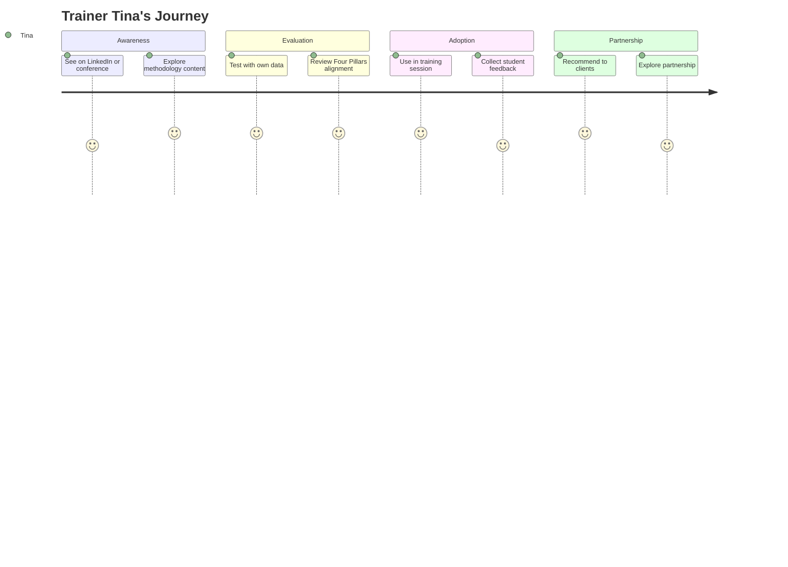

# Trainer Tina

| Attribute         | Detail                                                             |
| ----------------- | ------------------------------------------------------------------ |
| **Role**          | LSS Trainer / Consultant                                           |
| **Goal**          | Tools for courses & clients                                        |
| **Knowledge**     | Expert, evaluates for students                                     |
| **Pain points**   | Needs tools students can afford, wants consistent methodology      |
| **Decision mode** | Evaluates pedagogy, practical applicability, licensing for classes |

---

## What Tina is thinking

- "Is this tool aligned with how I teach?"
- "Can my students afford it?"
- "Does it reinforce the methodology or just push buttons?"
- "How can I integrate this into my courses?"

---

## 4-Phase Journey



---

## Entry Points

| Source                   | Context                     | Lands On            |
| ------------------------ | --------------------------- | ------------------- |
| LinkedIn                 | LSS community posts         | / or /learn         |
| YouTube                  | Tutorial content            | /tools/X            |
| Watson network           | Methodology reference       | /learn/four-pillars |
| Conference               | Tool demonstration          | /                   |
| Colleague recommendation | "Works great in my courses" | /                   |

---

## Tina's Evaluation Criteria

### Pedagogical Alignment

| Criterion     | Question                                       |
| ------------- | ---------------------------------------------- |
| Methodology   | Does it teach the Four Pillars?                |
| Visualization | Does it show relationships, not just numbers?  |
| Exploration   | Does it encourage "clicking around" to learn?  |
| Narrative     | Does it support the "find the story" approach? |
| Progressive   | Does it build from simple to complex?          |

### Practical Considerations

| Criterion          | Question                                       |
| ------------------ | ---------------------------------------------- |
| Student cost       | Can students afford it? (Free tier essential)  |
| Classroom use      | Can I demo live without internet issues?       |
| Assignment support | Can students complete exercises with it?       |
| Export             | Can students include screenshots in reports?   |
| Support            | Is documentation sufficient for self-learning? |

---

## Journey Flow

```
┌─────────────────┐
│ LinkedIn post   │
│ or conference   │
│ demo            │
└────────┬────────┘
         │
         ▼
┌─────────────────┐
│ /learn          │
│                 │
│ Four Pillars    │
│ Two Voices      │
│ EDA philosophy  │
└────────┬────────┘
         │
    ┌────┴───── "Does this align with
    │           how I teach?"
    │
    ▼
┌─────────────────┐
│ /cases          │
│                 │
│ Try case        │
│ studies with    │
│ own approach    │
└────────┬────────┘
         │
    ┌────┴───── "Can I use this in
    │           my training?"
    │
    ▼
┌─────────────────┐
│ /app            │
│                 │
│ Test with       │
│ real client     │
│ data            │
└────────┬────────┘
         │
    ┌────┴────────────┐
    │                 │
    ▼                 ▼
┌────────────┐  ┌────────────┐
│ USE IN     │  │ RECOMMEND  │
│ TRAINING   │  │ TO CLIENTS │
│            │  │            │
│ Integrate  │  │ Suggest    │
│ into       │  │ as tool    │
│ curriculum │  │ for teams  │
└────────────┘  └────────────┘
```

---

## Value Proposition for Trainers

### Why Tina Would Choose VariScout

1. **Methodology-first** - Not just charts, but the thinking behind them
2. **EDA approach** - Aligned with practical process improvement
3. **Free tier for students** - No barrier to classroom use
4. **Case-based learning** - Ready-made teaching materials
5. **Visual exploration** - Students "discover" rather than calculate

### Partnership Opportunities

- Curriculum integration materials
- Custom branding for training organizations
- Volume licensing for training programs
- Co-marketing with training courses

---

## Success Metrics

| Metric                          | Target |
| ------------------------------- | ------ |
| /learn page engagement          | >3 min |
| /cases → /app (trainer pattern) | Track  |
| Repeat visits (course prep)     | Track  |
| Student referrals from trainers | Track  |

---

## Related Flows

- [Content & YouTube Flow](../flows/content-youtube.md) — Discovery via content
- [SEO Learner Flow](../flows/seo-learner.md) — Students Tina sends
