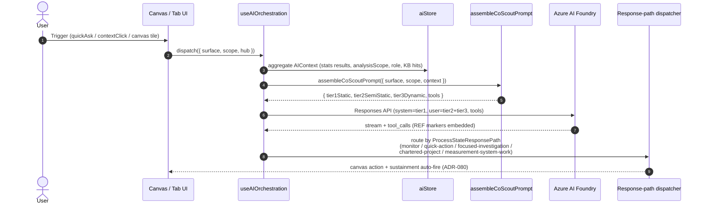

> **L3 feature stub** (M0 SDD inventory, 2026-05-18). Verified accurate against the CoScout code 2026-06-02 — the entry point is `assembleCoScoutPrompt()` (the `buildCoScoutSystemPrompt()` monolith was deleted, ADR-068). Full body expansion deferred to M3. Deep context-assembly reference: [ai-context-engineering.md](../../05-technical/architecture/ai-context-engineering.md).

# CoScout AI Orchestration

## Problem

An LLM assistant in an EDA tool must not recompute statistics, must respect customer-data boundaries, and must adapt its coaching to **whichever surface the analyst is on** (Process / Explore / Analyze-Wall / Report) and where they are in the investigation loop — otherwise it coaches the wrong surface, hallucinates numeric claims, or undermines the stats engine's authority. (The earlier linear "phase" model is retired — see the [CoScout surface + intent redesign](../../superpowers/specs/2026-06-09-coscout-surface-intent-redesign-design.md); ADR-068 amended.)

## Capability claim

CoScout assembly is centralized in `assembleCoScoutPrompt()` (replacing the deprecated `buildCoScoutSystemPrompt()`), with tiered prompts under `packages/core/src/ai/prompts/coScout/` (Tier 1 session-invariant for prompt-cache, Tier 3 per-session); the Azure app orchestrates calls via `useAIOrchestration` + `aiStore` in `apps/azure/src/features/ai/`, and the V1 Response Path System (shipped 2026-05-13) routes 5 canvas response paths through this prompt surface with Sustainment auto-fire per ADR-080.

## Intent diagram

User trigger → context assembly → tiered prompt → Responses API. Tier 1 stays session-invariant (Azure prompt cache hit); response-path routing dispatches the right canvas action on return:

Numeric claims come from the deterministic stats engine, never recomputed by the LLM (P5 / contribution-not-causation).

## Acceptance signals

TBD — testable conditions to be added on next edit. See related tests at `packages/core/src/ai/__tests__/` and `apps/azure/src/features/ai/__tests__/` for current verification.

## Out of scope / non-goals

TBD.

## Links

- **Code**: `packages/core/src/ai/`, `packages/core/src/ai/prompts/coScout/`, `apps/azure/src/features/ai/aiStore.ts`, `apps/azure/src/features/ai/useAIOrchestration.ts`
- **Tests**: `packages/core/src/ai/__tests__/`, `apps/azure/src/features/ai/__tests__/`
- **Related**: `docs/03-features/ai/visual-grounding.md`, `docs/07-decisions/adr-068-coscout-cognitive-redesign.md`, `docs/07-decisions/adr-080-control-auto-fire-pattern.md`, `docs/superpowers/specs/2026-06-09-coscout-surface-intent-redesign-design.md` (surface + intent model; supersedes ADR-068's phase-adaptive assembly)
