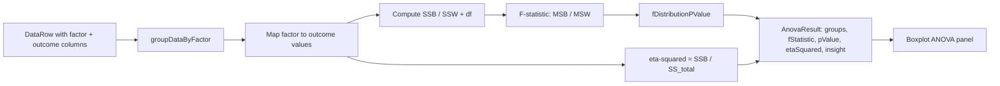

> **L3 feature stub** — created 2026-05-18 as part of M0 SDD migration inventory (Option A). Body to be expanded in M3 audit or on next feature edit.

# ANOVA / Group-Mean Comparison

## Problem

Process improvement teams need to test whether a categorical factor (supplier, shift, machine) drives meaningfully different means in a numeric outcome — the first screening pass before deciding which factors deserve deeper regression analysis.

## Capability claim

`calculateAnova()` in `packages/core/src/stats/anova.ts` performs one-way ANOVA over `DataRow[]`, returning per-group `{n, mean, stdDev}`, F-statistic, p-value (via `fDistributionPValue`), η² effect size (`getEtaSquared`), and a plain-language insight; pairs with the unified GLM/best-subsets engine documented in [regression-methodology.md](./regression-methodology.md).

## Intent diagram

## Acceptance signals

TBD — testable conditions to be added on next edit. See related tests at `packages/core/src/stats/__tests__/anova.test.ts` for current verification.

## Out of scope / non-goals

TBD. Continuous factors and mixed factor types are handled by the unified GLM engine, not ANOVA.

## Links

- **Code**: `packages/core/src/stats/anova.ts` (`calculateAnova`, `calculateAnovaFromArrays`, `getEtaSquared`, `groupDataByFactor`)
- **Tests**: `packages/core/src/stats/__tests__/anova.test.ts`
- **Related**: `docs/03-features/analysis/regression-methodology.md`, `docs/03-features/analysis/boxplot.md`
