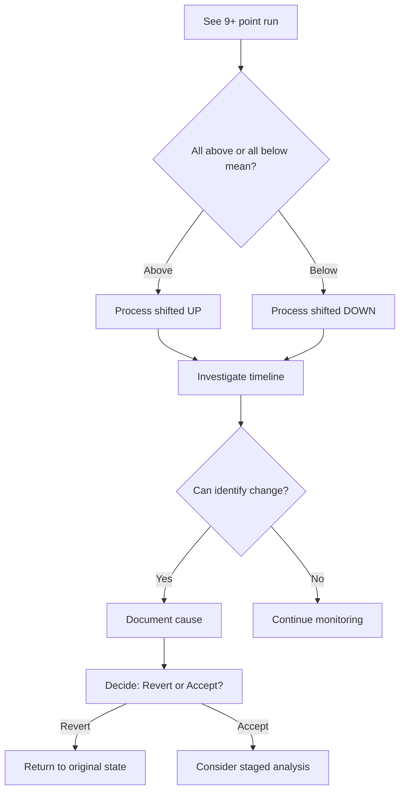
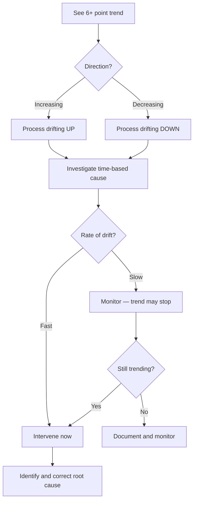

# Nelson Rules

Nelson Rules detect special cause variation patterns in control charts. VariScout implements Nelson Rule 2 (sustained shift) and Nelson Rule 3 (trend/drift) with distinct visual shapes for each violation type.

---

## Nelson Rule 2: Nine-Point Run

> "Nine or more consecutive points on the same side of the mean."

This pattern indicates a **sustained shift** in the process - not random fluctuation.

---

## What It Detects

| Pattern              | Meaning                             |
| -------------------- | ----------------------------------- |
| 9+ points above mean | Process shifted UP                  |
| 9+ points below mean | Process shifted DOWN                |
| Exactly on mean      | Point doesn't count for either side |

---

## Why It Matters

A single point outside control limits is obvious. But a sustained run on one side of the mean is equally significant - it means something systematic changed:

- New material batch
- Adjusted machine settings
- Different operator technique
- Environmental change (temperature, humidity)
- Measurement system drift

---

## Probability

For a stable process:

- Probability of 9 consecutive points above mean: (0.5)⁹ = 0.2%
- This rare probability makes it a reliable signal

---

## How to Interpret



---

## Investigation Questions

When you see a run:

1. **When did it start?** - First point in the run
2. **What changed then?** - Review logs, batches, personnel
3. **Is the shift good or bad?** - Moving toward target = good
4. **Is it permanent?** - One-time or ongoing change?

---

## Actions Based on Finding

| Situation                   | Action                                            |
| --------------------------- | ------------------------------------------------- |
| Shift improved process      | Document as improvement, consider staged analysis |
| Shift degraded process      | Investigate root cause, correct                   |
| Cause unknown, stable shift | Monitor, document, maintain                       |
| Cause unknown, variable     | Investigate urgently                              |

---

## Nelson Rule 3: Six-Point Trend

> "Six or more consecutive points that are strictly increasing or strictly decreasing."

This pattern indicates a **progressive drift** in the process — the mean is moving in one direction over time.

---

## What It Detects

| Pattern                  | Meaning                         |
| ------------------------ | ------------------------------- |
| 6+ strictly increasing   | Process drifting UP (rising)    |
| 6+ strictly decreasing   | Process drifting DOWN (falling) |
| Equal consecutive values | Trend broken — run resets       |

---

## Why It Matters

A trend is different from a shift: the process is not jumping to a new level, it is continuously moving. Left unchecked, a trend will eventually breach control limits or specification limits. Common causes:

- Tool wear or gradual degradation
- Temperature, pressure, or humidity drift over a production run
- Operator fatigue or learning curve
- Chemical concentration changing (e.g. bath depletion)
- Sensor drift or measurement system degradation

---

## Probability

For a stable random process:

- Probability of 6 consecutive strictly increasing values: 1/6! × 6 ≈ 0.14%
- The strictly monotone requirement (no ties) makes this a sensitive and reliable signal

---

## How to Interpret



---

## Investigation Questions

When you see a trend:

1. **How long has it been trending?** - First and last point in the sequence
2. **How fast is it moving?** - Slope (change per observation)
3. **What time-based factor drives this?** - Wear, temperature, batch depletion
4. **Where will it reach the limit?** - Extrapolate to predict breach point
5. **Is it accelerating or linear?** - Check if steps are growing larger

---

## Actions Based on Finding

| Situation                        | Action                                                      |
| -------------------------------- | ----------------------------------------------------------- |
| Tool wear / gradual degradation  | Schedule maintenance or replacement cycle                   |
| Environmental drift (temp/humid) | Add environmental controls or compensating adjustment       |
| Sensor/measurement drift         | Recalibrate instrument                                      |
| Process learning curve           | Document as expected; monitor for stabilisation             |
| Cause unknown                    | Use [Staged Analysis](staged-analysis.md) to isolate period |

---

## Violation Symbols

VariScout uses **dual encoding** on the I-Chart — each violation type gets both a distinct color and a distinct shape. This makes patterns identifiable even in greyscale or for users with colour vision differences.

| Symbol        | Shape             | Meaning                                          |
| ------------- | ----------------- | ------------------------------------------------ |
| Circle        | Filled circle     | In-control — no violation                        |
| Diamond       | Rotated square    | Rule 1 — beyond UCL/LCL or outside spec limits   |
| Square        | Upright square    | Rule 2 — 9+ consecutive points same side of mean |
| Triangle-up   | Upward triangle   | Rule 3 — 6+ consecutive strictly increasing      |
| Triangle-down | Downward triangle | Rule 3 — 6+ consecutive strictly decreasing      |

Priority order when multiple violations overlap at a point: **Rule 1 (diamond) > Rule 2 (square) > Rule 3 (triangle)**.

The shapes are defined in `packages/charts/src/ichart/ViolationShapes.tsx` (`ViolationShape` type) and assigned per-point in `IChart.tsx` via `getPointShape()`.

---

## In VariScout

VariScout highlights both Nelson Rule 2 and Rule 3 violations directly on the I-Chart:

- **Rule 2 (shift)**: Affected points are rendered as **squares**. The run length is included in the tooltip.
- **Rule 3 (trend)**: Affected points are rendered as **triangles** (up for increasing, down for decreasing). Direction is shown in the tooltip.
- **Rule 1 (out-of-control)**: Affected points are rendered as **diamonds** — this takes priority over Rule 2 and Rule 3 if a point is part of multiple violations.
- Sequences are tracked in Performance Mode across all channels.
- The `ChartInsightChip` surfaces Rule 2 and Rule 3 violations as deterministic insight text, with Rule 2 taking priority when both are present.
- Nelson Rule 2 and Rule 3 sequence counts are also included in the NarrativeBar and CoScout AI context via `buildAIContext()` violations.

---

## Staged Analysis Connection

When a run indicates a genuine process shift (e.g., after an improvement project):

1. The combined data shows a run violation
2. But the **new process state** may be stable
3. Use [Staged Analysis](staged-analysis.md) to calculate separate limits for before/after periods

Trends that stop after a root-cause correction are good candidates for staging — the pre-correction period is distinct from the corrected, stable state.

---

## Technical Reference

VariScout's implementation:

```typescript
// From @variscout/core
import {
  getNelsonRule2ViolationPoints,
  getNelsonRule2Sequences,
  getNelsonRule3ViolationPoints,
  getNelsonRule3Sequences,
} from '@variscout/core';

// Rule 2 — sustained shift
const rule2Violations = getNelsonRule2ViolationPoints(values, mean);
const rule2Sequences = getNelsonRule2Sequences(values, mean);
// sequence: { startIndex, endIndex, side: 'above' | 'below' }

// Rule 3 — trend/drift
const rule3Violations = getNelsonRule3ViolationPoints(values);
const rule3Sequences = getNelsonRule3Sequences(values);
// sequence: { startIndex, endIndex, direction: 'increasing' | 'decreasing' }
```

**Test coverage:** 48 test cases in `packages/core/src/__tests__/nelson.test.ts`

---

## See Also

- [I-Chart](i-chart.md) - Where Nelson rules are displayed
- [Staged Analysis](staged-analysis.md) - Handling legitimate process shifts
- [Glossary: Nelson Rules](../../glossary.md#nelson-rules)
- [Glossary: Special Cause](../../glossary.md#special-cause)
- [Glossary: Nelson Rule 3](../../glossary.md#nelson-rule-3)
- [CHANGE Lens](../../01-vision/four-lenses/change.md) - Time-based stability
