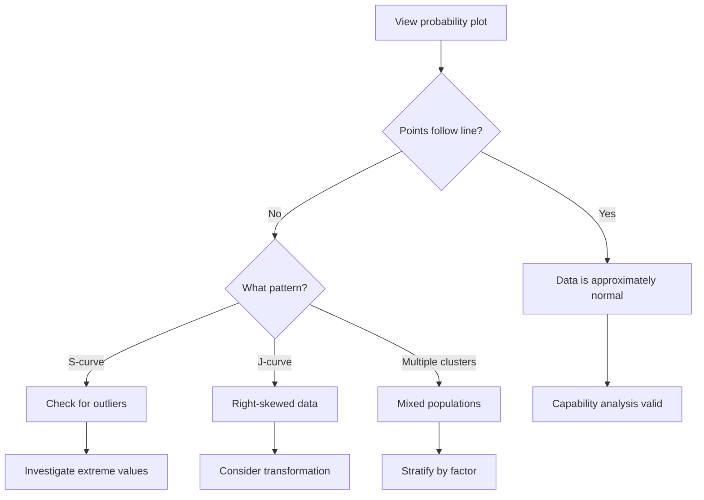

# Probability Plot

<!-- journey-phase: scout -->

> **Journey phase:** SCOUT — distribution-shape diagnosis that often comes immediately after the I-Chart.

The probability plot assesses whether data follows a normal distribution, but in VariScout it is also a general diagnostic chart for spotting mixed populations, tails, skew, and subgroup differences.

---

## Purpose

_"Is my data normally distributed?"_

Many statistical methods assume normality:

- **Cp/Cpk calculations** rely on normal distribution
- **Control limits** (±3σ) assume symmetric, bell-shaped data
- **Expected performance** predictions depend on distribution shape

The probability plot provides a visual answer.

---

## Dashboard Placement

In the laptop-first Analysis dashboard, `Probability` is the default tab in the adaptive right-hand lens.

- It is always available
- It stays visible whether specs exist or not
- When a subgroup factor is selected, it can overlay multiple series for factor-level comparison

This makes the probability plot part of the analyst's normal exploratory reading path, not a hidden verification-only step.

---

## How to Read It

### Linear = Normal

If your data is normally distributed, points fall along a **straight diagonal line**.

```
Normal Data:           Non-Normal Data:
     •                       •
    •  95%                   •
   •                       •
  •  line               •
 •                    •
•                   •
```

### Deviations from the Line

| Pattern            | Meaning                         |
| ------------------ | ------------------------------- |
| Points follow line | Normal distribution             |
| S-curve            | Heavy tails (outliers)          |
| J-curve            | Skewed right                    |
| Inverted J         | Skewed left                     |
| Multiple clusters  | Multi-modal (mixed populations) |

---

## Confidence Bands

VariScout shows **95% confidence bands** around the expected line:

- Points **within bands** = consistent with normality
- Points **outside bands** = significant deviation

A few points outside bands (especially at extremes) is normal. Systematic patterns outside bands indicate non-normality.

---

## Interpretation Workflow



---

## Technical Details

### Median Rank (Benard's Formula)

VariScout uses **Benard's approximation** for expected percentiles:

```
p = (i - 0.3) / (n + 0.4)
```

Where:

- `i` = rank position (1, 2, 3, ...)
- `n` = sample size
- `p` = expected cumulative probability

This formula is the **industry standard** (used by Minitab, JMP, and other statistical software).

### Normal Quantile

The Y-axis shows the **normal quantile** (z-score) calculated using the **Acklam algorithm** for the inverse cumulative distribution function.

---

## When Normality Fails

### Consequences

| Impact Area           | Effect of Non-Normality                |
| --------------------- | -------------------------------------- |
| Cpk                   | May overstate or understate capability |
| Control limits        | May be too wide or too narrow          |
| Pass rate predictions | Will be inaccurate                     |

### Solutions

| Approach                   | When to Use                            |
| -------------------------- | -------------------------------------- |
| Transform data             | Known skewness (e.g., log transform)   |
| Use non-parametric methods | When transformation not appropriate    |
| Stratify by factor         | Multi-modal suggests mixed populations |
| Increase sample size       | Small samples often appear non-normal  |
| Accept approximation       | Mild non-normality, large samples      |

---

## Factor Grouping (Multi-Series)

When a factor is selected in the Boxplot factor dropdown, the probability plot automatically overlays **one series per factor level** with different colors and a legend. This reveals whether normality varies across process conditions — a common finding in mixed-population data.

Each series shows its own:

- **Fitted line** with 95% confidence bands
- **Anderson-Darling test** p-value (per series, when n ≥ 7)
- **Mean, StdDev, N** in the series tooltip

This is especially useful for diagnosing multi-modal distributions: if the overall probability plot shows an S-curve or clusters, stratifying by factor often reveals that each subgroup is individually normal — the non-normality comes from mixing different populations.

The factor selection is linked to the Boxplot — both charts always show the same grouping factor. This keeps the analysis synchronized: you see distribution shape (probability plot) and location/spread (boxplot) for the same grouping.

---

## Example Interpretations

### Example 1: Normal Data

Points follow the line closely, all within confidence bands.

**Conclusion:** Capability metrics are reliable.

### Example 2: Heavy Tails

S-shaped curve with points outside bands at both ends.

**Conclusion:** More extreme values than normal predicts. Investigate for outliers or investigate the process for occasional disruptions.

### Example 3: Right Skew

J-shaped curve, data clustered at low end.

**Conclusion:** Process has a floor (can't go below zero?) but occasional high values. Consider log transformation or non-parametric analysis.

---

## Probability Plot vs. Histogram

| Aspect               | Probability Plot | Histogram         |
| -------------------- | ---------------- | ----------------- |
| Normality assessment | Excellent        | Good              |
| Tail behavior        | Clear            | Hard to see       |
| Small samples        | Works well       | Can be misleading |
| Outlier detection    | Good             | Depends on bins   |
| Distribution shape   | Precise          | Approximate       |

Use **both** for comprehensive assessment. In the dashboard, the companion histogram tab is labeled:

- `Distribution` when specs are not set
- `Capability` when specs are present

---

## Technical Reference

VariScout's implementation:

```typescript
// From @variscout/core
import { calculateProbabilityPlotData } from '@variscout/core';

const plotData = calculateProbabilityPlotData(values);

// Returns array of:
// {
//   value: number,          // Sorted data value
//   percentile: number,     // Benard's median rank
//   normalQuantile: number, // Z-score (Acklam)
//   ciLower: number,        // 95% CI lower bound
//   ciUpper: number         // 95% CI upper bound
// }
```

**Test coverage:** See `packages/core/src/__tests__/stats.test.ts` for probability plot tests.

---

## Inflection-Point Binning

<!-- journey-phase: scout -->

When the prob plot shows a visible kink (multi-modal distribution), the analyst can manufacture a categorical _stratification dimension_ directly from the column being plotted. This is the **inflection-point binning** workflow.

**The journey:**

1. Probability lens of Explore tab on a numeric column — analyst sees a kink in the curve
2. Side panel: `Detect inflections` button (or once-per-session banner suggesting it)
3. Algorithm runs: **piecewise linear regression** on the `(value, normalQuantile)` point cloud + grid search over candidate breakpoints
4. Up to 2 inflection points proposed as cyan dashed guides on the plot; side panel surfaces per-segment stats inline: `n / % share / mean / Anderson-Darling p-value`
5. Analyst drags / removes cuts to refine; numeric-range labels (`<47`, `47–89`, `≥89`) live-update
6. `Create bin column →` persists a `BinnedFactorBinding` on the active IP; the new column `{source}_bin` appears in the palette under **DERIVED FROM BINNING** and is selectable as a factor in Boxplot + Probability lenses
7. **Self-validation loop:** the analyst picks the new bin column as the prob plot's stratification factor — one series per level — and confirms each subgroup is individually linear (= normal). The detection objective ("each segment looks normal") IS the stratification validation criterion, so the loop closes by construction

**Direct-manipulation State B:** once committed, dragging a cut on the plot re-derives the bin column live; every chart in the Explore grid that has the bin as factor (Boxplot, Pareto, stratified Probability) updates without a save step. The bin column name stays stable so downstream chart references never break.

**Algorithm choice rationale:** piecewise linear regression on the prob plot is the unique method whose objective function (minimize total RSS across segments fitted to the normal-quantile mapping) matches the stratification validation criterion. KDE-valley detection answers "where's a gap in the density?"; change-point on sorted values answers "where does the sorted sequence shift its mean?" — neither directly tests subgroup-normality, so neither produces a self-validating binning. Anderson-Darling p-value per segment is the confidence signal the analyst reads.

**Methodology positioning vs Minitab/JMP:** SPC vendors deliberately do not auto-suggest cuts (their convention is _"stratify by an existing factor; investigate why the multi-modality exists"_). VariScout preserves that discipline as the primary advice in the [How to Read It](#how-to-read-it) flowchart above. Inflection binning is for the case where **no existing factor explains the multi-modality** — the analyst is willing to manufacture a stratification dimension from the data itself, with the algorithm's segment-normality test acting as the methodological guard. The cyan-dashed guides + segment-AD-p-value table make the algorithm's reasoning legible.

**See also:** [Canvas Connection Journey spec §3.5](../../superpowers/specs/2026-05-26-canvas-connection-journey-design.md), the 2026-05-28 decision-log entry refining §3.5 + §3.5.1.

---

## See Also

- [Capability](capability.md) - Where normality matters most
- [Chart Design: Probability Plot](../../06-design-system/charts/probability-plot.md)
- [Glossary: Probability Plot](../../glossary.md#probability-plot)
- [Histogram (Capability Chart)](capability.md) - Alternative view
