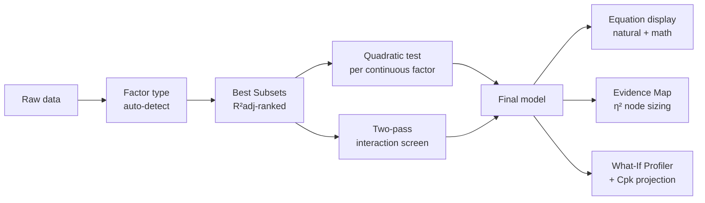

# Regression Methodology

How VariScout models the relationship between process factors and the measured outcome — using a **unified General Linear Model (GLM)** that handles categorical factors (machine type, shift, supplier), continuous factors (temperature, pressure, speed), and any mix of the two.

## Problem

Real process improvement rarely deals with pure-categorical or pure-continuous data. A coating process might have Operator (categorical, 4 levels), Temperature (continuous, 160–200°C), and Line Speed (continuous, 5–15 m/min) all affecting yield. Analyzing these with separate tools — ANOVA for Operator, correlation for Temperature — misses the interactions and gives incomplete answers. VariScout uses one unified engine so analysts can pose the question "which factors and which interactions explain this outcome?" without first choosing a tool.

## Capability claim

When an analyst points VariScout at a dataset, the engine auto-classifies each column as categorical or continuous (with override), runs **Best Subsets regression** to find which combination of factors best explains the outcome, automatically tests for quadratic curvature and two-way interactions, and surfaces the result through the Evidence Map, the regression equation display, and the What-If Prediction Profiler. Mixed-type interactions are classified by geometric pattern (ordinal vs disordinal) — never by causal claim.

## Teaching principle

> "Don't search for the equation first — search for which variables make a difference."

Best subsets evaluates all factor combinations to find the most explanatory model. The equation comes last — after you know which factors belong in it. This mirrors the INVESTIGATE phase logic: question-driven discovery, then synthesis.

## Intent diagram (engine flow)

## Two engines, clear roles

| Engine          | Used for                                                      | Why                                                         |
| --------------- | ------------------------------------------------------------- | ----------------------------------------------------------- |
| One-way ANOVA   | Boxplot factor display, per-factor η²                         | Fast, categorical-only, familiar to Six Sigma practitioners |
| Unified OLS/GLM | Best subsets, Evidence Map, What-If sliders, equation display | Handles mixed factor types, supports continuous prediction  |

Both engines agree exactly for categorical-only data.

## Acceptance signals

- A dataset with mixed factor types yields one ranked model containing main effects, quadratic terms (where curvature is detected), and significant interactions — with no manual tool switching.
- Interactions are surfaced as **ordinal** or **disordinal** patterns, never as moderator/primary roles.
- The Evidence Map node radial position reflects R²adj contribution; node size reflects partial η²; badge color reflects p-value confidence.
- The What-If Profiler projects Cpk as the analyst drags a slider, including a 95% prediction interval and an extrapolation warning when the slider leaves the observed range.
- The engine matches NIST StRD (Norris, Pontius, Longley) to 9+ significant digits, and the GLM-on-categorical-only result is mathematically equivalent to one-way ANOVA.

## Guardrails (analyst-visible)

- **Extrapolation warning** when a What-If slider moves outside the observed range for a continuous factor.
- **VIF > 10** warning when factors are highly correlated: "Machine and Shift are highly correlated. Individual effects may be unreliable."
- **Low R²adj < 0.30** guidance prompt: "The identified factors explain only X% of variation. Important factors may be missing."
- **Overfitting indicator** when R² − R²adj > 0.10 suggests collecting more data or reducing factor count.

## Out of scope

- Response surface / contour plots (DOE scope).
- Stepwise regression as a primary path (best subsets is the canonical entry).
- AIC / BIC as primary selection criteria (R²adj is canonical — matches Minitab/Six Sigma convention).

## Engineering detail

See [`05-technical/regression-glm-engine.md`](../../05-technical/regression-glm-engine.md) for the design-matrix construction, Furnival-Wilson best-subsets algorithm, QR-decomposition numerical-stability rationale, Type III SS computation, the two-pass interaction screener, and the testing strategy against NIST StRD.

## Cross-references

| Topic                                 | Document                                                                     |
| ------------------------------------- | ---------------------------------------------------------------------------- |
| ANOVA and η² (one-factor analysis)    | [Variation Decomposition](variation-decomposition.md)                        |
| Factor Intelligence ranking           | [Factor Intelligence](../../02-journeys/flows/factor-intelligence.md)        |
| Evidence Map spatial layout           | [Evidence Map](../../archive/specs/2026-04-05-evidence-map-design.md)        |
| What-If Simulator (direct adjustment) | [Investigation to Action](../workflows/investigation-to-action.md)           |
| Implementation reference              | [Statistics Technical Reference](../../05-technical/statistics-reference.md) |
| ADR decision record                   | [ADR-067](../../07-decisions/adr-067-unified-glm-regression.md)              |
