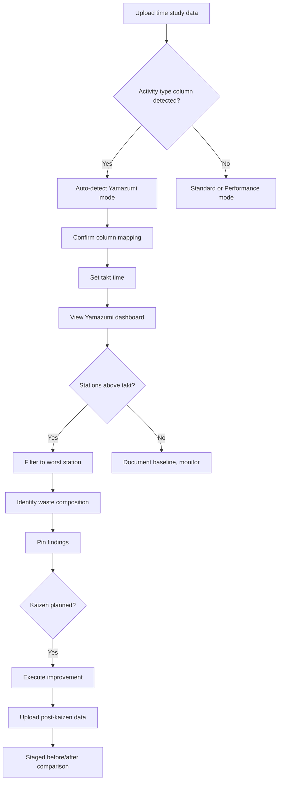

# Yamazumi Analysis

<!-- journey-phase: scout -->

> **Journey phase:** SCOUT — cycle time composition visualization reveals where waste hides inside stations.

Yamazumi analysis decomposes cycle time into activity types (value-add, non-value-add, semi-value-add, wait) per station, visualized as stacked bars against a takt time reference line.

---

## Purpose

_"Which stations exceed takt time, and is it because of real work or waste?"_

Traditional time study analysis in Excel requires manually building stacked bar charts, recalculating ratios, and losing the connection between the chart and the underlying data. VariScout's Yamazumi mode provides:

- **Instant composition view** — Stacked bars show activity type breakdown per station
- **Takt compliance at a glance** — Reference line makes violations obvious
- **Linked drill-down** — Click a segment to filter all charts to that station + activity type
- **Investigation workflow** — Pin findings, track hypotheses, verify kaizen improvements

---

## When to Use Yamazumi Mode

| Situation                        | Use Yamazumi? | Why                               |
| -------------------------------- | ------------- | --------------------------------- |
| Time study with activity types   | Yes           | Core use case                     |
| Cycle time by station (no types) | Partial       | Can show totals, no composition   |
| Fill weight or dimensional data  | No            | Use Standard SPC mode             |
| Multi-channel measurement data   | No            | Use Performance mode              |
| Kaizen before/after comparison   | Yes           | Staged analysis shows improvement |

---

## Chart Slot Mapping

The Yamazumi dashboard uses the same four-slot layout as Standard and Performance modes:

| Slot | Chart             | Purpose                                |
| ---- | ----------------- | -------------------------------------- |
| 1    | **YamazumiChart** | Stacked bar composition per station    |
| 2    | **I-Chart**       | Cycle time series (switchable metric)  |
| 3    | **Pareto**        | Waste ranking (switchable grouping)    |
| 4    | **Summary Panel** | Lean metrics (takt, efficiency, waste) |

---

## YamazumiChart

### Visual Structure

```
Takt = 60s
        ┃
Station ┃ ████████████████████████░░░░░░░░▒▒▒▒  72s
A       ┃ ▓▓▓▓ VA  ░░░░ SNVA  ▒▒ NVA  ░░ Wait
        ┃
Station ┃ ██████████████████░░░░░▒▒              55s
B       ┃
        ┃
Station ┃ ████████████████████████████░░▒▒▒▒▒▒▒ 68s
C       ┃
        ┗━━━━━━━━━━━━━━━━━━━━━━━━━━━━━━━━━━━━━━
          0s      20s      40s  ┃  60s      80s
                               Takt
```

### Interaction

- **Click segment** — Filters all charts to that station + activity type
- **Hover** — Tooltip shows activity type, duration, percentage of station total
- **Takt line** — Dashed reference line; segments above takt shown with emphasis
- **Responsive** — Follows existing `withParentSize` wrapper pattern

---

## Activity Type System

Four activity types with automatic classification via fuzzy matching:

| Type | Label          | Color | Description                                   |
| ---- | -------------- | ----- | --------------------------------------------- |
| VA   | Value-Add      | Green | Work the customer would pay for               |
| NVA  | Non-Value-Add  | Red   | Pure waste — target for elimination           |
| SNVA | Semi-Value-Add | Amber | Required but non-value — target for reduction |
| Wait | Wait / Idle    | Slate | Waiting for material, machine, information    |

### Classification

The `classifyActivityType()` function in `@variscout/core` maps column values to types:

```typescript
classifyActivityType('value add'); // → 'VA'
classifyActivityType('NVA'); // → 'NVA'
classifyActivityType('necessary'); // → 'SNVA'
classifyActivityType('idle time'); // → 'Wait'
classifyActivityType('unknown'); // → 'NVA' (conservative default)
```

Users can override classification in the Column Mapping step.

---

## I-Chart Metric Switching

The I-Chart in Yamazumi mode supports three metrics via a toggle:

| Metric     | Shows                               | Use Case                       |
| ---------- | ----------------------------------- | ------------------------------ |
| Total Time | Sum of all activity types per cycle | Overall cycle time stability   |
| VA Time    | Value-add time only                 | Is real work consistent?       |
| NVA Time   | Non-value-add time only             | Is waste increasing over time? |

Control limits recalculate per selected metric.

---

## Pareto Mode Switching

The Pareto chart supports two grouping modes:

| Mode             | X-Axis        | Bar Height       | Use Case                        |
| ---------------- | ------------- | ---------------- | ------------------------------- |
| Waste by Station | Station name  | Total NVA + Wait | "Which station has most waste?" |
| Waste by Type    | Activity type | Total time       | "What kind of waste dominates?" |

---

## Summary Panel Metrics

| Metric             | Formula                              | Interpretation                            |
| ------------------ | ------------------------------------ | ----------------------------------------- |
| Takt Time          | User-entered (available time/demand) | Reference for compliance                  |
| Bottleneck Station | max(total time per station)          | Constraint to address first               |
| Process Efficiency | sum(VA) / sum(Total) \* 100          | Lean counterpart to Cpk (higher = better) |
| Takt Compliance    | stations below takt / total stations | Line health indicator (target: 100%)      |
| Total NVA          | sum(NVA + Wait) across all stations  | Waste magnitude in absolute time          |

---

## Data Format Requirements

### Minimum Columns

| Column        | Type        | Required | Description                           |
| ------------- | ----------- | -------- | ------------------------------------- |
| Station/Step  | Categorical | Yes      | Process step identifier               |
| Duration/Time | Numeric     | Yes      | Activity duration in consistent units |
| Activity Type | Categorical | Yes      | VA/NVA/SNVA/Wait (auto-classified)    |

### Optional Columns

| Column      | Type        | Purpose                          |
| ----------- | ----------- | -------------------------------- |
| Observation | Sequential  | Time ordering for I-Chart        |
| Operator    | Categorical | Factor for drill-down            |
| Shift       | Categorical | Factor for drill-down            |
| Stage       | Categorical | Before/After for staged analysis |

### Sample Data

```csv
Station,Activity,Type,Duration_sec,Observation,Shift
Pick,Place component,VA,12,1,Morning
Pick,Walk to bin,NVA,8,1,Morning
Pick,Wait for feeder,Wait,5,1,Morning
Solder,Solder joints,VA,18,1,Morning
Solder,Rework cold joint,NVA,6,1,Morning
...
```

---

## Auto-Detection

Yamazumi mode is auto-detected when:

1. A categorical column contains values matching activity type patterns (VA/NVA/SNVA/Wait)
2. A numeric column represents duration/time
3. A categorical column represents stations/steps

Detection runs before Performance mode detection. The user can override via the mode switcher.

---

## Workflow



---

## Technical Reference

```typescript
// From @variscout/core
import {
  classifyActivityType,
  detectYamazumiFormat,
  calculateYamazumiStats,
} from '@variscout/core';
import type { ActivityType, YamazumiStationData } from '@variscout/core';

// Detect format
const isYamazumi = detectYamazumiFormat(columns, sampleRows);

// Classify activity types
const type: ActivityType = classifyActivityType(rawValue);

// Calculate per-station metrics
const stations: YamazumiStationData[] = calculateYamazumiStats(
  data,
  stationColumn,
  durationColumn,
  activityTypeColumn,
  taktTime
);
```

---

## See Also

- [ADR-034: Yamazumi Analysis Mode](../../07-decisions/adr-034-yamazumi-analysis-mode.md) — Architecture decision
- [Staged Analysis](staged-analysis.md) — Before/after comparison for kaizen verification
- [Yamazumi Lens](../../01-vision/four-lenses/yamazumi-lens.md) — Four Lenses methodology connection
- [Assembly Line Case Study](../../04-cases/assembly-line/index.md) — Teaching case with sample data
- [Engineer Eeva](../../02-journeys/personas/engineer-eeva.md) — Primary persona for Yamazumi mode
