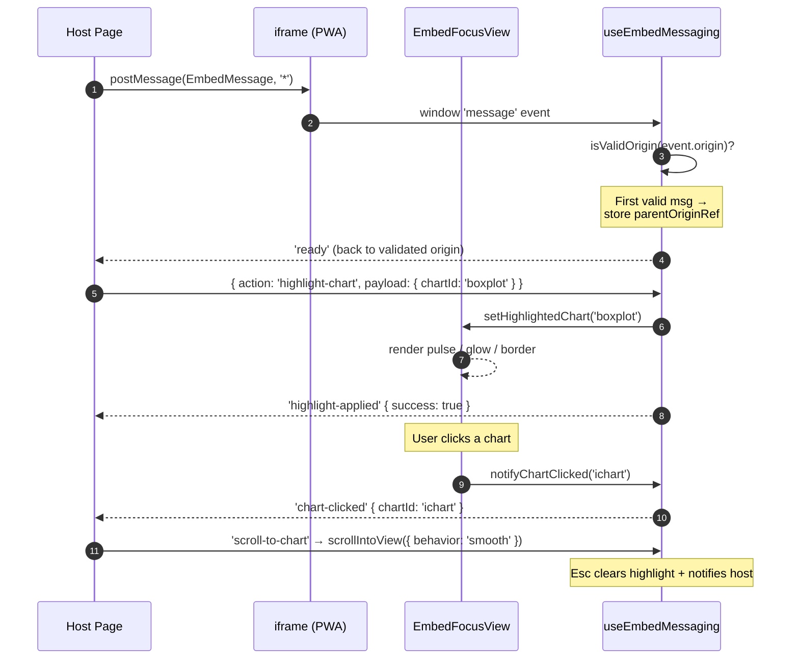

> **L3 feature stub** — created 2026-05-18 as part of M0 SDD migration inventory (Option A). Body to be expanded in M3 audit or on next feature edit.

# PWA Embedded Mode

## Problem

Educational content sites, marketing pages, and live training scenarios need to host an interactive VariScout view that can be cross-driven from the surrounding page (highlight a specific chart, scroll into view, react to clicks) without giving up the browser-only data boundary.

## Capability claim

The PWA exposes an iframe-embeddable focus view via `EmbedFocusView` in `apps/pwa/src/components/views/EmbedFocusView.tsx` (renders any of `'ichart' | 'boxplot' | 'pareto' | 'stats'` as the focal chart), with a `postMessage` protocol handled by `useEmbedMessaging` (typed `EmbedMessage` / `EmbedResponse`, origin validation, message IDs) supporting `highlight-chart`, `clear-highlight`, `ping`, and `scroll-to-chart` actions plus `ready` / `chart-clicked` / `state-update` outbound events.

## Intent diagram

Host page ↔ iframe bidirectional postMessage protocol. Origin validation happens on the first inbound message; `ready` is emitted only after a validated parent origin is known:

Customer data never leaves the iframe — only highlight intent and chart-click events cross the boundary.

## Acceptance signals

TBD — testable conditions to be added on next edit. See related tests at `apps/pwa/src/hooks/__tests__/` for current verification.

## Out of scope / non-goals

TBD.

## Links

- **Code**: `apps/pwa/src/components/views/EmbedFocusView.tsx`, `apps/pwa/src/hooks/useEmbedMessaging.ts`
- **Tests**: `apps/pwa/src/hooks/__tests__/`
- **Related**: `docs/02-journeys/flows/pwa-education.md`, `apps/pwa/CLAUDE.md`
