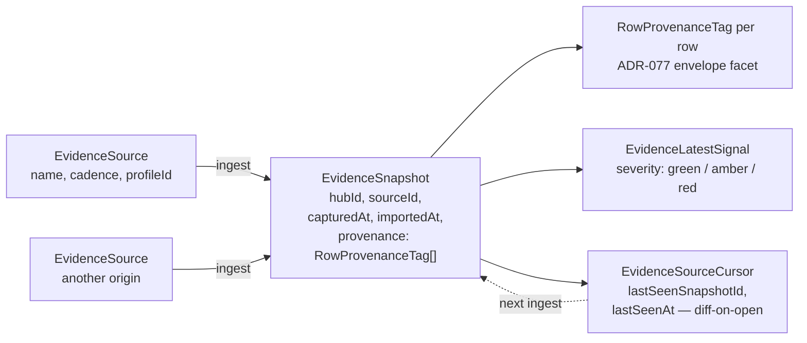

> **L3 feature stub** — created 2026-05-18 as part of M0 SDD migration inventory (Option A). Body to be expanded in M3 audit or on next feature edit.

# Evidence Sources

## Problem

A Process Hub aggregates rows from heterogeneous origins (pasted spreadsheets, scheduled exports, manual entry) at different cadences — analysts need a registry of where data came from, how fresh each source is, and which rows trace back to which source so claims stay defensible.

## Capability claim

`EvidenceSource` (`packages/core/src/evidenceSources.ts`) types each catalog entry with `hubId`, `name`, `cadence` (`'manual' | 'hourly' | 'shiftly' | 'daily' | 'weekly'`), optional `profileId`, and lineage via `EvidenceSourceCursor` (per-source `lastSeenSnapshotId` for diff-on-open polling, ADR-077 D8); the canonical row-provenance home is `EvidenceSnapshot.provenance?: RowProvenanceTag[]` (ADR-077 amendment 2026-05-07 — runtime sidecar Map retired in F3.6-β), and `EvidenceLatestSignal` surfaces severity-tagged latest readings per source.

## Intent diagram

Source registry → ingest produces `EvidenceSnapshot` → snapshot carries provenance for every row + cursor tracks freshness:

`EvidenceSnapshot.provenance` is the canonical home for row-source metadata (ADR-077 amendment 2026-05-07 — sidecar Map retired). Cadence drives staleness signals on the Investigation Wall; `EvidenceLatestSignal` surfaces severity-tagged readings without re-running stats.

## Acceptance signals

TBD — testable conditions to be added on next edit. See related tests at `packages/core/src/__tests__/` for current verification.

## Out of scope / non-goals

TBD.

## Links

- **Code**: `packages/core/src/evidenceSources.ts`, `packages/core/src/matchSummary/`, `apps/azure/src/features/evidenceSources/`
- **Tests**: `packages/core/src/__tests__/`
- **Related**: `docs/03-features/data/data-input.md`, `docs/03-features/data/storage.md`, `docs/07-decisions/adr-077-provenance-envelope-facet.md`
