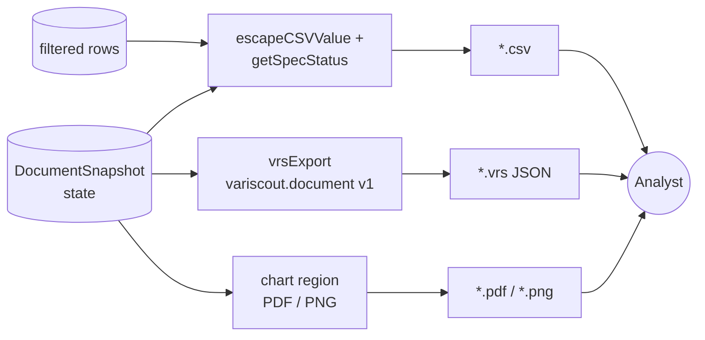

> **L3 feature stub** (M0 SDD inventory, 2026-05-18). Verified accurate against R6 code 2026-06-02; full body expansion deferred to M3. See **[save-and-load.md](save-and-load.md)** for the save/load/access contract.

# Export

## Problem

Analysts and process owners need to take findings out of the browser session for sharing, archiving, and import into other tools — without losing the spec-status, provenance, or hub-level context that VariScout has reconstructed.

## Capability claim

VariScout serializes outbound state across three channels: CSV via `@variscout/core/export` (`escapeCSVValue` neutralizes formula injection; `getSpecStatus` stamps PASS/FAIL_USL/FAIL_LSL per row), chart-region PDF/PNG via the Azure app's chart-export plumbing, and the portable `.vrs` JSON file via `packages/core/src/serialization/vrsFormat.ts` (`kind: "variscout.document"`, `version: 1`, `documentSnapshot`).

## Intent diagram

Three outbound channels, all driven from the current document state. CSV stamps per-row spec status + neutralizes formula injection; `.vrs` carries a snapshot-only document envelope for round-trip via `vrsImport`; chart-region PDF/PNG goes through the Azure app's chart-export plumbing.

## Acceptance signals

TBD — testable conditions to be added on next edit. See related tests at `packages/core/src/serialization/__tests__/roundtrip.test.ts` for current `.vrs` round-trip verification.

## Out of scope / non-goals

TBD.

## Links

- **Code**: `packages/core/src/export.ts`, `packages/core/src/serialization/vrsFormat.ts`, `packages/core/src/serialization/vrsExport.ts`, `packages/core/src/serialization/vrsImport.ts`
- **Tests**: `packages/core/src/serialization/__tests__/roundtrip.test.ts`
- **Related**: `docs/03-features/data/storage.md`, `docs/03-features/data/validation.md`
