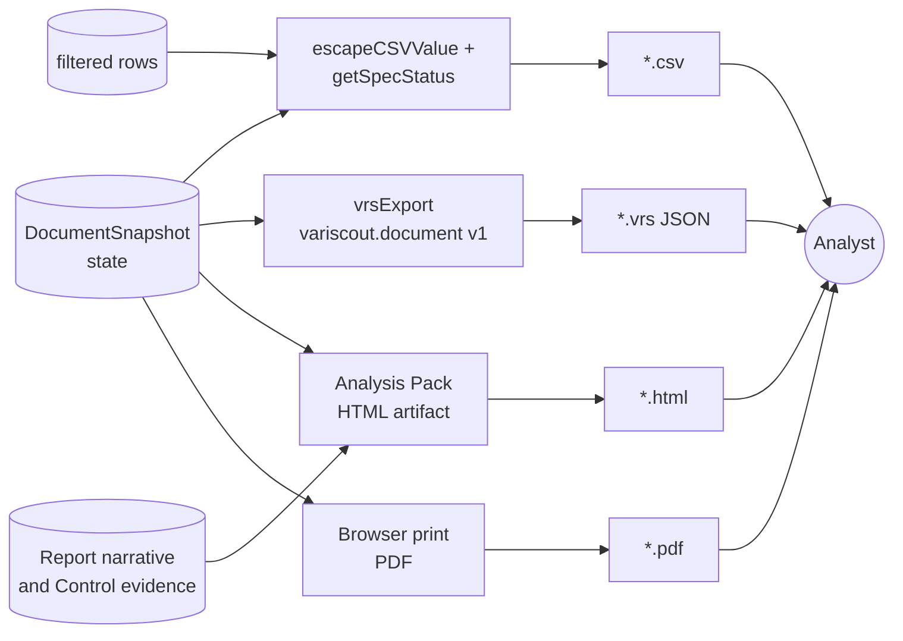

> **Last material edit 2026-06-11** — Expanded from an export stub into the Analysis Pack capability proposed by [ADR-092](../../07-decisions/adr-092-local-first-variscout-product-model.md). Current shipped exports remain CSV, `.vrs`, and browser print/PDF; HTML Analysis Packs are the product direction, not fully built.

# Export and Analysis Packs

## Problem

Analysts need to take evidence out of VariScout without turning the work back into manual screenshots, spreadsheets, and slide decks. The export model must support three jobs:

1. Save or transfer a Workspace for later analysis.
2. Share evidence with the right level of detail.
3. Preserve enough provenance for technical review without leaking unnecessary sensitive data.

## Capability claim

VariScout has four outbound channels:

1. **CSV** via `@variscout/core/export` (`escapeCSVValue` neutralizes formula injection; `getSpecStatus` stamps PASS/FAIL_USL/FAIL_LSL per row).
2. **`.vrs` snapshot** via `packages/core/src/serialization/vrsFormat.ts` (`kind: "variscout.document"`, `version: 1`, `documentSnapshot`).
3. **Print/PDF** via browser print and report print styles.
4. **Analysis Pack** (product direction): a self-contained HTML evidence artifact generated from Report/workspace state.

Analysis Packs are the strategic sharing layer for local-first VariScout. They are not the canonical save format; `.vrs` remains the workspace snapshot.

## Analysis Pack family

| Pack | Audience | Data posture | Content |
| --- | --- | --- | --- |
| **Executive** | Sponsor, manager, customer | No raw rows | Summary, selected charts, findings, actions, Control outcome, next step. |
| **Technical** | Engineer, Black Belt, auditor | Computed details, not necessarily raw rows | Full chart set, methods, assumptions, specs, computed tables, evidence trace. |
| **Reproducible** | Analyst, internal reviewer | Includes or links `.vrs` | Technical pack plus workspace snapshot for reopening. |
| **Redacted** | External reviewer, supplier, training | Sensitive labels/raw rows removed or generalized | Same structure as Executive/Technical, with explicit redaction note. |

The quality bar is a polished standalone HTML file: responsive, printable, navigable, and visually strong enough to replace a hand-built PowerPoint summary. It may include tabs, cards, timelines, tables, charts, and a print stylesheet, but it must remain inspectable and portable as a local file.

## Artifact rules

- **Export level is explicit.** The user chooses Executive, Technical, Reproducible, or Redacted before export.
- **Raw rows are opt-in.** Raw data appears only in `.vrs` or explicit reproducible exports.
- **Redaction is visible.** Redacted packs include a short note that names were generalized or row-level data was omitted.
- **Stats stay deterministic.** Exported metrics come from `@variscout/core` / report state, not generated prose.
- **Comments are sidecar-ready.** Future comments can live in `comments.json` or a returned annotated pack without changing the canonical `.vrs`.

## Future Agent Workspace Bundle

For Claude Code, local LLMs, or company-approved agents, VariScout can emit a controlled bundle:

```text
workspace/
  workspace.vrs
  report-draft.html
  findings.md
  actions.md
  control-plan.md
  charts/
  comments.json
  AGENT_GUIDE.md
```

Agents may review, draft, critique, and propose. They do not silently mutate the live Workspace. The user imports or applies any accepted changes.

## Intent diagram



Outbound artifacts are all driven from current document/report state. CSV stamps per-row spec status + neutralizes formula injection; `.vrs` carries the snapshot-only document envelope for round-trip via `vrsImport`; browser print/PDF remains a lightweight report export; Analysis Packs become the polished sharing layer.

## Acceptance signals

- CSV formula-injection protection remains covered by core export tests.
- `.vrs` round-trip remains covered by `packages/core/src/serialization/__tests__/roundtrip.test.ts`.
- Analysis Pack implementation must test each export level's inclusion/exclusion rules: raw rows absent from Executive/Redacted, `.vrs` present only in Reproducible, Control evidence present when available.
- Generated HTML must open as a standalone local file and print without hidden navigation controls covering content.

## Out of scope / non-goals

- Analysis Packs are not a replacement for `.vrs` canonical workspace state.
- Analysis Packs do not create a shared cloud workspace.
- Agent Workspace Bundles are future-facing; no MCP/local LLM execution is shipped by this doc.

## Links

- **Code**: `packages/core/src/export.ts`, `packages/core/src/serialization/vrsFormat.ts`, `packages/core/src/serialization/vrsExport.ts`, `packages/core/src/serialization/vrsImport.ts`
- **Tests**: `packages/core/src/serialization/__tests__/roundtrip.test.ts`
- **Related**: `docs/03-features/data/storage.md`, `docs/03-features/data/validation.md`, `docs/03-features/workflows/report.md`, `docs/07-decisions/adr-092-local-first-variscout-product-model.md`
