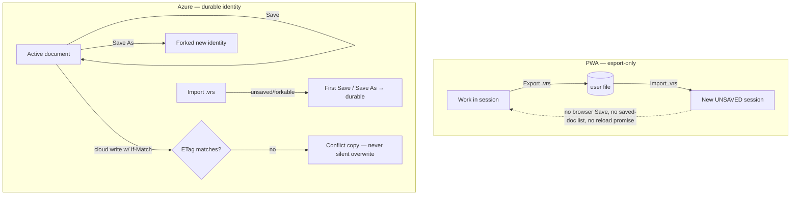

# Save, Load & Access — the document contract

Every portable save/export/import speaks **one** model: a hub-scoped `DocumentSnapshot`. This is the settled V1 contract (R6a–R6e); pre-R6 `hub`/`rawData`/`AnalysisState` paths are gone. **Save identity differs by app: the PWA is export-only; Azure owns durable documents.**

## The unit — `DocumentSnapshot`

A `DocumentSnapshot` (`schemaVersion: 1`) is the **hub-scoped** portable envelope for one document: Project config/data + Analyze state (findings / categories / hypotheses / causalLinks / scopes) + Canvas state (`canonicalMap` / outcomes / `primaryScopeDimensions`) + **zero-or-one** `ImprovementProject` for that hub. The multi-hub `useImprovementProjectStore.projectsById` mirror is **never serialized**. Quick-analysis hubs carry no Project; formalized hubs carry one.

- `buildDocumentSnapshot({ activeHub? })` reads the document-layer stores → a snapshot.
- `hydrateDocumentSnapshot(snapshot)` loads it back into those stores.
- `documentSnapshotFingerprint(snapshot)` is a stable `fnv1a64` hash of canonically-ordered JSON — the **authoritative dirty-state signal** (not ad-hoc UI flags).

Code: `packages/stores/src/documentSnapshot.ts`.

## The `.vrs` file — a snapshot envelope

`.vrs` = `{ kind: 'variscout.document', version: 1, exportedAt, metadata?, documentSnapshot }`. `parseDocumentSnapshotVrs()` **rejects** a file whose `kind`/`version` mismatch, that carries legacy `hub`/`rawData`, or whose payload fails the `isDocumentSnapshot` guard — no legacy compatibility. Code: `packages/stores/src/documentSnapshotVrs.ts`.

## Save semantics (R6d)

- **PWA is export-only.** No browser Save / saved-document list / reload-from-browser. `.vrs` export is backup/share only. Importing a `.vrs` starts a **new unsaved in-memory session**; the file name is not retained as a save target.
- **Azure owns durable identity.** **Save** updates the active document; **Save As** forks a new identity; importing a `.vrs` starts an unsaved/forkable document that becomes durable only after Save / Save As.
- **Dirty state** = current snapshot fingerprint vs the saved baseline.

Code: PWA `apps/pwa/src/lib/export.ts` (re-exports core; session-only by default); Azure `apps/azure/src/lib/persistence.ts` (`save/update/load` locally + `.vrs` import/export), `apps/azure/src/services/storage.ts`.

## Cloud conflicts — never last-write-wins

Azure cloud writes send the prior `ETag` as `If-Match`. A `412` (precondition-failed) means the cloud document changed: the user's local work is saved as **`<name> (conflict copy)`** (or routed through the existing conflict path) and they choose what to keep — **never a silent overwrite**. The evidence-snapshot catalog uses `If-Match` with a 3-retry exponential backoff (100/200/400 ms), then emits a non-blocking paste-conflict event. Detail: [etag-concurrency.md](etag-concurrency.md). Code: `apps/azure/src/services/blobClient.ts`, `storage.ts`.

## Access — who can see/load a document

- **Quick analyses (no Project)** are **private to the creator** (`ownerUserId = creator`, `memberUserIds = [creator]`).
- **Formal Projects** derive access from `improvementProject.metadata.members` — only the **Lead / Member / Sponsor** roster can see or load them; non-members never see them in the list.
- Access is **server-enforced** (R6e): all Blob list/read/write goes through same-origin `/api/storage/*` endpoints that check `hasAccessForPrincipal` against the EasyAuth principal **before** any blob op. Broad browser container SAS is retired; production storage disables Shared Key (connection strings are local-dev/test only). The customer's data never leaves their tenant ([ADR-059](../../07-decisions/adr-059-web-first-deployment-architecture.md)). Detail: [acl.md](acl.md).

## Not yet built (do not document as live)

The R7 (store/domain cleanup), R8 (shell convergence), and R9 (launch/platform hardening — soft-delete/versioning, scoped SAS, RBAC, incident recovery) slices are **decision-gated horizons**, not shipped. PWA cloud sync is out of V1 scope (export-only). In-product approval/sign-off is out-of-band in V1.

## See also

- [storage.md](storage.md) — the persistence boundary + authorities. · [export.md](export.md) — CSV/PNG/`.vrs` export channels.
- **[persistence-internals.md](../../05-technical/architecture/persistence-internals.md)** — the fnv1a64 fingerprint algorithm + the `/api/storage` server-enforcement flow (dev-detail).
- [acl.md](acl.md) — the role ACL. · [etag-concurrency.md](etag-concurrency.md) — conditional writes. · [cloud-sync.md](cloud-sync.md) — Azure sync orchestration.
- [ADR-059](../../07-decisions/adr-059-web-first-deployment-architecture.md) — customer-owned data + the R6d/R6e amendments.
