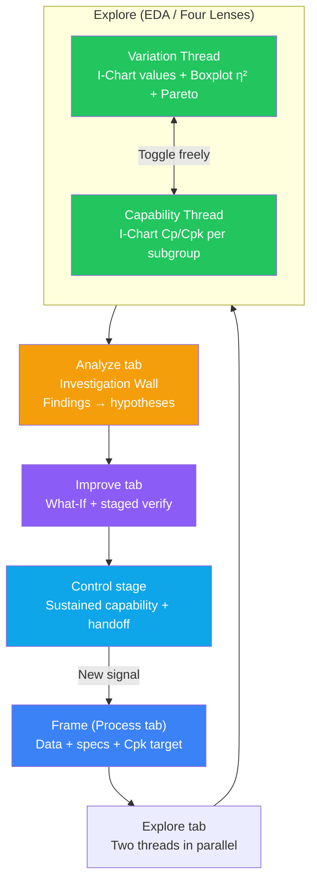
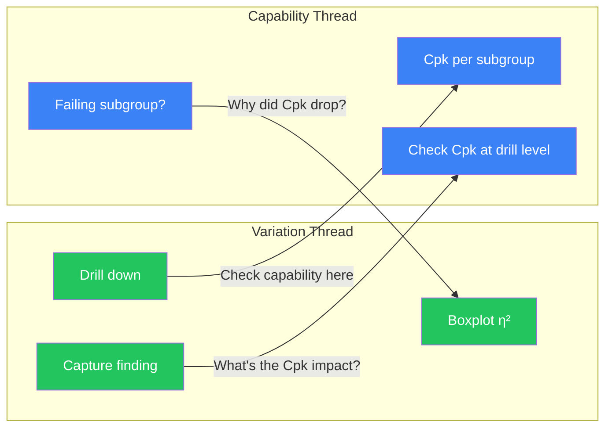
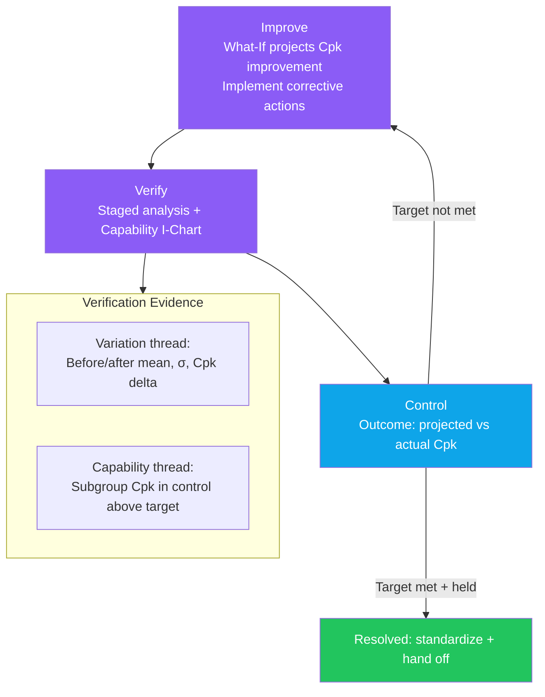

# Analysis Flow

## 1. Introduction

VariScout's analysis journey weaves **two analytical threads** through the 5-verb activity frame — **Frame → Explore → Analyze → Improve → Control** (see [IA & Nav Model §Vocabulary](../../02-journeys/ia-nav-model.md)):

- **Variation Analysis** — "Where does variation come from?" Uses the I-Chart with raw measurement values, the subgroup/variation panel for factor comparison, and Pareto when ranking is meaningful. The analyst progressively drills down using the highest eta-squared factor until sufficient variation is isolated.

- **Capability Analysis** — "Are we meeting our Cpk target?" Uses the same I-Chart with a **"Values | Capability" toggle** that switches the Y-axis from raw measurements to per-subgroup Cp/Cpk. This reveals whether capability itself is stable across batches, shifts, time periods, or equipment.

Capability mode is a **flexible I-Chart view toggle**, not a separate workflow. The analyst switches freely at any point during analysis. Findings, drill-down, and Wall investigation work identically in both modes. Three entry paths determine which thread leads the analysis.

All of this happens inside one **Workspace** — the place the analyst brings data and investigates. The Workspace is always backed by a single Project (informal until deliberately formalized), and the only analytical-narrowing lens is **Analysis Scope** (outcome · factor · process step · filters). There is no activate/exit/switch — you narrow and broaden attention with scope.

### Analysis Workspace Anatomy

The Explore tab has exactly **two persistent chrome rows** above the chart area:

1. **Compact header** (AppHeader) — one row, icon-only tools, workspace + scope chip, Findings count badge.
2. **Context line** (ProcessHealthBar) — one row; left cluster: `N rows · <date range> · x̄ · σ · Cpk (graded, clickable → capability I-Chart) · Filters`; right cluster: `Subgroup · Time · Stages · Export · measure chip (Edit framing menu)`.

The framing toolbar is **Process-tab chrome only** — it does not appear on Explore. Below the two chrome rows, the layout is **scroll-only**: the I-Chart fills a viewport-relative hero band (`h-[calc(100dvh-240px)]`), giving the chart the room it needs. The scope ribbon was deleted (header chips are the single scope chrome).

This structure mirrors the EDA flow: orient on the hero I-Chart, use the context-line lenses (Subgroup / Time / Stages) to slice and compare, read the stats summary inline, then drill into variation sources on the lower panels.

### Y Model

Explore has one **active Y** at a time and a separate list of **tracked outcomes** for the process hub. The I-Chart header is the global Y switcher:

- **Tracked outcomes** appear first and show spec badges when `measureSpecs[y] ?? specs` contains LSL, target, USL, or Cpk target.
- **Other numeric columns** appear after tracked outcomes. Selecting one switches the active Y across the I-Chart, factor strip, boxplot, Pareto, histogram, and verification lens without automatically tracking it.
- An untracked active Y shows inline `track this outcome?`; clicking it promotes that Y into the tracked outcome list. The old Frame `+ track another outcome` wizard jump is not the tracking mechanism.
- Findings stamp the active Y in `FindingContext.yColumn`, so Analyze can distinguish evidence captured for different outcomes.

Per-measure specs resolve consistently as `measureSpecs[outcome] ?? specs`; empty specs do not imply a direction of goodness.

Canonical wireframe: [`docs/02-journeys/wireframes/assets/explore-redesign-mockup-2026-06-10.html`](../../02-journeys/wireframes/assets/explore-redesign-mockup-2026-06-10.html)

---

## 2. Three Entry Paths x Two Threads

The first question the analyst asks depends on the entry path — not a fixed sequence.

| Entry Path              | Starting Question              | Primary Thread                                                                   | Secondary Thread                                             |
| ----------------------- | ------------------------------ | -------------------------------------------------------------------------------- | ------------------------------------------------------------ |
| **Problem to Solve**    | "What's causing this problem?" | Variation first — drill to isolate drivers                                       | Capability quantifies impact ("How bad is it in Cpk terms?") |
| **Hypothesis to Check** | "Is my theory right?"          | Depends on hypothesis — variation if cause-focused, capability if target-focused | The other thread validates                                   |
| **Routine Check**       | "Are we still on target?"      | Capability first — are subgroups meeting Cpk target?                             | Variation if a signal is found ("Why did Cpk drop?")         |

---

## 3. The Two Threads

### Thread 1: Variation Analysis

- **Core question:** "Where does variation come from?"
- **Tools:** I-Chart (values), Factor strip (ω²-adjusted η² ranking), Boxplot (comparison after chip click), optional Pareto
- **Method:** Progressive stratification — read the strip for guidance, click the chip with the largest share to rebind the comparison, filter, repeat until 50-70% or more of variation is isolated
- **Findings:** Pin at breadcrumb (filter state + stats + Cpk) or right-click chart observation

### Thread 2: Capability Analysis

- **Core question:** "Are we meeting our Cpk target?"
- **Tools:** I-Chart (Cp/Cpk per subgroup), SubgroupConfig
- **Method:** Toggle I-Chart to "Values | Capability", configure subgroups (column or fixed-size), read Cpk dots vs target line
- **Dual series:** Cpk (blue) + Cp (green) — the gap between them directly visualizes centering loss
- **Requires:** Specification limits (USL/LSL) to be set

### What Changes When You Toggle

| Aspect           | Values Mode                      | Capability Mode            |
| ---------------- | -------------------------------- | -------------------------- |
| Y-axis data      | Raw measurements                 | Cpk values per subgroup    |
| Control limits   | Calculated from measurement data | Calculated from Cpk series |
| Secondary series | None                             | Cp (green)                 |
| Target line      | None                             | Cpk target (if set)        |
| Boxplot/Pareto   | Unchanged                        | Unchanged                  |
| Findings         | Same context                     | Same context               |

---

## 4. Frame

**Frame** (the **Process tab**) defines the problem space and seeds both analytical threads.

- **Data input** — Upload, paste, or open file. Parser detects delimiters and validates structure.
- **Column mapping** — Assign measurement column and factor columns. Data-rich cards with type badges and preview values.
- **Specification limits** — Enter USL, LSL, and optional target via `SpecEditor`. These flow through to capability calculations and enable the capability thread.
- **Cpk target setting** — Enables the capability thread's target line. Without a Cpk target, capability mode still works but has no compliance reference.
- **Characteristic type** — Nominal, smaller-is-better, or larger-is-better. Affects both threads (one-sided specs change Cp/Cpk calculation).
- **Time factor extraction** — TimeExtractionPanel creates categorical columns from timestamps (Year, Month, Week, DayOfWeek, Hour, and minute intervals). These become regular factor columns usable in Boxplot drill-down, findings, AND as subgroup columns in capability mode. This unification means time-based subgroups are fully integrated with the variation analysis infrastructure.
- **CapabilitySuggestionModal** — When specs are set during Frame, a contextual modal suggests starting in capability view once you move to Explore. The analyst can accept (auto-configures subgroups) or dismiss (starts in standard view). Either way, they can toggle freely later.

---

## 5. Explore

**Explore** (the **Explore tab**) is EDA for process improvement — **not sequential verification gates**. The analyst follows the most interesting signal across the Four Lenses, switching between threads as questions arise, narrowing and broadening with **Analysis Scope**.

### Factor Strip — "What does explain it?"

The **factor strip** renders as a flex-none band directly beneath the I-Chart hero. It ranks **every candidate factor** by its cardinality-penalised share of variation (ω²-adjusted η²), from largest to smallest, so the analyst sees guidance on the **default surface** without drilling into the boxplot carousel.

Key strip behaviours:

- **Prominence, not gate (D13 seed-not-gate).** All candidate factors appear — weak or non-significant chips render in gray at the bottom of the list. The strip frames selection as attention, not permission. Unselected candidates collapse under an "+ N also screened" disclosure row.
- **Process-to-Explore bridge.** Process asks "What might be affecting it?" and Explore answers "What does explain it?" The candidate set is the same; Explore ranks it from the data. Step-attributed X columns show compact process-step badges and become available to the Stages lens without auto-selection.
- **Cardinality-penalised shares.** Continuous X columns are quartile-binned (Q1–Q4) inside the engine before ranking, so a high-cardinality continuous factor is not artificially inflated. The ★ badge marks the largest significant share.
- **Chip → comparison rebind.** Clicking a chip sets the active factor for the Variation Sources boxplot comparison (identical to using the now-retired Factor dropdown). The selected chip goes examined-✓ (transient per-session).
- **What-if hover (spec-direction-gated).** Hovering a chip shows the matched-best projection: "if every group's mean shifted to the best group's mean, the overall outcome would move from X to Y." Only rendered when a characteristic type (smaller/larger-is-better) is set — never recommended without a direction. Note: `computeMatchedBestProjection` computes this quantity (every group shifted to best-group mean); `computeCumulativeProjection` computes a different, complement-fixing quantity — do not conflate them.
- **Strip v2 — in-model ΔR² upgrade (ER-6).** Once the model drawer completes the two-pass best-subsets run, the strip upgrades to in-model semipartial ΔR² (the per-factor contribution after jointly fitting all kept factors). The caption flips from "η² share of variation" to "in-model ΔR²" and the residual becomes `1 − R²adj` (model-unexplained, not just the leftover from the largest share). Before the model run completes, the strip shows the marginal ω²-adjusted η² values exactly as before (progressive non-regressive enhancement).
- **⚡ Interaction chip (ER-6).** When the two-pass model detects a significant factor-factor interaction (via partial-F screening), a distinct dashed ⚡ chip appears after the factor chips. Its face shows the geometric conclusion directly: `⚡ A × B +ΔR²% — A differences depend on B`. The pattern is classified as **ordinal** (lines differ in slope, no crossing) or **disordinal** (lines cross — the relationship reverses). Clicking the chip sets the active comparison to factor A, showing the paired `A × {focal level, rest}` comparison in the boxplot slot. Vocabulary note: patterns are always ordinal/disordinal — never "moderator"/"primary".
- **Scoped retitle.** When an Analysis Scope / drill condition is active, the strip title changes to "…within this condition?" to make the scope visible.

### Decision Points (Natural Questions, Not Gates)

| #   | Decision                        | Evidence                                                 | Outcome                               |
| --- | ------------------------------- | -------------------------------------------------------- | ------------------------------------- |
| 1   | What patterns exist?            | All four lenses simultaneously                           | Follow the most interesting signal    |
| 2   | Where does variation come from? | Factor strip (ω²-adjusted η²) + Boxplot comparison       | Click the largest-share chip to drill |
| 3   | Are we meeting Cpk target?      | Capability I-Chart vs target line                        | Below target: which subgroups?        |
| 4   | Centering problem?              | Cp-Cpk gap                                               | Large gap: investigate centering      |
| 5   | Enough variation isolated?      | Key factors examined via strip ranking? Findings pinned? | Capture finding, carry to Analyze     |
| 6   | Toggle view?                    | Curiosity about other perspective                        | Switch I-Chart mode freely            |

### Thread Switching Moments

Concrete switching examples:

- **Capability to Variation:** "Batch 7 Cpk below target" — filter to Batch 7 — drill Boxplot — find why
- **Variation to Capability:** "Machine C explains 47%" — toggle capability, group by Machine — see Machine C's Cpk trend
- **Deep drill to Capability check:** "Isolated to Night Shift + Machine C" — toggle capability to check Cpk for this specific condition

### Drill-Down and Capability Interaction

- Both views work at any drill level on the same filtered data
- Capability mode respects current drill-down filters
- Boxplot and Pareto always show variation perspective (they do not change when toggling the I-Chart)

### Count/Event-Log Y — Auto-Dispatch (ER-5b)

When the Y column is count- or event-log-shaped, the engine detects this at paste time and
auto-dispatches to defect handling — **no user mode switch required**:

- **High confidence** (clearly count-shaped): mapping is applied automatically, `analysisMode` is set to
  `'defect'`, and a **`DefectDispatchBanner`** appears in the sticky chrome. The banner offers two
  corrections: `[adjust columns ▾]` (re-opens the mapping modal) and `[use as standard data]`
  (reverts to `'standard'` mode). This makes the dispatch post-hoc correctable without blocking the
  analyst's flow.
- **Medium confidence**: the `DefectDetectedModal` gate is preserved — the analyst confirms before
  dispatch proceeds.

In defect dispatch mode, the chart slot layout shifts to `ichart → boxplot → pareto → defect-summary`
(Pareto promoted to a primary slot) and the **factor strip flips to the defect-rate-share variant**:
factors are ranked by weighted MAD of per-level defect rates against the overall rate (ADR-088 §level-native
defect-rate share), NOT by η²-variance share. The strip title confirms the rate basis ("rate contribution").
The transform-before-stats boundary is **never compromised**: `computeDefectRates()` runs before the
stats engine; the continuous-Y engine never sees raw event-log data.

### Brush to Create Factor Flow (for Fixed-Size Subgroups)

When capability mode uses fixed-size subgroups and a specific subgroup fails:

1. Switch to standard I-Chart (Values mode)
2. Brush the problematic data points
3. Create named factor (e.g., "Problem Period")
4. New factor appears in Boxplot — can drill, filter, pin findings

This flow bridges capability observations back into the variation analysis infrastructure.

### Findings Work Identically in Both Modes

- Same context captured: filter state, stats (including Cpk), cumulative scope, source
- No separate "capability finding" type needed
- Whether toggled to Values or Capability when pinning — same FindingContext

The **Finding is the unit of progress.** A Finding captured here is the connective tissue that links forward into the Analyze tab — it becomes the seed for a hypothesis on the Investigation Wall.

---

## 6. Analyze

**Analyze** (the **Analyze tab**) is **canvas-first** — the **Investigation Wall** is its home. A Finding captured during Explore links forward into a hypothesis / suspected cause on the Wall, where data-, gemba-, and expert-evidence accumulate against it.

- **Variation-sourced finding:** "Machine C explains 47%" — propose a hypothesis on the Wall — test why Machine C produces more variation
- **Capability-sourced finding:** "Batch 7 Cpk dropped" — cross back to Explore — filter to Batch 7 — drill to find why Cpk dropped — then carry the finding to the Wall as a hypothesis
- **Hypotheses test causes (eta-squared), not capability** — clean separation of concerns. The question shifts from "what is the Cpk?" to "why is it low?"
- **Synthesis** weaves evidence from both threads into a suspected-cause narrative on the Wall.

The thread the finding originated from does not change the investigation method on the Wall. The **Evidence Map** is available as a demoted, **read-only lens** alongside the Wall — a supporting view, not the home of investigation.

---

## 7. Improve

**Improve** (the **Improve tab**) is where both threads provide complementary verification evidence as the analyst plans and stages a change.

- **What-If:** Projects Cpk improvement from mean shift and sigma reduction. The analyst sees projected Cpk before implementing changes.
- **Staged analysis:** Before/after comparison showing mean shift, sigma ratio, and Cpk delta. Quantifies the actual improvement.
- **Capability verification:** Subgroup Cpk I-Chart in control after improvement = sustained evidence. An in-control Cpk series means the process consistently meets the target.
- **Verification:** Uses both variation evidence (staged before/after comparison) AND capability evidence (consistent Cpk above target) to verify the improvement.
- **Outcome learning loop:** Projected Cpk vs actual Cpk — green if the projection was met, red if it fell short. This feeds back into the analyst's calibration for future What-If projections.

---

## 8. Control

**Control** is the closing stage on the **Project tab** — verify that the improvement holds, then hand off.

- **Sustained capability:** A subgroup Cpk I-Chart that stays in control above target is the durable evidence that the gain is held, not a one-off.
- **Outcome check:** Projected vs actual Cpk closes the learning loop and feeds the analyst's calibration.
- **Handoff:** When the target is met and held, standardize and hand off via the Report. If the target is not met, a new signal sends the work back to Frame.

---

## 9. Cpk Touchpoint Matrix

Cpk appears at 10 touchpoints across the activity frame, forming a continuous thread from goal-setting through verification.

| Activity | Touchpoint                            | Purpose                                             |
| -------- | ------------------------------------- | --------------------------------------------------- |
| Frame    | Cpk target in specs                   | Set the goal                                        |
| Explore  | Stats panel (Cp, Cpk)                 | Current capability at any drill level               |
| Explore  | Capability Histogram                  | Visual spec compliance (distribution overlay)       |
| Explore  | Capability I-Chart (per subgroup)     | Meeting target across subgroups?                    |
| Explore  | Probability Plot                      | Can we trust the Cpk calculation? (normality check) |
| Analyze  | Finding context (Cpk at drill level)  | Quantify impact of each driver in Cpk terms         |
| Improve  | What-If projected Cpk                 | Project improvement before acting                   |
| Improve  | Staged analysis Cpk delta             | Verify actual improvement                           |
| Control  | Capability I-Chart (post-improvement) | Sustained stable capability after fix               |
| Control  | Outcome (projected vs actual)         | Learning loop — calibrate future projections        |

---

## 10. Use Case Examples

### Supplier PPAP (Routine Check — Capability Thread Leads)

Weekly data load. Toggle to capability mode. All subgroups above Cpk 1.67? In-control Cpk I-Chart = PPAP evidence — submit report. If a subgroup fails: filter to that subgroup, switch to variation thread, drill to find the cause, carry the finding to the Wall, improve.

### Customer Complaint (Problem to Solve — Variation Thread Leads)

Complaint data loaded. I-Chart: when did the shift happen? Boxplot: Machine C eta-squared = 47%. Drill to Machine C + Night Shift. Capture finding. On the Wall, hypothesis: worn nozzle. Gemba validates. What-If: replace nozzle, projected Cpk = 1.35. Staged verification: Cpk 0.85 to 1.38. Toggle to capability mode — Cpk I-Chart in control — sustained improvement confirmed. Resolved.

### Batch Consistency (Hypothesis to Check — Depends on Hypothesis)

"Batch 7 uses new supplier material." Toggle to capability mode, group by Batch. Batch 7 Cpk = 0.72, well below target. Switch to standard mode. Filter to Batch 7. Boxplot: Supplier = New, eta-squared = 65%. Hypothesis confirmed — the new supplier material drives the variation. Improvement: qualify new supplier material or adjust process parameters.

---

## 11. Code Traceability

| Activity             | Thread     | Key Hooks                                                                                                                     | Key Components                                                                                                 |
| -------------------- | ---------- | ----------------------------------------------------------------------------------------------------------------------------- | -------------------------------------------------------------------------------------------------------------- |
| Frame                | Both       | `useDataIngestion`, `useDataState`                                                                                            | `ColumnMapping`, `SpecsPopover`, `TimeExtractionPanel`, `CapabilitySuggestionModal`                            |
| Explore (variation)  | Variation  | `useFilterNavigation`, `useVariationTracking`, `useIChartData`, `useBoxplotData`, `useFactorStripModel`, `useDefectRateModel` | `IChartWrapperBase`, `BoxplotWrapperBase`, `ParetoChartWrapperBase`, `FactorStripBase`, `DefectDispatchBanner` |
| Explore (capability) | Capability | `useCapabilityIChartData`                                                                                                     | `CapabilityMetricToggle`, `SubgroupConfig`                                                                     |
| Explore (both)       | Both       | `useFindings`, `useChartScale`                                                                                                | `FindingsLog`, `ChartAnnotationLayer`, `CreateFactorModal`                                                     |
| Analyze              | Both       | `useHypotheses`, `useFindings`                                                                                                | `HypothesisTreeView`, `FindingBoardView`, `SynthesisCard`                                                      |
| Improve / Control    | Both       | `useFindings` (actions, outcome)                                                                                              | `WhatIfPageBase`, `StagedComparisonCard`, `ImprovementWorkspaceBase`                                           |

---

## Related Documentation

- [Analysis Journey Map](analysis-journey-map.md) — Visual guide with flowcharts and decision points
- [Subgroup Capability Analysis](../analysis/subgroup-capability.md) — Dual Cp/Cpk series, interpretation, architecture
- [Methodology](../../01-vision/methodology.md) — Watson's EDA, Four Lenses, Two Voices
- [Mental Model Hierarchy](../../05-technical/architecture/mental-model-hierarchy.md) — How all conceptual frameworks nest together
- [Drill-Down Workflow](drill-down-workflow.md) — Progressive stratification protocol
- [Analyze to Action](analyze-to-action.md) — Findings, hypothesis trees, What-If
- [Staged Analysis](../analysis/staged-analysis.md) — Before/after comparison methodology
