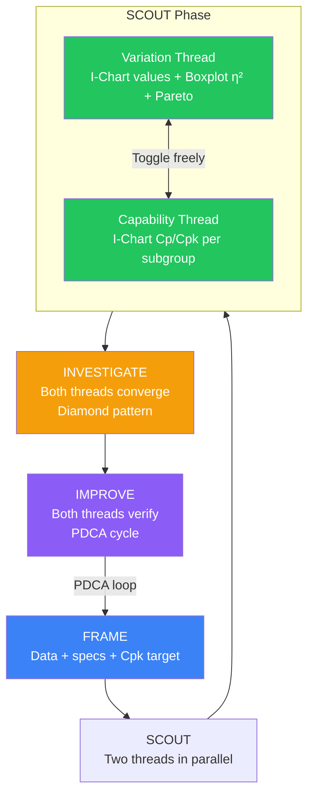
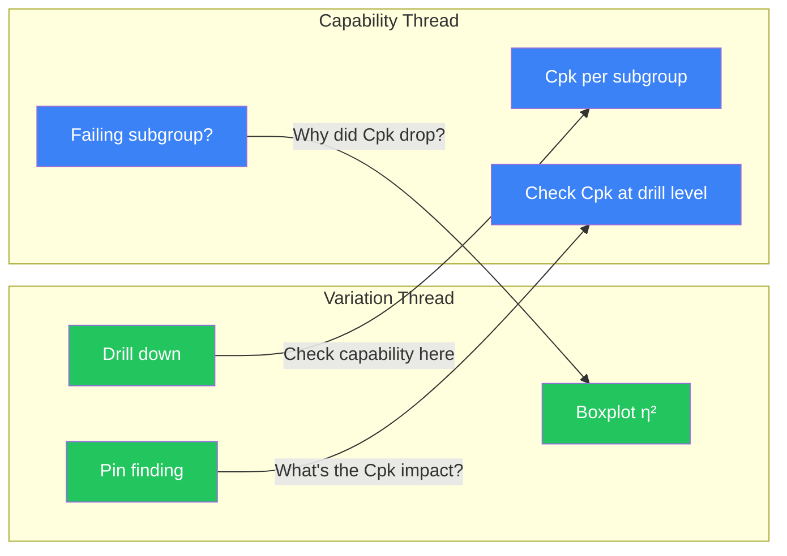
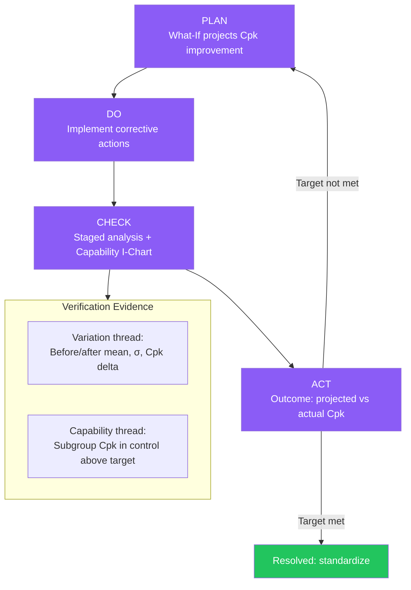

# Analysis Flow

## 1. Introduction

VariScout's analysis journey weaves **two analytical threads** through four phases (FRAME, SCOUT, INVESTIGATE, IMPROVE):

- **Variation Analysis** — "Where does variation come from?" Uses the I-Chart with raw measurement values, Boxplot eta-squared for factor comparison, Pareto for ranking, and Stats for summary metrics. The analyst progressively drills down using the highest eta-squared factor until sufficient variation is isolated.

- **Capability Analysis** — "Are we meeting our Cpk target?" Uses the same I-Chart with a **"Values | Capability" toggle** that switches the Y-axis from raw measurements to per-subgroup Cp/Cpk. This reveals whether capability itself is stable across batches, shifts, time periods, or equipment.

Capability mode is a **flexible I-Chart view toggle**, not a separate workflow. The analyst switches freely at any point during analysis. Findings, drill-down, and investigation work identically in both modes. Three entry paths determine which thread leads the analysis.

---

## 2. Three Entry Paths x Two Threads

The first question the analyst asks depends on the entry path — not a fixed sequence.

| Entry Path              | Starting Question              | Primary Thread                                                                   | Secondary Thread                                             |
| ----------------------- | ------------------------------ | -------------------------------------------------------------------------------- | ------------------------------------------------------------ |
| **Problem to Solve**    | "What's causing this problem?" | Variation first — drill to isolate drivers                                       | Capability quantifies impact ("How bad is it in Cpk terms?") |
| **Hypothesis to Check** | "Is my theory right?"          | Depends on hypothesis — variation if cause-focused, capability if target-focused | The other thread validates                                   |
| **Routine Check**       | "Are we still on target?"      | Capability first — are subgroups meeting Cpk target?                             | Variation if a signal is found ("Why did Cpk drop?")         |

---

## 3. The Two Threads

### Thread 1: Variation Analysis

- **Core question:** "Where does variation come from?"
- **Tools:** I-Chart (values), Boxplot (eta-squared), Pareto, Stats
- **Method:** Progressive stratification — drill via highest eta-squared, filter, repeat until 50-70% or more of variation is isolated
- **Findings:** Pin at breadcrumb (filter state + stats + Cpk) or right-click chart observation

### Thread 2: Capability Analysis

- **Core question:** "Are we meeting our Cpk target?"
- **Tools:** I-Chart (Cp/Cpk per subgroup), SubgroupConfig
- **Method:** Toggle I-Chart to "Values | Capability", configure subgroups (column or fixed-size), read Cpk dots vs target line
- **Dual series:** Cpk (blue) + Cp (green) — the gap between them directly visualizes centering loss
- **Requires:** Specification limits (USL/LSL) to be set

### What Changes When You Toggle

| Aspect           | Values Mode                      | Capability Mode            |
| ---------------- | -------------------------------- | -------------------------- |
| Y-axis data      | Raw measurements                 | Cpk values per subgroup    |
| Control limits   | Calculated from measurement data | Calculated from Cpk series |
| Secondary series | None                             | Cp (green)                 |
| Target line      | None                             | Cpk target (if set)        |
| Boxplot/Pareto   | Unchanged                        | Unchanged                  |
| Findings         | Same context                     | Same context               |

---

## 4. FRAME Phase

FRAME defines the problem space and seeds both analytical threads.

- **Data input** — Upload, paste, or open file. Parser detects delimiters and validates structure.
- **Column mapping** — Assign measurement column and factor columns. Data-rich cards with type badges and preview values.
- **Specification limits** — Enter USL, LSL, and optional target via SpecsPopover. These flow through to capability calculations and enable the capability thread.
- **Cpk target setting** — Enables the capability thread's target line. Without a Cpk target, capability mode still works but has no compliance reference.
- **Characteristic type** — Nominal, smaller-is-better, or larger-is-better. Affects both threads (one-sided specs change Cp/Cpk calculation).
- **Time factor extraction** — TimeExtractionPanel creates categorical columns from timestamps (Year, Month, Week, DayOfWeek, Hour, and minute intervals). These become regular factor columns usable in Boxplot drill-down, findings, AND as subgroup columns in capability mode. This unification means time-based subgroups are fully integrated with the variation analysis infrastructure.
- **CapabilitySuggestionModal** — When specs are set during FRAME, a contextual modal suggests starting SCOUT in capability view. The analyst can accept (auto-configures subgroups) or dismiss (starts in standard view). Either way, they can toggle freely later.

---

## 5. SCOUT Phase

SCOUT is EDA for process improvement — **not sequential verification gates**. The analyst follows the most interesting signal, switching between threads as questions arise.

### Decision Points (Natural Questions, Not Gates)

| #   | Decision                        | Evidence                                                   | Outcome                               |
| --- | ------------------------------- | ---------------------------------------------------------- | ------------------------------------- |
| 1   | What patterns exist?            | All four lenses simultaneously                             | Follow the most interesting signal    |
| 2   | Where does variation come from? | Boxplot eta-squared                                        | Drill into highest eta-squared factor |
| 3   | Are we meeting Cpk target?      | Capability I-Chart vs target line                          | Below target: which subgroups?        |
| 4   | Centering problem?              | Cp-Cpk gap                                                 | Large gap: investigate centering      |
| 5   | Enough variation isolated?      | Key factors identified via R²adj ranking? Findings pinned? | Pin finding, move to INVESTIGATE      |
| 6   | Toggle view?                    | Curiosity about other perspective                          | Switch I-Chart mode freely            |

### Thread Switching Moments

Concrete switching examples:

- **Capability to Variation:** "Batch 7 Cpk below target" — filter to Batch 7 — drill Boxplot — find why
- **Variation to Capability:** "Machine C explains 47%" — toggle capability, group by Machine — see Machine C's Cpk trend
- **Deep drill to Capability check:** "Isolated to Night Shift + Machine C" — toggle capability to check Cpk for this specific condition

### Drill-Down and Capability Interaction

- Both views work at any drill level on the same filtered data
- Capability mode respects current drill-down filters
- Boxplot and Pareto always show variation perspective (they do not change when toggling the I-Chart)

### Brush to Create Factor Flow (for Fixed-Size Subgroups)

When capability mode uses fixed-size subgroups and a specific subgroup fails:

1. Switch to standard I-Chart (Values mode)
2. Brush the problematic data points
3. Create named factor (e.g., "Problem Period")
4. New factor appears in Boxplot — can drill, filter, pin findings

This flow bridges capability observations back into the variation analysis infrastructure.

### Findings Work Identically in Both Modes

- Same context captured: filter state, stats (including Cpk), cumulative scope, source
- No separate "capability finding" type needed
- Whether toggled to Values or Capability when pinning — same FindingContext

---

## 6. INVESTIGATE Phase

Both threads converge in INVESTIGATE. Whether the finding came from variation drill-down or capability observation, the investigation follows the same diamond pattern: **Initial, Diverge, Validate, Converge**.

- **Variation-sourced finding:** "Machine C explains 47%" — hypothesis tree — test why Machine C produces more variation
- **Capability-sourced finding:** "Batch 7 Cpk dropped" — switch to variation — filter to Batch 7 — drill to find why Cpk dropped — then investigate the cause
- **Hypotheses test causes (eta-squared), not capability** — clean separation of concerns. The question shifts from "what is the Cpk?" to "why is it low?"
- **Convergence synthesis** weaves evidence from both threads into a suspected cause narrative

The thread the finding originated from does not change the investigation method. The diamond pattern is the same regardless.

---

## 7. IMPROVE Phase

Both threads provide complementary verification evidence through the PDCA cycle.

- **What-If:** Projects Cpk improvement from mean shift and sigma reduction. The analyst sees projected Cpk before implementing changes.
- **Staged analysis:** Before/after comparison showing mean shift, sigma ratio, and Cpk delta. Quantifies the actual improvement.
- **Capability verification:** Subgroup Cpk I-Chart in control after improvement = sustained evidence. An in-control Cpk series means the process consistently meets the target.
- **PDCA Check:** Uses both variation evidence (staged before/after comparison) AND capability evidence (consistent Cpk above target) to verify the improvement.
- **Outcome learning loop:** Projected Cpk vs actual Cpk — green if the projection was met, red if it fell short. This feeds back into the analyst's calibration for future What-If projections.

---

## 8. Cpk Touchpoint Matrix

Cpk appears at 10 touchpoints across all four phases, forming a continuous thread from goal-setting through verification.

| Phase       | Touchpoint                            | Purpose                                             |
| ----------- | ------------------------------------- | --------------------------------------------------- |
| FRAME       | Cpk target in specs                   | Set the goal                                        |
| SCOUT       | Stats panel (Cp, Cpk)                 | Current capability at any drill level               |
| SCOUT       | Capability Histogram                  | Visual spec compliance (distribution overlay)       |
| SCOUT       | Capability I-Chart (per subgroup)     | Meeting target across subgroups?                    |
| SCOUT       | Probability Plot                      | Can we trust the Cpk calculation? (normality check) |
| INVESTIGATE | Finding context (Cpk at drill level)  | Quantify impact of each driver in Cpk terms         |
| IMPROVE     | What-If projected Cpk                 | Project improvement before acting                   |
| IMPROVE     | Staged analysis Cpk delta             | Verify actual improvement                           |
| IMPROVE     | Capability I-Chart (post-improvement) | Sustained stable capability after fix               |
| IMPROVE     | Outcome (projected vs actual)         | Learning loop — calibrate future projections        |

---

## 9. Use Case Examples

### Supplier PPAP (Routine Check — Capability Thread Leads)

Weekly data load. Toggle to capability mode. All subgroups above Cpk 1.67? In-control Cpk I-Chart = PPAP evidence — submit report. If a subgroup fails: filter to that subgroup, switch to variation thread, drill to find the cause, investigate, improve.

### Customer Complaint (Problem to Solve — Variation Thread Leads)

Complaint data loaded. I-Chart: when did the shift happen? Boxplot: Machine C eta-squared = 47%. Drill to Machine C + Night Shift. Pin finding. Hypothesis: worn nozzle. Gemba validates. What-If: replace nozzle, projected Cpk = 1.35. Staged verification: Cpk 0.85 to 1.38. Toggle to capability mode — Cpk I-Chart in control — sustained improvement confirmed. Resolved.

### Batch Consistency (Hypothesis to Check — Depends on Hypothesis)

"Batch 7 uses new supplier material." Toggle to capability mode, group by Batch. Batch 7 Cpk = 0.72, well below target. Switch to standard mode. Filter to Batch 7. Boxplot: Supplier = New, eta-squared = 65%. Hypothesis confirmed — the new supplier material drives the variation. Improvement: qualify new supplier material or adjust process parameters.

---

## 10. Code Traceability

| Phase              | Thread     | Key Hooks                                                                        | Key Components                                                                      |
| ------------------ | ---------- | -------------------------------------------------------------------------------- | ----------------------------------------------------------------------------------- |
| FRAME              | Both       | `useDataIngestion`, `useDataState`                                               | `ColumnMapping`, `SpecsPopover`, `TimeExtractionPanel`, `CapabilitySuggestionModal` |
| SCOUT (variation)  | Variation  | `useFilterNavigation`, `useVariationTracking`, `useIChartData`, `useBoxplotData` | `IChartWrapperBase`, `BoxplotWrapperBase`, `ParetoChartWrapperBase`                 |
| SCOUT (capability) | Capability | `useCapabilityIChartData`                                                        | `CapabilityMetricToggle`, `SubgroupConfig`                                          |
| SCOUT (both)       | Both       | `useFindings`, `useChartScale`                                                   | `FindingsLog`, `ChartAnnotationLayer`, `CreateFactorModal`                          |
| INVESTIGATE        | Both       | `useHypotheses`, `useFindings`                                                   | `HypothesisTreeView`, `FindingBoardView`, `SynthesisCard`                           |
| IMPROVE            | Both       | `useFindings` (actions, outcome)                                                 | `WhatIfPageBase`, `StagedComparisonCard`, `ImprovementWorkspaceBase`                |

---

## Related Documentation

- [Analysis Journey Map](analysis-journey-map.md) — Visual guide with flowcharts and decision points
- [Subgroup Capability Analysis](../analysis/subgroup-capability.md) — Dual Cp/Cpk series, interpretation, architecture
- [Methodology](../../01-vision/methodology.md) — Watson's EDA, Four Lenses, Two Voices
- [Mental Model Hierarchy](../../05-technical/architecture/mental-model-hierarchy.md) — How all conceptual frameworks nest together
- [Drill-Down Workflow](drill-down-workflow.md) — Progressive stratification protocol
- [Investigation to Action](investigation-to-action.md) — Findings, hypothesis trees, What-If
- [Staged Analysis](../analysis/staged-analysis.md) — Before/after comparison methodology
