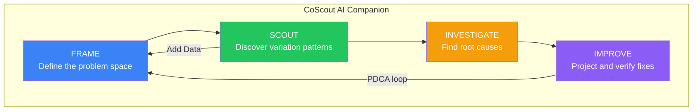
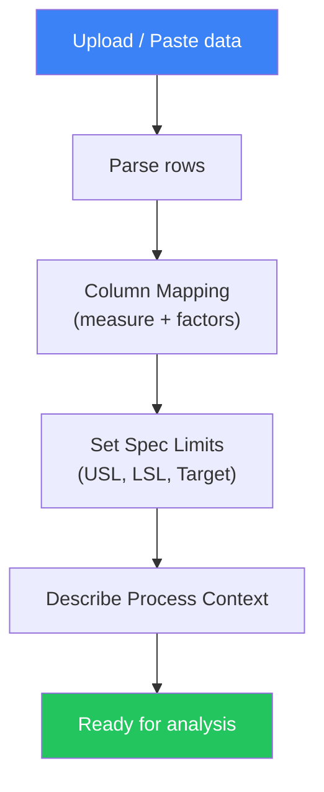
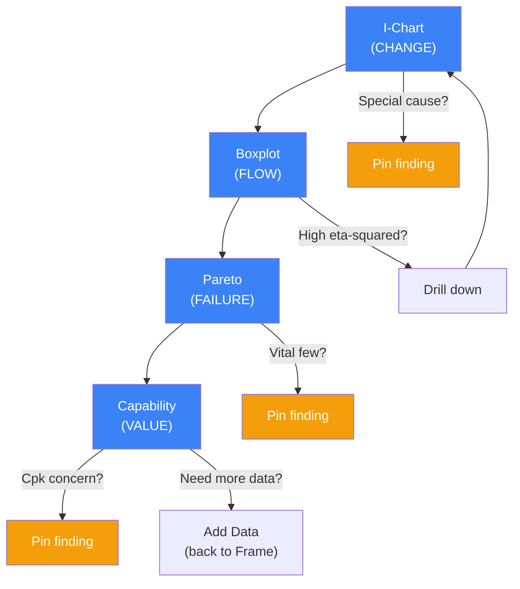
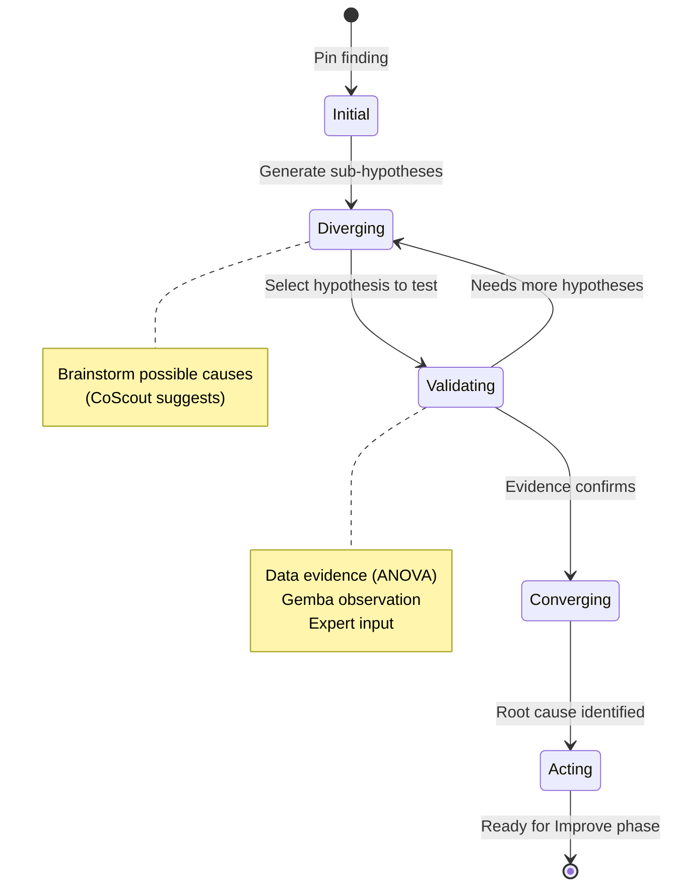
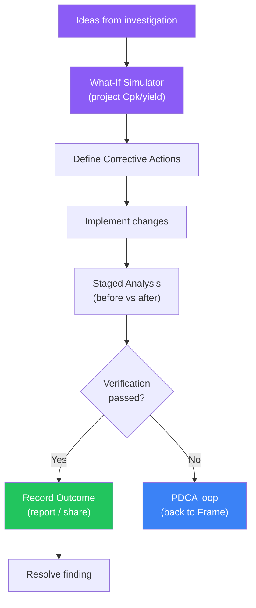
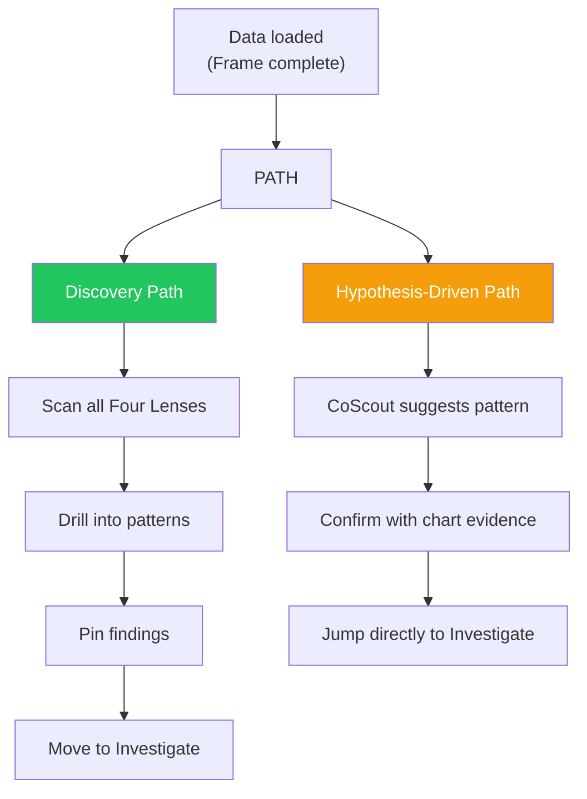
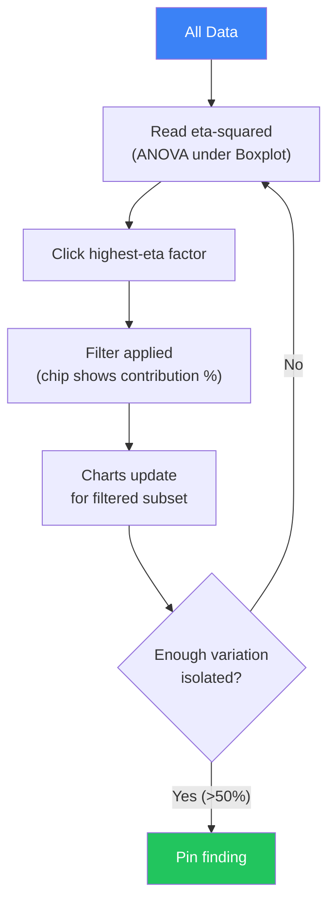
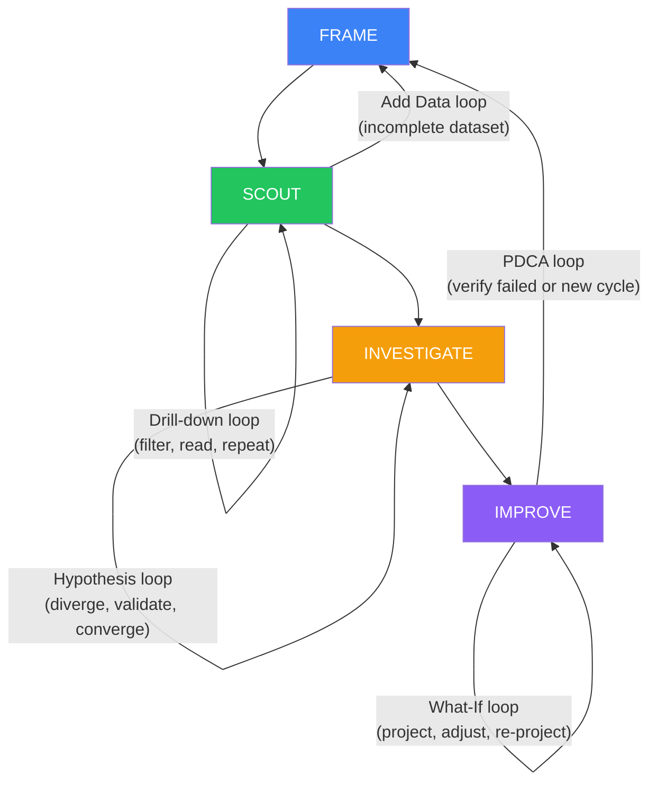

# Analysis Journey Map

VariScout guides quality analysts through four distinct phases: **Frame**, **Scout**, **Investigate**, and **Improve**. Each phase has a clear purpose, specific data shapes at its boundaries, and defined decision points that move the analyst forward. CoScout, the AI companion, adapts its behaviour at each phase to provide contextually relevant guidance.

## Journey Overview

The journey is not strictly linear. Two feedback loops connect the phases:

- **PDCA loop** -- After verifying an improvement, the analyst re-enters Frame with new data to confirm the gains hold.
- **Add Data loop** -- While scouting, the analyst may realise the dataset is incomplete and return to Frame to add more data or remap columns.

---

## Phase 1: FRAME

**Purpose:** Define the problem space by loading data, mapping columns, and setting specification limits.

### Steps

1. **Upload or paste data** -- CSV, Excel, or clipboard paste. The parser (`parseText` / `parseFile`) detects delimiters and validates structure.
2. **Map columns** -- Assign one measurement column and up to N factor columns. The `ColumnMapping` component provides data-rich cards with type badges and preview values.
3. **Set specification limits** -- Enter USL, LSL, and optional target via `SpecsPopover`. These flow through to capability calculations.
4. **Describe process context** -- Optional but valuable for CoScout. Process name, characteristic type, and any known constraints.

### Data Shapes at Boundary

| Entry                     | Exit                                          |
| ------------------------- | --------------------------------------------- |
| Raw file / clipboard text | `DataRow[]` (parsed, validated)               |
| --                        | `ValidationResult` (quality checks)           |
| --                        | `ColumnMapping` (measure + factors assigned)  |
| --                        | `AnalysisState` (specs, settings, ready flag) |

### Tier Differences

| Dimension   | PWA (Free)   | Azure (Standard / Team)         |
| ----------- | ------------ | ------------------------------- |
| Max factors | 3            | 6                               |
| Max rows    | 50,000       | 100,000                         |
| Persistence | Session only | IndexedDB (+ OneDrive for Team) |

### CoScout in Frame

CoScout is **not active** during Frame -- there is no analysed data to reason about yet. Once the analyst clicks "Start", data flows into the Scout phase and CoScout activates.

### Key Code References

- `useDataIngestion` -- shared file upload and parsing hook
- `useDataState` -- shared DataContext state management
- `ColumnMapping` component -- column assignment UI
- `parser.ts` -- CSV/Excel parsing and validation

---

## Phase 2: SCOUT

**Purpose:** Discover variation patterns using the Four Lenses -- CHANGE, FLOW, FAILURE, VALUE.

### Steps

1. **Scan I-Chart for stability** -- Look for points outside control limits, runs, and trends. Red dots signal special causes.
2. **Compare factors in Boxplot** -- Read ANOVA eta-squared to identify which factor explains the most variation.
3. **Rank in Pareto** -- See which categories within a factor contribute most to failures or out-of-spec results.
4. **Check Cpk** -- After filtering, assess whether the isolated subset meets specification requirements.

At any point, the analyst can **pin a finding** to capture an observation for later investigation.

### Two Speeds

| Path            | Duration | When to Use                                                   |
| --------------- | -------- | ------------------------------------------------------------- |
| **Quick Check** | ~5 min   | Daily monitoring, shift handover                              |
| **Deep Dive**   | ~30 min  | Customer complaint, root cause project, process qualification |

See [quick-check.md](quick-check.md) and [deep-dive.md](deep-dive.md) for detailed protocols.

### Data Shapes

| Type                           | Purpose                                                 |
| ------------------------------ | ------------------------------------------------------- |
| `StatsResult`                  | Mean, sigma, Cp, Cpk, median for current filter scope   |
| `AnovaResult`                  | F-statistic, p-value, eta-squared for factor comparison |
| `FilterAction[]`               | Ordered drill trail (filter stack)                      |
| `Finding` (status: `observed`) | Pinned observations from charts                         |

### Tier Differences

| Dimension          | PWA (Free)                            | Azure (Standard / Team)   |
| ------------------ | ------------------------------------- | ------------------------- |
| Max drill factors  | 3                                     | 6                         |
| Finding statuses   | 3 (observed, investigating, analyzed) | 5 (+ improving, resolved) |
| Variation tracking | Cumulative Total SS                   | Cumulative Total SS       |

### CoScout in Scout

- **NarrativeBar** suggests patterns detected in the data ("Shift detected after sample 47")
- **ChartInsightChips** appear on individual charts with contextual observations

### Key Code References

- `useFilterNavigation` -- filter navigation with multi-select and breadcrumbs
- `useVariationTracking` -- cumulative Total SS scope tracking
- `useChartScale` -- Y-axis scale calculation
- `useBoxplotData`, `useIChartData` -- chart data transforms

---

## Phase 3: INVESTIGATE

**Purpose:** Move from observations to validated root causes through structured hypothesis testing.

### IDEOI Phases

The investigation follows the IDEOI lifecycle within each finding:

| Phase          | Status              | Activity                                                                                |
| -------------- | ------------------- | --------------------------------------------------------------------------------------- |
| **I**nitial    | `observed`          | Finding pinned from chart, no hypothesis yet                                            |
| **D**iverging  | `investigating`     | Generate multiple sub-hypotheses, brainstorm causes                                     |
| **V**alidating | `investigating`     | Test hypotheses against data (eta-squared thresholds), gemba walks, expert consultation |
| **C**onverging | `analyzed`          | Confirm root cause, tag as key-driver or low-impact                                     |
| **A**cting     | `improving` (Azure) | Define corrective actions, enter Improve phase                                          |

### Steps

1. **Formulate hypotheses** -- Based on Scout observations, propose why the variation exists. CoScout can suggest hypotheses grounded in the data.
2. **Test with data** -- Use ANOVA results and drill-down filtering to validate or reject each hypothesis. Auto-validation uses eta-squared thresholds.
3. **Gemba observation** -- Go to the process and observe. Azure Team plan supports photo evidence (EXIF-stripped).
4. **Expert input** -- Add comments and notes from domain experts to findings.
5. **Converge** -- Select the validated root cause and classify the finding (key-driver vs low-impact).

### Data Shapes

| Type            | Purpose                                                              |
| --------------- | -------------------------------------------------------------------- |
| `Finding`       | Core investigation record with status progression                    |
| `Hypothesis`    | Sub-hypothesis linked to a finding, with validation state            |
| `FindingStatus` | `observed` / `investigating` / `analyzed` / `improving` / `resolved` |
| `FindingTag`    | `key-driver` or `low-impact` classification                          |

### Tier Differences

| Dimension             | PWA (Free)                            | Azure (Standard / Team)      |
| --------------------- | ------------------------------------- | ---------------------------- |
| Finding statuses      | 3 (observed, investigating, analyzed) | 5 (all statuses)             |
| Photo evidence        | No                                    | Team plan only               |
| Hypothesis management | Full                                  | Full                         |
| Board view            | 3 columns                             | 5 columns with drag-and-drop |

### CoScout in Investigate

- Suggests hypotheses based on data patterns and process context
- Validates hypotheses against statistical evidence
- Links related findings across investigation sessions

### Key Code References

- `useFindings` -- finding CRUD, status transitions, hypothesis linking
- `useHypotheses` -- hypothesis CRUD, auto-validation with eta-squared thresholds
- `FindingsLog`, `FindingBoardView` -- UI components for findings management

---

## Phase 4: IMPROVE

**Purpose:** Project improvements, define corrective actions, verify with staged analysis, and record outcomes.

### Steps

1. **Generate improvement ideas** -- Based on root cause analysis, propose specific changes. Each idea can have a projected impact.
2. **Model with What-If Simulator** -- Use `directAdjustment` to project how changes would affect Cpk and yield.
3. **Define corrective actions** -- Create trackable action items with owners, dates, and status.
4. **Verify with staged analysis** -- Load before-and-after data into staged analysis to confirm the improvement. Compare control limits and Cpk.
5. **Record outcome** -- Document whether the action resolved the variation source. Mark the finding as resolved.

### Data Shapes

| Type                           | Purpose                                    |
| ------------------------------ | ------------------------------------------ |
| `ActionItem`                   | Corrective action with owner, date, status |
| `FindingOutcome`               | Documented result of the improvement       |
| `Finding` (status: `resolved`) | Closed investigation                       |

### Tier Differences

| Dimension         | PWA (Free) | Azure (Standard / Team)              |
| ----------------- | ---------- | ------------------------------------ |
| What-If Simulator | Available  | Available                            |
| Action tracking   | Limited    | Full (improving + resolved statuses) |
| Staged analysis   | Available  | Available                            |
| Outcome recording | No         | Team plan                            |

### CoScout in Improve

- Suggests corrective actions based on validated root cause
- Assists with What-If parameter selection
- Summarises before/after comparison

### Key Code References

- `WhatIfSimulator` / `WhatIfPageBase` -- simulation UI
- `simulation.ts` -- `directAdjustment` computation
- [staged-analysis.md](../analysis/staged-analysis.md) -- staged comparison methodology

---

## Two Entry Paths into Scout

Not every analysis starts the same way. VariScout supports two distinct paths into the Scout phase:

| Path                  | Starting Point                        | Duration  | Best For                           |
| --------------------- | ------------------------------------- | --------- | ---------------------------------- |
| **Discovery**         | No prior knowledge                    | 15-30 min | New datasets, exploratory analysis |
| **Hypothesis-driven** | CoScout suggestion or prior knowledge | 5-10 min  | Known issues, repeat monitoring    |

---

## The Drill-Down Loop

The drill-down loop is the core interaction pattern within the Scout phase. Each iteration narrows the data scope and increases the percentage of variation explained.

Each filter chip displays the cumulative contribution percentage (Total SS scope), giving the analyst a running measure of how much variation has been explained by the current drill path. See [drill-down-workflow.md](drill-down-workflow.md) for the detailed protocol.

---

## Decision Point Map

Twelve key decision points shape the analysis journey. Each has a clear question, evidence source, and branching outcome.

| #   | Decision Point                     | Phase       | Evidence                               | Yes Path                         | No Path                              |
| --- | ---------------------------------- | ----------- | -------------------------------------- | -------------------------------- | ------------------------------------ |
| 1   | Stable?                            | Scout       | I-Chart (control limits, Nelson rules) | Proceed to Boxplot               | Investigate special causes first     |
| 2   | Which factor drives variation?     | Scout       | Boxplot eta-squared                    | Drill into highest eta-squared   | Check interactions                   |
| 3   | Enough variation isolated?         | Scout       | Cumulative Total SS > 50%              | Pin finding, move to Investigate | Continue drilling                    |
| 4   | Capable?                           | Scout       | Cpk vs target (1.33 default)           | Process acceptable               | Needs improvement                    |
| 5   | Quick Check or Deep Dive?          | Scout       | Time available, severity               | Quick Check (~5 min)             | Deep Dive (~30 min)                  |
| 6   | Discovery or Hypothesis-driven?    | Scout       | Prior knowledge, CoScout input         | Discovery (scan all lenses)      | Hypothesis-driven (confirm and jump) |
| 7   | Key Driver or Low Impact?          | Investigate | eta-squared magnitude, Pareto rank     | Tag as key-driver                | Tag as low-impact                    |
| 8   | Single or multiple hypotheses?     | Investigate | Complexity of problem                  | Test single hypothesis           | Diverge into sub-hypotheses          |
| 9   | Data, gemba, or expert validation? | Investigate | Available evidence                     | Statistical test (ANOVA)         | Physical observation or consultation |
| 10  | Converged on root cause?           | Investigate | Hypothesis validation status           | Enter Improve phase              | Generate more hypotheses             |
| 11  | What-If projection effective?      | Improve     | Projected Cpk meets target             | Define corrective actions        | Revise approach                      |
| 12  | Verification passed?               | Improve     | Staged analysis (before vs after)      | Resolve finding, close           | PDCA loop back to Frame              |

---

## All Loops Visualized

Five feedback loops keep the analysis iterative and self-correcting:

| Loop                  | Phase            | Trigger                                            | Exit Condition                              |
| --------------------- | ---------------- | -------------------------------------------------- | ------------------------------------------- |
| Drill-down            | Scout            | eta-squared suggests deeper factor                 | >50% variation explained or no more factors |
| Hypothesis validation | Investigate      | Hypothesis not yet confirmed                       | Root cause validated with evidence          |
| What-If iteration     | Improve          | Projected Cpk below target                         | Projection meets target or approach revised |
| PDCA re-entry         | Improve to Frame | Staged verification fails or new improvement cycle | Verification passes                         |
| Add Data              | Scout to Frame   | Dataset missing factors or insufficient samples    | Data reloaded with additional columns/rows  |

---

## Related Documentation

- [Four Lenses Workflow](four-lenses-workflow.md) -- detailed CHANGE / FLOW / FAILURE / VALUE methodology
- [Drill-Down Workflow](drill-down-workflow.md) -- progressive stratification using filter chips
- [Quick Check](quick-check.md) -- 5-minute monitoring protocol
- [Deep Dive](deep-dive.md) -- 30-minute investigation protocol
- [Investigation to Action](investigation-to-action.md) -- findings and What-If workflow
- [Investigation Lifecycle Map](investigation-lifecycle-map.md) -- IDEOI state machine detail
- [Decision Trees](decision-trees.md) -- branching logic for analysis decisions
