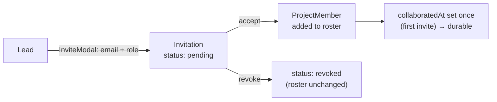

# Collaboration — comments, invitations & the team layer

The social layer over the [Findings & Hypotheses domain](findings-hypotheses.md). **Collaboration is the Azure trigger:** inviting someone turns a solo investigation into a team Project. Most of this surface is **Azure-only** — the PWA stays solo (comments aside).

## Comments + @mentions

`FindingComment` is polymorphic (`parentKind: 'finding' | 'hypothesis'`, `parentId`) — one shape for discussion on either entity. Each carries:

- **`photos`** (`PhotoAttachment[]`) and **`attachments`** (`CommentAttachment[]` — PDF/XLSX/CSV/TXT). Team plan uploads to OneDrive/Blob (`driveItemId`, `webUrl`); Standard keeps a local filename reference only.
- **`@mentions`** — `parseMentions()` (longest-match) resolves `@displayName` → `mentionedUserIds`.

Comment text from today (hub + finding comments, `parentKind`-merged, capped at 10) flows into CoScout as `AIContext.recentComments` (Azure — there's no `buildAIContext` on PWA). Photo handling: `usePhotoComments` strips EXIF, generates a ~50 KB `thumbnailDataUrl`, optimistically adds, then uploads to Blob (falls back to local-only if offline).

## Invitations & roster

- **`Invitation`** (`status: pending | accepted | revoked`, `projectId`, `userId`, `role`, `invitedAt`/`acceptedAt`/`revokedAt`) and **`ProjectMember`** (`role: lead | member | sponsor`) live in `improvementProject.metadata.members` — the canonical roster. Code: `packages/core/src/projectMembership/`.
- **`INVITATION_ACCEPT`** synthesizes a `ProjectMember` from the invitation and appends it; revoke marks status only (does not prune the roster).
- **Access** is role-gated by `canAccess(userId, members, action)` (ADR-082): Lead = full; Member = edit contributions; Sponsor = read-mostly across Project context with active review gestures; non-members never see the Project. Detail: [acl.md](../data/acl.md).

## The `collaboratedAt` marker

`ImprovementProject.collaboratedAt` (Unix ms) is set **once**, when the roster first grows beyond the solo creator (first invite), and **never cleared** — a durable marker of collaboration history. `isCollaborative(ip)` = `Boolean(ip.collaboratedAt)` gates Azure-only team affordances (the optional, non-blocking sign-off section). A PWA investigation never sets it (no invite flow) → always solo. (Note: this replaces the deleted `isPaidTier` gate.)

## Active Project Context

Collaboration is scoped by the **active Project context**. Internally, some code still uses `useActiveIPContext` + the `<NoActiveProjectGuidance>` empty state; treat those as implementation names until a broader rename is justified. Selecting a Project scopes the workflow tabs to it. Full model: [ia-nav-model.md §Active Project Context Rules](../../02-journeys/ia-nav-model.md).

## Azure vs PWA

|                                         | Azure (€120)                                        | PWA (free)                             |
| --------------------------------------- | --------------------------------------------------- | -------------------------------------- |
| Invitations / roster / `collaboratedAt` | ✓                                                   | — (solo only)                          |
| Sign-off section                        | ✓ (optional, non-blocking; `isCollaborative`-gated) | —                                      |
| Comments                                | ✓                                                   | ✓ (local-only photos, no cloud upload) |
| `recentComments` → CoScout              | ✓                                                   | — (no `buildAIContext`)                |
| Action-item team assignment             | ✓                                                   | local                                  |

## Not yet built (do not document as live)

The real Graph user-lookup is a stub (`useInvitationSync` returns a derived display name; the live Graph call is F5-deferred); cross-device pending-invite persistence is F5-deferred (acceptance is in-session); hypothesis-level `ActionItem`s (`HYPOTHESIS_ACTION_*`) are reserved no-ops. In-product sign-off is out-of-band in V1.

## See also

- [findings-hypotheses.md](findings-hypotheses.md) — the entities comments/actions attach to.
- [acl.md](../data/acl.md) — the role ACL. · [ia-nav-model.md](../../02-journeys/ia-nav-model.md) — the nav + active Project context.
- [ADR-082](../../07-decisions/adr-082-wedge-architecture.md) — the wedge membership model.
