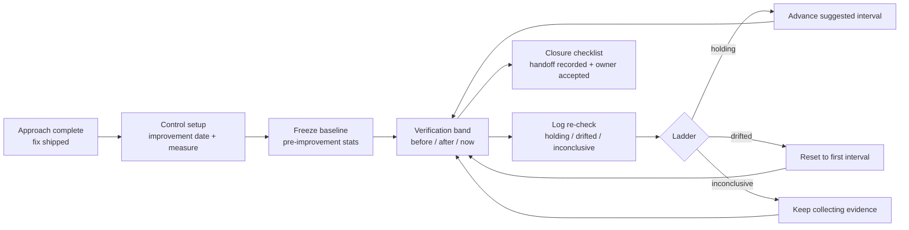

# Control Phase

## Problem

Improvement projects fail when the team stops monitoring after the fix lands: drift returns, the change is silently rolled back, or the control surface (MES recipe, SCADA alarm, work instruction) goes stale. The third Project stage in the V1 `Charter -> Approach -> Control` model keeps the proof going through the same Measure <-> Analyze re-ingest loop the analyst already uses.

## Capability claim

Control is analyst-owned data-driven sustainment, not a calendar verdict machine. The core entities live in `packages/core/src/control.ts` and `packages/core/src/control/comparison.ts`:

- `ControlRecord` binds the Project to an analyst-set `improvementDate`, a frozen `ControlBaseline`, an analyst-adjustable re-check `ladder`, and a status of `'verifying' | 'confirmed-sustained' | 'drifted'`.
- `ControlReview` is the re-check: analyst verdict `'holding' | 'drifted' | 'inconclusive'`, frozen `nowStats`, data stamp, and next suggested check.
- `ControlHandoff` records surface / system / owner / description / reaction plan. Owner acceptance is a trusted closure-checklist input, not a persisted handoff status machine.
- `computeSustainmentComparison` renders before -> after -> now evidence from existing statistics (`applyWindow` + `calculateStats`), with the frozen baseline as fallback when baseline rows are no longer present.

There are no automatic verdict/status writes from evidence ingestion. Survey/Home prompts only suggest when a re-ingest would be useful.

## Intent diagram

## User-visible workflow

1. Analyst enters Control from the Project detail surface after Approach work is ready to verify.
2. Analyst selects the measure, sets the improvement date, and freezes the baseline. The frozen baseline is the auditable "where we started" anchor.
3. The verification band shows a phase-split I-Chart plus same-scale before/after/now comparison panels. A live baseline is used while baseline rows remain available; otherwise the frozen baseline is shown.
4. Analyst re-ingests recent data at widening intervals. The default ladder is 7 / 30 / 90 / 180 days, but it is editable and advisory.
5. Analyst logs each re-check verdict. Holding advances the ladder; drifted resets it; inconclusive keeps the loop open.
6. Closure requires handoff recorded, owner accepted, ladder walked or analyst override reason recorded, and analyst-confirmed sustainment.

## Acceptance signals

- No `ControlCadence`, due/overdue semantics, consecutive ticks, or automatic status promotion exists in the shipped model.
- A new re-ingest can recompute the verification band without creating a verdict.
- Reports can cite the frozen baseline, re-check sequence, latest comparison, and simplified handoff.
- Closing Control is blocked until the closure checklist is complete or the analyst records an override reason for the ladder.

## Out of scope / non-goals

- Multi-project Control review boards and cross-project overdue queues belong to named-future VariScout Process, not V1's one Workspace -> one Project model.
- Recurring snapshot trigger / cadence enforcement remains named-future; V1 uses soft prompts only.
- Generic workflow/state-machine infrastructure is out of scope.

## Links

- **Code**: `packages/core/src/control.ts`, `packages/core/src/control/comparison.ts`, `packages/core/src/actions/controlActions.ts`, `packages/core/src/actions/controlHandoffActions.ts`, `packages/core/src/survey/control.ts`, `packages/hooks/src/useSustainmentComparison.ts`, `packages/ui/src/components/ControlVerificationBand/`, `packages/ui/src/components/IPDetail/stages/ControlOverview.tsx`, `apps/azure/src/components/control/`, `apps/pwa/src/components/ControlPanel.tsx`
- **Tests**: `packages/core/src/__tests__/control.test.ts`, `packages/core/src/control/__tests__/comparison.test.ts`, `packages/hooks/src/__tests__/useSustainmentComparison.test.ts`, `packages/ui/src/components/ControlVerificationBand/__tests__/ControlVerificationBand.test.tsx`, `packages/ui/src/components/IPDetail/stages/__tests__/ControlOverview.test.tsx`
- **Related**: [Control verification band wireframe](../../02-journeys/wireframes/control-verification-band.md), [Control closure + Report end-state spec](../../superpowers/specs/2026-06-10-control-closure-and-report-endstate-design.md), [ADR-080](../../07-decisions/adr-080-control-auto-fire-pattern.md) (superseded), [ADR-082](../../07-decisions/adr-082-wedge-architecture.md)
