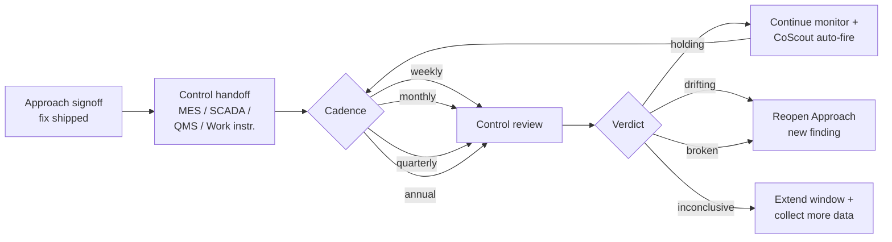

> **L3 feature stub** — created 2026-05-18 as part of M0 SDD migration inventory (Option A). Body to be expanded in M3 audit or on next feature edit.

# Control Phase

## Problem

Improvement projects fail when the team stops monitoring after the fix lands — drift returns, the change is silently rolled back, or the control surface (MES recipe, SCADA alarm, work instruction) goes stale; the third Project stage in the wedge V1 `Charter → Approach → Control` model exists to keep the proof going.

## Capability claim

Control domain types live in `packages/core/src/control.ts` (`ControlCadence` weekly through annual; `ControlVerdict` of `'holding' | 'drifting' | 'broken' | 'inconclusive'`; `ControlStatus` of `'pending' | 'confirmed-sustained' | 'drifted'`; `ControlHandoffStatus`; and `ControlHandoffSurface` enumerating nine handoff targets — `'mes-recipe' | 'scada-alarm' | 'qms-procedure' | 'work-instruction' | 'training-record' | 'audit-program' | 'dashboard-only' | 'ticket-queue' | 'other'`), with the `ControlRecord` entity and Azure UI in `apps/azure/src/components/control/ControlPanel.tsx` + editors, and CoScout auto-fire on Control events per [ADR-080](../../07-decisions/adr-080-control-auto-fire-pattern.md). Note: the control-domain **code identifiers are `Control*`** — the Sustainment → Control vocabulary rename propagated to code here (unlike the `sustainment` narrative tokens preserved elsewhere).

## Intent diagram

Third Project stage in the wedge V1 `Charter → Approach → Control` model. `ControlVerdict` drives the branch (`holding | drifting | broken | inconclusive`); CoScout auto-fires on Control events per ADR-080.

## Acceptance signals

TBD — testable conditions to be added on next edit. See related tests at `packages/core/src/__tests__/control.test.ts` and `packages/core/src/__tests__/control.paths.test.ts` for current verification.

## Out of scope / non-goals

TBD.

## Links

- **Code**: `packages/core/src/control.ts`, `packages/core/src/actions/controlActions.ts`, `packages/core/src/actions/controlHandoffActions.ts`, `packages/core/src/survey/control.ts`, `apps/azure/src/components/control/`, `apps/azure/src/pages/Editor.control.tsx`
- **Tests**: `packages/core/src/__tests__/control.test.ts`, `packages/core/src/__tests__/control.paths.test.ts`
- **Related**: `docs/07-decisions/adr-080-control-auto-fire-pattern.md`, `docs/07-decisions/adr-082-wedge-architecture.md`, `docs/03-features/workflows/improvement-workspace.md`
