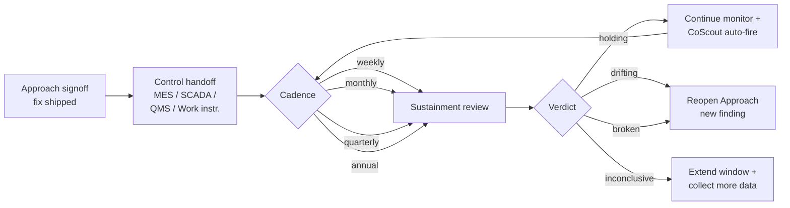

> **L3 feature stub** — created 2026-05-18 as part of M0 SDD migration inventory (Option A). Body to be expanded in M3 audit or on next feature edit.

# Control Phase

## Problem

Improvement projects fail when the team stops monitoring after the fix lands — drift returns, the change is silently rolled back, or the control surface (MES recipe, SCADA alarm, work instruction) goes stale; the third Project stage in the wedge V1 `Charter → Approach → Control` model exists to keep the proof going.

## Capability claim

Control domain types live in `packages/core/src/sustainment.ts` (`SustainmentCadence` weekly through annual, `SustainmentVerdict` of `'holding' | 'drifting' | 'broken' | 'inconclusive'`, `SustainmentStatus`, and `ControlHandoffSurface` enumerating `'mes-recipe' | 'scada-alarm' | 'qms-procedure' | 'work-instruction'`), with Azure UI in `apps/azure/src/components/sustainment/SustainmentPanel.tsx` + editors and CoScout auto-fire on Control events per ADR-080. Note: code identifiers (`sustainment`, `SustainmentCadence`, etc.) are preserved as stable tokens per Task #40 rename discipline.

## Intent diagram

Third Project stage in the wedge V1 `Charter → Approach → Control` model. `SustainmentVerdict` drives the branch (`holding | drifting | broken | inconclusive`); CoScout auto-fires on Control events per ADR-080.

## Acceptance signals

TBD — testable conditions to be added on next edit. See related tests at `packages/core/src/__tests__/sustainment.test.ts`, `packages/core/src/__tests__/sustainment.paths.test.ts`, and `apps/azure/src/components/__tests__/SustainmentEditors.test.tsx` for current verification.

## Out of scope / non-goals

TBD.

## Links

- **Code**: `packages/core/src/sustainment.ts`, `packages/core/src/actions/sustainmentActions.ts`, `packages/core/src/survey/sustainment.ts`, `apps/azure/src/components/sustainment/`, `apps/azure/src/pages/Editor.sustainment.tsx`
- **Tests**: `packages/core/src/__tests__/sustainment.test.ts`, `packages/core/src/__tests__/sustainment.paths.test.ts`
- **Related**: `docs/07-decisions/adr-080-control-auto-fire-pattern.md`, `docs/07-decisions/adr-082-wedge-architecture.md`, `docs/03-features/workflows/improvement-workspace.md`
