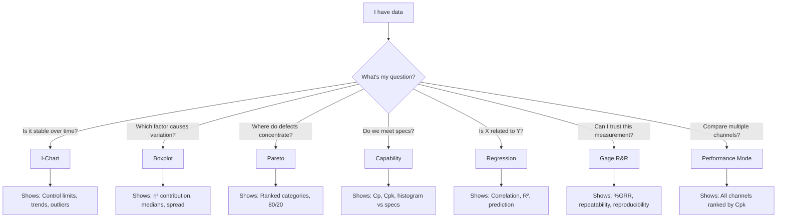
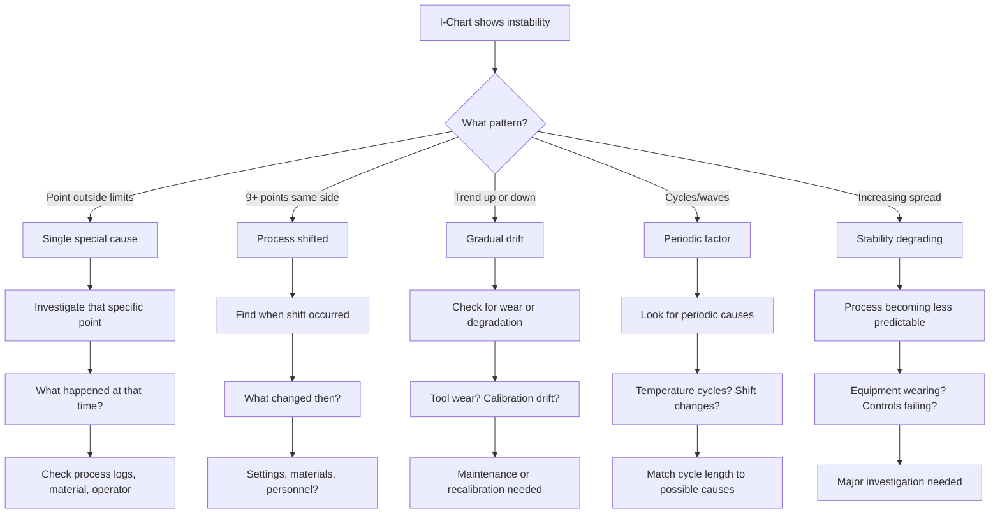
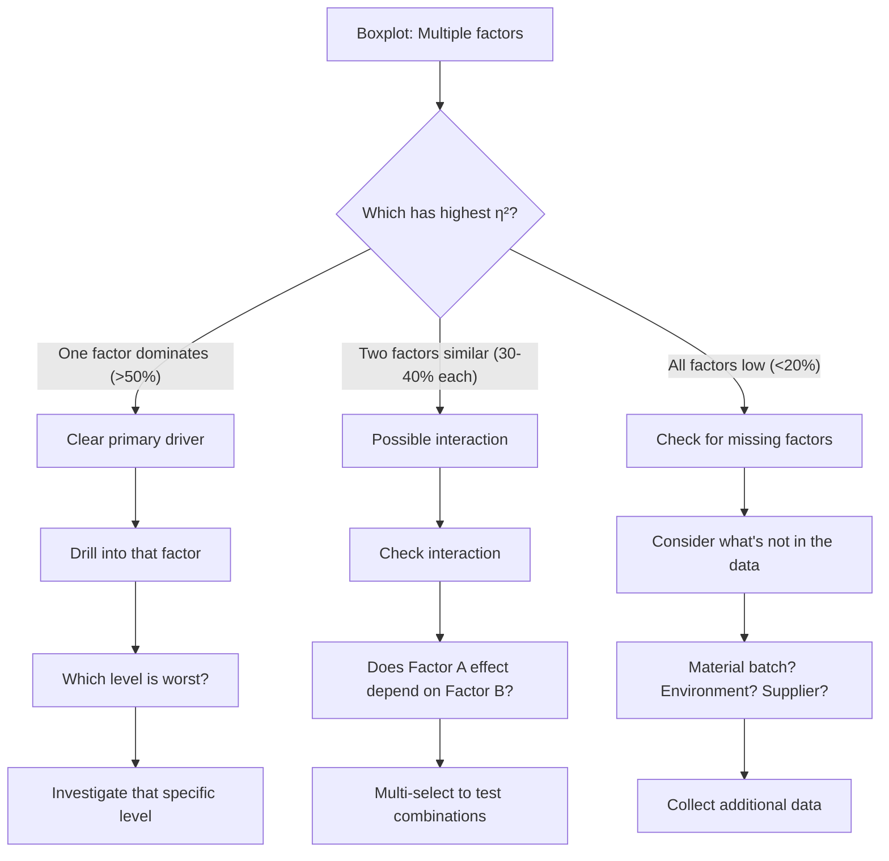
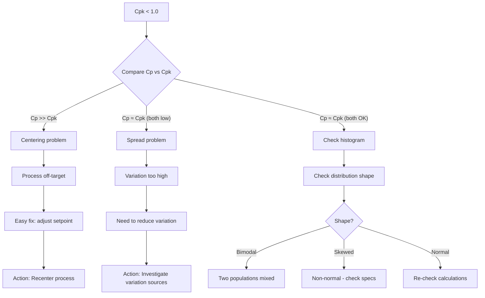
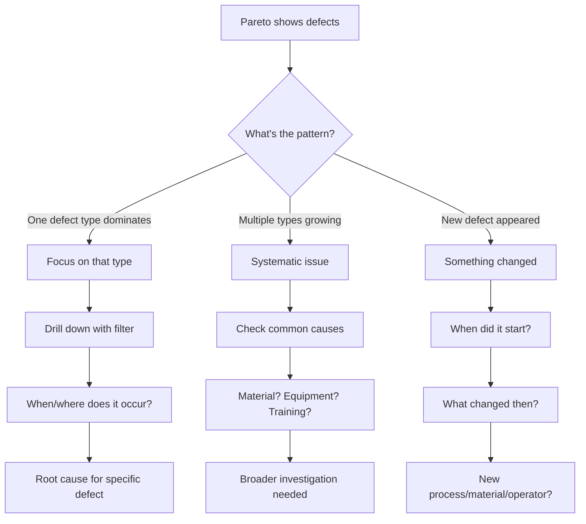
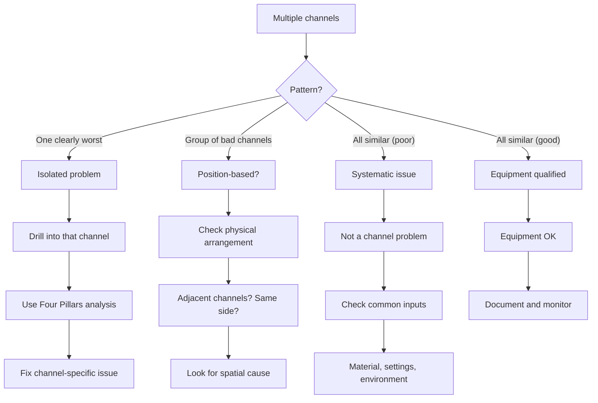
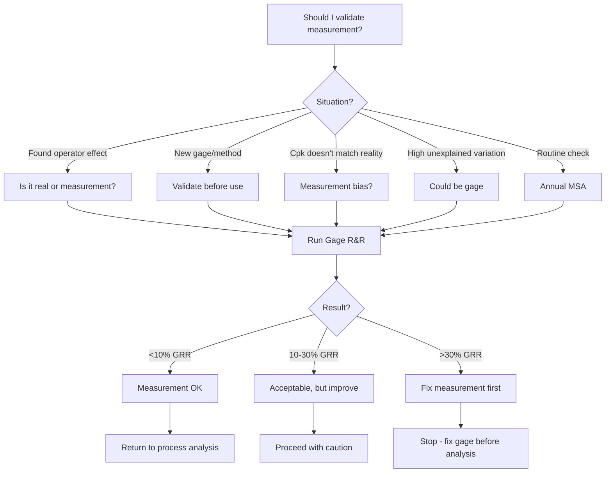
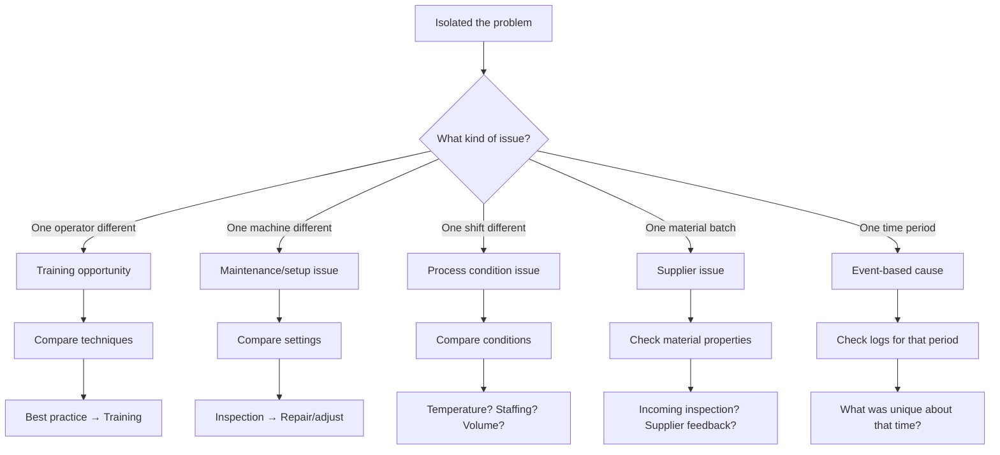

# Decision Trees

Flowcharts to answer common analyst questions: "Which chart should I use?" and "What do I do next?"

## Which Chart Should I Use?

## I Found Instability - Now What?

## High Variation - Which Factor?

## Poor Capability - Why?

## Defects Increasing - Where to Look?

## Performance Mode - Which Channel?

## MSA Decision - Should I Do Gage R&R?

## After Drill-Down - What Action?

## Quick Reference Card

### Chart Selection

| Question           | Chart            |
| ------------------ | ---------------- |
| Stable over time?  | I-Chart          |
| Which factor?      | Boxplot          |
| Which defects?     | Pareto           |
| Meet specs?        | Capability       |
| X vs Y related?    | Regression       |
| Trust measurement? | Gage R&R         |
| Compare channels?  | Performance Mode |

### Next Steps

| Finding              | Action                       |
| -------------------- | ---------------------------- |
| Point outside limits | Investigate that sample      |
| High η² factor       | Drill down                   |
| Poor Cpk             | Check Cp vs Cpk              |
| New defect type      | Find when it started         |
| Channel worst        | Four Pillars on that channel |
| Operator effect      | Consider MSA first           |

### Warning Signs

| Sign               | Investigate         |
| ------------------ | ------------------- |
| Bimodal histogram  | Mixed populations   |
| Cp >> Cpk          | Centering issue     |
| All factors low η² | Missing factor      |
| All channels poor  | Systematic cause    |
| GRR > 30%          | Measurement problem |

## Related Documentation

- [Four Pillars Workflow](four-pillars-workflow.md)
- [Drill-Down Workflow](drill-down-workflow.md)
- [Quick Check](quick-check.md)
- [Deep Dive](deep-dive.md)
- [MSA Workflow](msa-workflow.md)
