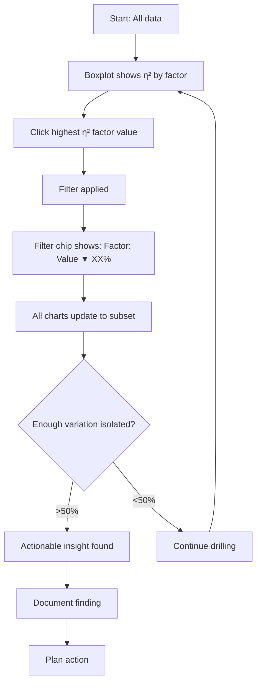

# Drill-Down Analysis Workflow

VariScout's signature interaction pattern—progressive stratification using filter chips to isolate variation sources.

## Overview

Drill-down analysis lets you progressively filter data to isolate specific variation sources. Each filter shows how much variation it explains, building a cumulative picture of your data.

## The Drill-Down Pattern



## Filter Chips

### What They Show

When you apply a filter, a chip appears showing:

```
[Shift: Night ▼ 46%] [Operator: B ▼ 23%] [Machine: 3 ▼ 15%]
```

| Component   | Meaning                   |
| ----------- | ------------------------- |
| Factor name | The column being filtered |
| Value       | The selected level        |
| ▼           | Click to remove           |
| Percentage  | Variation contribution    |

### Contribution Percentage

The percentage on each chip shows that factor's **contribution to variation**:

- Calculated as η² (eta-squared)
- Shows proportion of variance explained
- Helps prioritize which factors matter most

!!! info "Cumulative vs Individual"
Each chip shows its individual contribution. The variation funnel shows cumulative progress.

## Variation Funnel

The funnel visualization tracks your cumulative progress:

```
100% ─────────────────── Total variation
 │
 │ Shift: Night (-46%)
 │ ▼
54% ─────────────── Remaining
 │
 │ Operator: B (-23%)
 │ ▼
31% ─────────── Remaining
 │
 │ Machine: 3 (-15%)
 │ ▼
16% ─────── Unexplained (common cause)
```

### Reading the Funnel

| Funnel Level     | Interpretation            |
| ---------------- | ------------------------- |
| > 50% remaining  | More drilling needed      |
| 30-50% remaining | Significant factors found |
| < 30% remaining  | Good isolation            |
| < 15% remaining  | Common cause only         |

## Single-Select vs Multi-Select

### Single-Select (Default)

Click a value to filter to just that level:

```
Shift: Night ▼ 46%
```

- Shows only Night shift data
- Good for focusing on one problem area

### Multi-Select

Hold Ctrl/Cmd and click multiple values:

```
Shift: Night, Evening ▼ 52%
```

- Shows data from both shifts
- Useful for comparing similar groups
- Combined contribution may be higher

## The Drill-Down Process

### Step 1: Start with Full Data

View the Boxplot with all data. Note which factor has highest η².

### Step 2: Click to Filter

Click on the bar (or box) for the level you want to investigate:

- Click the **highest** level to isolate the biggest contributor
- Click an **outlier** level to focus on the problem area
- Click a **good** level to understand what works

### Step 3: Observe Changes

After filtering:

- Filter chip appears with contribution %
- All charts update to show filtered subset
- Boxplot recalculates η² for remaining factors
- Capability shows filtered Cpk

### Step 4: Continue or Stop

**Continue drilling if:**

- Still significant variation unexplained
- Next factor has meaningful η² (> 10%)
- Enough data remains for analysis (n > 20)

**Stop drilling when:**

- Variation sufficiently isolated (> 50-70%)
- Remaining variation is common cause
- Data too sparse for reliable statistics
- Actionable insight found

### Step 5: Document Path

Record your filter path for:

- Reproducing the analysis
- Explaining to others
- Tracking improvements

```
Filter path: Shift=Night → Operator=B → Machine=3
Result: Isolated 84% of variation
Finding: Machine 3 accounts for most off-spec production on night shift
```

## Example: Coffee Case Study

### Starting Point

Full dataset: Fill weight variation

| Factor   | η²  | Interpretation      |
| -------- | --- | ------------------- |
| Batch    | 45% | Biggest contributor |
| Operator | 18% | Moderate            |
| Time     | 12% | Some effect         |

### Drill-Down Sequence

**Filter 1: Batch = 3**

```
[Batch: 3 ▼ 45%]
```

Remaining factors:

| Factor   | η²  |
| -------- | --- |
| Operator | 32% |
| Time     | 8%  |

Batch 3 was different—now Operator is more prominent.

**Filter 2: Operator = New**

```
[Batch: 3 ▼ 45%] [Operator: New ▼ 32%]
```

Remaining factors:

| Factor | η²  |
| ------ | --- |
| Time   | 15% |

Cumulative: 77% isolated

**Result**

- New operator on Batch 3 explains most variation
- Training opportunity identified
- Time effect (15%) is shift-related—secondary factor

## When to Use Multi-Select

### Comparing Groups

Select multiple "good" values to establish baseline:

```
[Operator: A, C, D ▼ 8%]  ← Combined good operators
```

Then compare against the excluded "problem" level.

### Excluding Outliers

Select "normal" values to see process without anomalies:

```
[Shift: Day, Evening ▼ 52%]  ← Excluding Night shift
```

### Investigating Interactions

Select combinations to test interaction effects:

```
[Shift: Night ▼] [Operator: New ▼]
```

vs

```
[Shift: Day ▼] [Operator: New ▼]
```

Does new operator perform differently by shift?

## Best Practices

### Do

- Start with the highest η² factor
- Note the cumulative variation as you drill
- Check Cpk at each level
- Verify sample size remains adequate
- Document your filter path

### Don't

- Don't drill too deep (sparse data)
- Don't ignore factors with moderate η²
- Don't forget to check stability at each level
- Don't over-interpret small samples

## Reading Chart Updates

### Boxplot After Filtering

- Shows remaining factors for filtered subset
- η² values recalculated
- May reveal hidden factors

### I-Chart After Filtering

- Shows only filtered time series
- Control limits recalculated
- May reveal pattern previously masked

### Capability After Filtering

- Shows Cpk for filtered subset
- Compare to overall Cpk
- Helps quantify factor impact

### Pareto After Filtering

- Shows defect types for filtered subset
- May reveal concentrated failure modes
- Connects variation to specific problems

## Navigating Back

### Remove Single Filter

Click the ▼ on any filter chip to remove it.

### Clear All Filters

Click "Clear all" to return to full dataset.

### Breadcrumb Navigation

Use breadcrumbs to jump to any point in drill path:

```
All Data > Shift: Night > Operator: B
```

Click "Shift: Night" to remove Operator filter but keep Shift.

## Related Documentation

- [Four Pillars Workflow](four-pillars-workflow.md)
- [Linked Filtering](../navigation/linked-filtering.md)
- [Breadcrumbs](../navigation/breadcrumbs.md)
- [Boxplot Feature](../analysis/boxplot.md)
